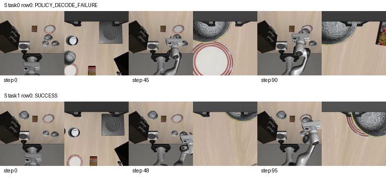
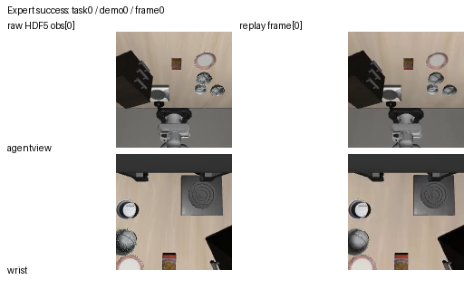
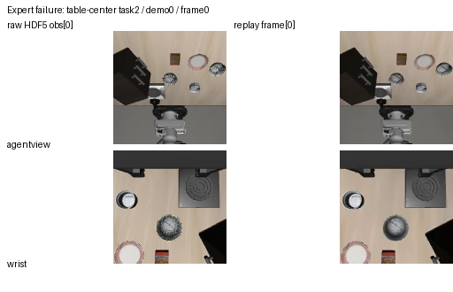

# F1：基线与数据——阶段日志

## 当前进展

> 公开版说明：机器内部路径、GPU UUID、PID、工具会话与具体运行标识已脱敏。`$XIYUAN_WORKSPACE`、`$XIYUAN_GPU_UUID`、`$XIYUAN_RUN_ID`等为占位符，不是已设置的环境变量；历史命令需按本机记录还原后使用。精确命令、原始日志及恢复点保留在服务器各run目录与审计记录中，公开版不作为直接启动/恢复命令。

最后核对：2026-09-08。**F1 / T01、T02 的机器实施已完成，G1=BLOCKED_HUMAN。** 四个隔离环境、数据/权重/tokenizer/Plus资产准备已完成；61,750个样本的完整FAST审计通过。数据v2为450/50整episode、55,682/6,068动作起点，norm仅训练集；初态关联仍有未知项，不宣称严格初态留出。

**300步小样本pilot已完成并退出0。** 200个train样本池、有效batch16、累计8×物理2，共4,800次样本抽取；前10步平均action loss13.606，末10步1.929。全部300更新的样本顺序独立复核一致，数值有限。实际100→200步全部10个LoRA叶子更新，32个冻结叶子不变；第100步冻结叶子与基础权重一致。完整检查点为run a/checkpoints/100、200、300。

**独立恢复诊断已精确通过**：统一step类型/分片，并固定确定性GPU执行设置后，模型、optimizer、step、样本和接续更新逐参数一致。实际累计入口与独立上游微批次参考的GPU数值对照已通过；与大batch的BF16分批差异已实测记录，不宣称逐位相同。

**早期开发闭环曾失败，最终3,000步结果已收口。** 第100、200步固定checkpoint在同一预留clean开发单元的首请求均出现动作系数长度错误；第200步生成56个，要求70个，未补零/截断，未向仿真发送动作。训练loss下降不能替代策略闭环成功。最初浮点token承载类型的服务适配错误已单独修复并保留失败记录。

七维各一个真实单例全部执行成功；重复加载同状态精确一致，布局例仅1个118维状态，其余例为50×92库存、实际检查2行。机器人姿态扰动须检查预热后的观测，噪声例实际改变第三人称图像；这不等于最终manifest或全部初态唯一性已验收。专家完整开环仍9/10成功，失败例补充GT状态恢复诊断，不改写失败。

2,000步全数据S开发训练已完成并完整保存500/1000/1500/2000步checkpoint；最终2000步固定训练帧4/5自然生成合法，20个预留clean闭环单元为2成功、1超时、17次显式解码失败。独立3,000步开发延长已完成并提交第500/1000/1500/2000/2500/3000步checkpoint；2000步同一缓存位置修正版下，5个固定训练帧全部自然生成合法，物理动作MAE约0.048—0.113（均值0.071）；teacher-forcing动作token准确率0.304—0.524（均值0.453），平均loss 2.120。最终固定20单元评测及G1状态见文末最新记录。

工程根upstream/openpi；训练pilot执行版本与provenance保存在run目录，后续服务/检查点保留修复另记工程Git版本，不追溯冒充旧作业代码。证据位于artifacts/audits/f1-resources-20260907/；阶段日志以下保留历史运行状态及失败，以上为最新恢复入口。

## 执行记录

### 2026-09-07｜全量Plus初态哈希盘点与teacher-forcing诊断

全量Plus配置初态矩阵已重新盘点，脚本首次因JSON tuple key失败（未生成结果），修复后实际退出0；`plus-state-uniqueness.json`覆盖2,402配置、0个加载错误。背景258、机器人初态350、视角376、语言390、噪声351、布局385、光照292。除布局外均为50×92、每配置50行且行内精确hash全唯一；布局385个配置各只有1行，维度分布92/105/118/131/144/157，不能据配置数凑独立20单元。此盘点只说明存储行的精确重复情况，不证明仿真reset唯一、跨条件血缘独立或扰动生效；七维代表性运行结果仍单独保留。

第500步全数据checkpoint的真实teacher-forced动作后缀诊断已退出0，5个训练样本action token准确率0.304—0.471，首/末动作token均正确，teacher-forced loss 2.4375—3.84375；它解释了训练确实改变了动作后缀分布，但自由生成仍可能提前EOS。此前两次脚本错误（全序列logits维度、索引维度）和修复均保留；最终使用与`compute_loss`相同的最后token-length切片。该结果不是策略成功率，也不把teacher forcing当作闭环。

截至本记录，全数据训练实际约595/2000更新，500步checkpoint完整；所有更新使用固定配置与有效batch16，训练作业继续运行。公开版不保存服务器内部标识，具体进程和GPU分配在本机registration。

### 2026-09-07｜第500步推理与教师强制结果

第500步全数据模型在5个固定训练帧上使用隔离推理worktree的缓存位置修正版，5/5仍返回`invalid_coefficient_length`；未执行任何策略动作，未将GT动作送入请求。生成仍包含Action/EOS边界，但FAST解码得到的系数不足10×7，服务保持显式失败而不补零、不截断。该失败意味着500步尚未满足自由生成/控制验收，并不能由teacher-forcing指标替代。隔离推理版本及5帧结果保留在本机审计目录，运行中的全数据训练源码指纹未改变。

teacher-forcing诊断使用同一500步checkpoint、同一项目模型入口、5个真实训练样本；只在离线前向中读目标用于计算准确率，策略请求没有目标后缀。动作后缀位置数为17—23（FAST BPE token会压缩多个系数），准确率0.304—0.471，首/末token均正确；这证明部分后缀学习而不是证明完整70系数序列自回归生成成功。完整日志及最终JSON记录全部样本和版本。

当前可并行使用的GPU已按负责人授权分配给训练和诊断；每个入口启动前两次查询占用，所有本轮服务/renderer/诊断完成后自动退出。没有修改其他用户进程，没有把空闲卡数量写成独占承诺。全数据训练和后续checkpoint仍按原配置、样本顺序、有效batch和停止条件执行。

### 2026-09-07｜负责人批准进入F1环境准备

完整读取 [GPT复审回复](https://chatgpt.com/s/t_6a9e70cd88588191849e2ce5dc143374) 的公开正文（3631字符，完成状态）。负责人要求按意见继续，采用其F1环境准备范围。F0结论保留，README切至F1；真实会话已阅读工程入口、F1 PLAN/LOG、F0交接与主文档相关正文，不以文件hash代替理解。不重复入口测试，不扩大到训练。

### 2026-09-07｜uv固定版校验通过，开始准备Python

官方发行版uv 0.12.10已下载至项目tools/uv，压缩包SHA256与官方sha256文件及GitHub asset digest一致：173d95a0c32d18c896c46ba6fafbf3cf9c14ab74b033f81b76c883ef492a976b。uv --version及python install/sync --help均退出0；原始清单见uv-bootstrap.json。未修改全局PATH；后续使用绝对路径。正安装用户目录Python3.11，结果待核验。

### 2026-09-07｜Python就绪，处理安装中的NFS归属检查

`uv python install 3.11 --install-dir $XIYUAN_WORKSPACE/tools/python --no-bin` 退出0，实际安装CPython3.11.16。后续锁定该补丁版本，不修改系统Python或全局PATH。

学生环境使用UV_PROJECT_ENVIRONMENT=工作区/envs/policy-train、UV_CACHE_DIR=工作区/cache/uv、UV_LINK_MODE=copy，GIT_LFS_SKIP_SMUDGE=1，按固定openpi `uv sync --frozen --no-dev` 安装。初次及第一次重试分别被uv的LeRobot Git缓存目录及.git别名的NFS归属检查阻止（退出1）；保留policy-sync*.log/.exit。仅在本轮临时git-safe.config列出已知项目缓存/checkout精确路径，未设通配信任、未改用户全局配置。第二次重试已通过LeRobot构建，继续安装；上游pyproject/uv.lock未改，尚不能标环境通过。

安装进展：第二次重试已完成189个包准备（安装日志报告4m29s），开始写入隔离环境；仍待最终退出码和运行验证，不提前标安装通过。PyTorch是固定上游运行/数据依赖，学生模型路线仍为JAX/Flax，不执行PyTorch移植。

### 2026-09-07｜学生环境与实际运行检查结果

| 项目 | 结果 | 证据文件（本轮审计目录） |
|---|---|---|
| uv发布版校验 | PASS：0.12.10，官方SHA256一致 | uv-bootstrap.json |
| Python安装 | PASS：3.11.16，项目tools目录，系统Python未改 | python-install.log/.exit、python-runtime.json |
| 固定锁安装 | PASS：第二次重试退出0；前两次失败保留 | policy-sync*.log/.exit |
| 包一致性 | PASS：202包无冲突 | pip-check.log/.exit |
| 环境/导入路径 | PASS：解释器prefix为policy-train，11项导入通过 | policy-import-check.json/.log/.exit |
| 训练/服务CLI | PASS：两个--help退出0，没有开始训练或服务 | train-help.log/.exit、serve_policy-help.log/.exit |
| 离线锁同步检查 | PASS：Would make no changes | policy-sync-check.log/.exit |
| 单卡GPU合成检查 | PASS：FP32 JIT、自动求导、BF16矩阵乘法；GPU1对应进程内cuda:0 | gpu-smoke-run.json、jax-gpu-check.json/.log/.exit |
| 上游文件完整性 | PASS：pyproject.toml、uv.lock、.python-version与安装前一致 | source-lock-before.json、environment-validation.json |

实际主要版本：JAX/jaxlib0.5.3、Flax0.10.2、Torch2.7.1、torchvision0.22.1、NumPy1.26.4、transformers4.53.2、Orbax0.11.13、ml-dtypes0.4.1、tensorstore0.1.74。openpi/openpi-client以本地固定源码导入，LeRobot来自锁定0cf864870cf29f4738d3ade893e6fd13fbd7cdb5。完整安装列表在policy-freeze.txt，其hash与解释器hash已写environment-validation.json。默认dev与可选RLDS依赖未安装，不能据此声称开发测试工具或RLDS转换环境齐备。

GPU验证是明确的SYNTHETIC环境检查：128×128单位矩阵上的编译、梯度与BF16乘法，与数学结果比较；浮点梯度容差仅用于此合成算式，不替代项目模型容差。记录的约4秒为脚本内计算段时间，不是训练step benchmark、模型吞吐或总启动耗时。未升级驱动；535.274.02在这个固定环境上的该检查通过，复杂模型编译仍待实测。

已执行命令（以下路径属于本机；不需激活全局环境）：

```sh
UV_CACHE_DIR=$XIYUAN_WORKSPACE/cache/uv $XIYUAN_WORKSPACE/tools/uv/bin/uv python install 3.11 --install-dir $XIYUAN_WORKSPACE/tools/python --no-bin

env -u PYTHONPATH -u PYTHONHOME -u VIRTUAL_ENV UV_CACHE_DIR=$XIYUAN_WORKSPACE/cache/uv UV_PYTHON_INSTALL_DIR=$XIYUAN_WORKSPACE/tools/python UV_PROJECT_ENVIRONMENT=$XIYUAN_WORKSPACE/envs/policy-train UV_LINK_MODE=copy GIT_LFS_SKIP_SMUDGE=1 GIT_CONFIG_GLOBAL=$XIYUAN_WORKSPACE/artifacts/audits/f1-env-20260907/git-safe.config $XIYUAN_WORKSPACE/tools/uv/bin/uv sync --project $XIYUAN_WORKSPACE/upstream/openpi --frozen --no-dev --python $XIYUAN_WORKSPACE/tools/python/cpython-3.11.16-linux-x86_64-gnu/bin/python3.11

UV_CACHE_DIR=$XIYUAN_WORKSPACE/cache/uv $XIYUAN_WORKSPACE/tools/uv/bin/uv pip check --python $XIYUAN_WORKSPACE/envs/policy-train/bin/python
```

首条是实际初装历史命令，后续复现锁定已得到的3.11.16，不用浮动3.11请求升级补丁；已存在环境无需重装。sync使用临时精确safe.directory配置，覆盖本项目LeRobot缓存路径，不能删除此配置后假设NFS归属问题自动消失。源码锁hash：793488b5a55bb87200db90a61fd0af51922b686d94e1da4f4c587ab119b37d74。

CPU导入检查使用本轮check-policy-env.py：调用时仅进程级清除PYTHONPATH/PYTHONHOME/LD_LIBRARY_PATH，设置CUDA_VISIBLE_DEVICES为空、JAX_PLATFORMS=cpu、HF_HUB_OFFLINE=1、TRANSFORMERS_OFFLINE=1、WANDB_MODE=disabled，以及项目缓存路径，未修改用户全局环境。两个CLI --help沿用该隔离调用方式。GPU检查由run-gpu-check.py先查询UUID/空闲显存/计算进程，再选择一张空闲卡，设置JAX_PLATFORMS=cuda和XLA_PYTHON_CLIENT_PREALLOCATE=false，90秒超时；此次退出0。脚本及原始记录均保留在本轮审计目录，不是新增科研训练入口。

安装期间一次du查询遇到正在原子改名的临时文件消失而退出1，不是安装失败；后续未用该瞬时容量作为完成依据。完成依据为安装退出0、独立包/导入/锁检查及实际运行结果。没有隐藏或清除失败记录，也没有为通过检查放宽模型精度标准。

本轮只完成PLAN“本轮执行范围”的三项，四环境总步骤仍未勾选。来源依据为固定openpi源码与 [uv官方安装说明](https://docs.astral.sh/uv/getting-started/installation/)、[JAX官方安装说明](https://docs.jax.dev/en/latest/installation.html)，最终兼容结论以本机检查的具体范围为准。文档将按负责人持续授权提交推送并给出固定版本链接；不公开环境、源码缓存或原始设备信息。

发布前文档检查通过（退出0）：本轮四个文档的链接/围栏、README当前阶段、三项限定范围勾选；上游锁文件不变，其余环境及模型/数据/监督目录未创建。`git diff --check`退出0，远端fetch成功；仅推送Vault文档，安装与验证原件留工作区。

### 2026-09-07｜持续目标：完成F1

负责人明确持续目标完成F1，首批学生环境完成为实质进展；现继续余下环境、官方资源、数据/回放与项目S验证，最终以完整G1证据为准。保留原环境和日志，不重复安装；本批证据放artifacts/audits/f1-resources-20260907。正式训练仍未授权越过G2。

### 2026-09-07｜余下环境与原始数据开始准备

Python3.8.20/3.10.21已装入项目tools目录，sim-clean/sim-plus/teacher虚拟环境已建立但安装尚在进行。选用固定openpi示例核心robosuite1.4.1/MuJoCo3.2.3（与LIBERO requirements中的1.4.0差异显式记录），clean/plus保持一致；实际运行将导入独立LIBERO/Plus checkout，不使用未初始化子模块。环境兼容候选将示例Numba0.53.1/llvmlite0.36.0更新为0.58.1/0.41.1以配合NumPy1.22.4；其余库按源要求解析，真实导入/回放后再判可用，不称官方环境逐项复现。独立解析结果均退出0，保存在sim-clean/sim-plus/teacher.resolved.txt。

首个官方Spatial HDF5已下载并校验长度及LFS SHA256（508779600字节）。真实打开后确认50条完整演示；首条98步，actions7维，ee_pos3+ee_ori3+gripper_states2可组成基线8维本体状态，robot_states另为9维，不能混用或截断；两路RGB均128×128，states92维，demo含init_state/model_file。结构可用不代表时序或控制链路已验证。原始证据first-hdf5-inventory.json。现继续同revision全部10任务下载，复用第一项并逐个验证；尚未划分train/dev/final。

当前已启动并持有工具句柄：sim-clean安装（见本机记录）、sim-plus安装与teacher安装句柄见本次工具记录，全部数据下载（见本机记录）（状态/进程在spatial-download.json）。中断后先查.exit、实际进程或同一工具句柄，不据超时重复启动。没有GPU科研作业、没有训练checkpoint；本批日志与锁文件在artifacts/audits/f1-resources-20260907。

### 2026-09-07｜实际数据时序审计与负责人确认

全部10任务、500条演示已下载并校验，共62250行原始动作。逐演示比较真实joint_states与states中的机器人关节位置，在所有61750个可比较位置上，obs[i].joint_states与states[i+1]对应位置逐元素精确相同；同索引误差显著。结合固定源码create_dataset.py在env.step后采集obs的路径，确认原始数据不能直接同索引配对。原始证据full-hdf5-timing-audit.json、joint-state-lag-diagnostic.json；不是synthetic数据。

负责人明确回复“同意”，采用统一修正：obs[i]、states[i+1]、actions[i+1:]，i从0到L-2。每条轨迹缺少动作前原始图像的首个动作起点不训练，共排除500个（约0.8%），保留61750个，其余不得因A/B监督差异删样本。不重新渲染训练图像，原HDF5保持不变。批准映射写入工作区protocols/data-timing-v1.json，四组共用；尚未锁定正式protocol.lock或生成划分/norm。

clean/plus基础安装及独立源码包安装已完成。首次导入暴露上游setup.py未发现外层namespace导致的现代editable空映射：只在各自环境增加精确source-root .pth，分别绑定独立LIBERO/Plus，未改全局PYTHONPATH或源码。clean随后导入通过。plus缺ImageMagick，已将Ubuntu官方包按APT SHA256校验后解压到项目tools/imagemagick，并补齐liblqr/libfftw3；仅在plus进程设置原生库路径，最终plus导入通过，无sudo/系统安装。

teacher安装与pip check通过；初次导入受到继承的$SYSTEM_CUDA_PATH的不可读libnvJitLink影响，进程级清除LD_LIBRARY_PATH后Torch2.3.1+cu121、torchvision0.18.1+cu121和FastVGGT/pycolmap/pyceres/open3d导入通过。原失败日志保留。基础模型与Plus资产仍在下载校验；FAST tokenizer文件已校验，尚未执行其远程代码。

真实专家前三步回放完成，记录了原始XML到本机资产的路径映射（不改相机/几何参数）、图像朝向及位姿误差；raw朝向明显优于flip/rotate180。前三步未完成任务不算失败，现完整回放首条演示检验真实成功谓词。后续训练图像与在线输入采用同一经审计的确定性约定，不直接复制上游RLDS专用180度旋转。

准备真实权重合成集成检查：run_id=$XIYUAN_RUN_ID，GPU0启动前确认空闲，上限600秒/2次更新、物理与有效batch均1，仅诊断不计正式或学习曲线。配置/脚本hash及本地实现commit见real-model-check-registration.json，输出runs/diagnostics/$XIYUAN_RUN_ID；验证冻结叶子不变、LoRA实际更新及不同RNG的模型入口预处理。依赖已满足，尚未宣称通过。

### 2026-09-07｜资源、真实模型与数据验证汇总

本节更新前文安装中/下载中/未划分等历史状态，不删除失败记录。

| 已执行项 | 结果及证据（本轮审计目录） |
|---|---|
| Spatial下载 | 10文件/500演示/62,250原始动作行；源revision及每文件LFS SHA256校验，spatial-download.json COMPLETE |
| 基础模型 | 官方35对象共10,850,405,453字节，base-download.json COMPLETE；真实参数32叶子、2,923,335,408参数 |
| FAST/PaliGemma | 本地文件校验完成，fast-download.json、paligemma-tokenizer.json；FAST处理器代码先审计后离线加载 |
| 三个新增环境 | sim-clean125包、sim-plus131包、teacher127包依赖检查及必要导入通过；sim各自LIBERO_CONFIG_PATH隔离 |
| Plus资产 | 固定revision ZIP校验，448,799文件解压及CRC检查完成，plus-extraction.json |
| 专家回放 | expert-replay-run.json COMPLETE，十条视频及JSON保留；9/10成功 |
| 七维资源 | plus-inventory.json：实际API枚举2,402配置，0加载错误，385个单行配置；不是2,402个独立评测单元 |
| FAST测试 | tokenizer-tests-retry.log/.exit：9项PASS，退出0 |
| 数据测试 | data-tests.log/.exit：4项synthetic PASS，退出0 |
| 实际模型 | real-model-check-b.log/.exit及run result.json：两步synthetic PASS，退出0 |
| 真实动作回环 | real-data-roundtrip.json：100个样本通过，尚未做全量长度审计 |
| norm独立复核 | norm-provenance-check.json/.log/.exit：train-only mean/std/q01/q99与独立重算完全一致，退出0 |

Plus资产ZIP保存在NFS `data/raw/libero-plus-assets/assets.zip`；为避免约45万小文件的NFS开销，解压缓存位于 `$PRIVATE_TEMP_PATH`，Plus assets链接指向它。该缓存可丢失，恢复先验完成标记/路径，缺失从保留ZIP重建；不能把临时盘当唯一持久证据。

失败回放为table-center任务demo0（103帧），最终末端位置与记录差约0.0159米；视频显示放置靠近盘缘。原因仍待核实，不能断言只是模拟器误差，也不能换成功演示掩盖失败。原数据生成器可强制写末帧reward/done，验收采用实际仿真成功谓词。当前原始RGB与在线视图保留一致朝向，不复制RLDS专用180度旋转。

实际模型首次诊断a因未先batch的image mask构造失败，修复为先batch字典再构建Observation；重试前发现GPU0已被其他用户占用，未触碰其进程，改用空闲GPU1运行b。b实际更新两步，loss 4.64285755→3.75446439，所有10个LoRA叶子变化、冻结参数hash保持一致，模型预处理仅调用一次且train=False，跨RNG输入图像精确一致。首步编译约33.55秒、第二步约0.31秒均仅此batch1合成诊断，不是正式吞吐或真实数据可学习证据。

FAST实现保留合法编码并直接从token ID恢复动作段。发现上游先decode为文本再strip/encode会在一个可复现fixture中丢失首FAST token，70个系数变68个并触发静默零动作；项目S改为明确边界和长度校验。IDCT遗漏ortho归一化及EOS测试误用bos ID的问题已纠正，失败记录保留；最终与直接上游FAST处理器比较，不以已损坏的外层文本回环作正确性标准。修正属于四组共用S，不计A/B方法贡献。

数据v1在任何训练前补强初态来源审计并生成v2，v1标SUPERSEDED_BEFORE_ANY_TRAINING；train/val/norm文件hash完全一致，没有看模型效果重划分。500条演示init与官方初态行无精确匹配，这不证明独立，标UNKNOWN_NOT_INDEPENDENT。预留clean官方行0—4为开发候选、5—49为最终候选，但正式manifest未冻结，Plus跨条件血缘仍待核查。

已验证的复核命令（CPU、无训练；工作目录为工程根）：

```sh
env -u PYTHONPATH -u PYTHONHOME -u LD_LIBRARY_PATH CUDA_VISIBLE_DEVICES= JAX_PLATFORMS=cpu $XIYUAN_WORKSPACE/envs/policy-train/bin/python -m unittest discover -s $XIYUAN_WORKSPACE/upstream/openpi/tests/xiyuan -p test_data.py
env -u PYTHONPATH -u PYTHONHOME -u LD_LIBRARY_PATH CUDA_VISIBLE_DEVICES= JAX_PLATFORMS=cpu $XIYUAN_WORKSPACE/envs/policy-train/bin/python $XIYUAN_WORKSPACE/artifacts/audits/f1-resources-20260907/check-norm-provenance.py
```

训练入口、累计/完整恢复、真实数据短训及七维单例仍未验收，不提供假设存在的训练启动命令。下一步从data-v2和上述实现commit继续，先查作业再启动。文档提交仅公开计划和结果摘要，数据、权重、视频、环境及私人规则留工作区。

### 2026-09-07｜全量FAST长度与完整动作解码审计

新增并实际运行工程CLI `scripts/xiyuan/audit_token_lengths.py`，实现commit `d29c2a44f3a118895cd02d114334b3647b9838a2`。只使用已批准data-v2的状态、动作、当前指令及train-only norm；不读取监督或使用GPU。逐样本经过实际delta/normalize与严格FAST编码、完整解码，覆盖训练55,682和验证6,068个样本，退出0。

训练长度范围60—91，验证61—92；两者P50/P95/P99均72/83/86，最长公共prefix58，无样本超过128。全部61,750个动作解码均为有限10×7数组。由此128可用于当前S开发训练；不据此认定加入A方向后也不会溢出，也不代表编解码无量化误差。证据 `full-token-audit.json/.log`，记录manifest/norm hash及最长样本ID；耗时约105.94秒为本CPU审计耗时。

已执行CLI先通过--help，实际命令：

```sh
env -u PYTHONPATH -u PYTHONHOME -u LD_LIBRARY_PATH CUDA_VISIBLE_DEVICES= JAX_PLATFORMS=cpu HF_HOME=$XIYUAN_WORKSPACE/cache/huggingface HF_MODULES_CACHE=$XIYUAN_WORKSPACE/cache/huggingface/modules HF_HUB_OFFLINE=1 OPENBLAS_NUM_THREADS=1 OMP_NUM_THREADS=1 $XIYUAN_WORKSPACE/envs/policy-train/bin/python $XIYUAN_WORKSPACE/upstream/openpi/scripts/xiyuan/audit_token_lengths.py --data-dir $XIYUAN_WORKSPACE/protocols/data-v2 --raw-root $XIYUAN_WORKSPACE/data/raw/libero/libero_spatial --tokenizer-root $XIYUAN_WORKSPACE/weights/tokenizers --output $XIYUAN_WORKSPACE/artifacts/audits/f1-resources-20260907/full-token-audit.json
```

输出已存在时脚本拒绝覆盖；复核使用新的输出名。原始norm和manifest保持不变。

### 2026-09-07｜独立进程真实恢复诊断进行中

`check-real-resume.py --help`退出0后，登记 `real-resume-registration.json`，运行save模式：真实基础权重、data-v2实际样本、物理/有效batch1，固定初始化RNG123、模型RNG456、sampler seed0；保存第2次有效更新，并拟用第3次更新建立连续运行参考。独立restore进程将校验模型/optimizer/step hash，再比较同样本第3次更新的参数和指标。诊断配置为constant lr3e-5/warmup0，仅用于恢复比较，不是正式训练配置。

当前save实际完成两步，action loss分别16.190626和11.707721，数据样本不同，不以此判断学习趋势。Orbax完整保存仍在 `runs/diagnostics/$XIYUAN_RUN_ID/checkpoints/2.orbax-checkpoint-tmp-0`；尚未产生expected.json，也没有PASS结果。禁止把临时目录当完整checkpoint，禁止在session（见本机记录）未结束时重复启动。保存进程仍真实存活；检查点包括norm及模型/optimizer，外侧provenance绑定数据/norm/基座来源/代码hash。最终完整恢复验证仍待执行。

启动前GPU1空闲；启动后核实另一项目渲染任务也出现在GPU1，PID（见本机记录）不属本次任务，未终止或修改。当前自己的PID（见本机记录）已进入保存收尾，最多600秒；后续restore改在重新确认空闲GPU进行。本次不用于吞吐benchmark，保留资源竞争事实。

实际启动（stdout/stderr保存为本轮real-resume-save.log）：

```sh
env -u PYTHONPATH -u PYTHONHOME -u LD_LIBRARY_PATH CUDA_VISIBLE_DEVICES=$XIYUAN_GPU_UUID JAX_PLATFORMS=cuda XLA_PYTHON_CLIENT_PREALLOCATE=false HF_HOME=$XIYUAN_WORKSPACE/cache/huggingface HF_MODULES_CACHE=$XIYUAN_WORKSPACE/cache/huggingface/modules HF_HUB_OFFLINE=1 OMP_NUM_THREADS=2 OPENBLAS_NUM_THREADS=2 timeout 600 $XIYUAN_WORKSPACE/envs/policy-train/bin/python $XIYUAN_WORKSPACE/artifacts/audits/f1-resources-20260907/check-real-resume.py --mode save --run-dir $XIYUAN_WORKSPACE/runs/diagnostics/$XIYUAN_RUN_ID
```

这条命令是已启动历史记录，不可原样重复（run目录存在会拒绝）。恢复当前工作先poll工具session（见本机记录）并读取save-status/log；只有checkpoint提交完成且expected.json存在后才允许进入restore。restore仅--help注册过，尚未验证执行成功。G1继续IN_PROGRESS，不存在无人值守后续训练队列。

保存更新：session（见本机记录）已退出0，save-status为COMPLETE；正式提交的诊断checkpoint路径为 `runs/diagnostics/$XIYUAN_RUN_ID/checkpoints/2`（约4.6G），snapshot.json绑定完整模型/optimizer/step，expected.json含连续第3步参数hash/样本/指标。原临时目录状态已结束。重新查询GPU2空闲后启动独立restore，工具session（见本机记录）/PID（见本机记录），GPU UUID见registration更新；600秒限时保持不变。restore使用同一已注册CLI，将mode改为restore，CUDA_VISIBLE_DEVICES改为GPU2的UUID，日志real-resume-restore.log。启动本身不等于恢复验证通过。

### 2026-09-07｜恢复诊断结果：状态恢复通过，接续更新失败

独立restore session（见本机记录）已终止，退出1；失败处为 `resumed continuation differs exactly`。在这之前，第2步的全部模型参数、optimizer叶子及step与保存前snapshot逐项shape/dtype/SHA256精确一致，继续采样的sample_id也与连续运行相同。连续第3步loss=14.61308575、grad_norm=26.53478622；独立恢复第3步loss=14.64101601、grad_norm=26.78891373，最终参数hash不同。不能把“成功读取checkpoint”当作完整恢复验收，也不能根据这次跨GPU比较放宽容差。

完整checkpoint和expected/snapshot/provenance均保留，失败日志real-resume-restore.log保留；没有训练/教师/评测活跃作业。该差异可能涉及跨进程编译、模型静态状态或数值执行路径，现有证据尚未定位原因。下一步在相同GPU上独立复验并保存输入batch/hash、图结构及重复前向/更新误差，区分输入、状态和编译问题；未经证实不归咎GPU。原诊断脚本hash已绑定provenance，新增诊断用新版本/新输出，不覆盖历史证据。恢复gate仍未通过，F1与真实S学习训练均继续待办。

### 2026-09-07｜同卡恢复复验与梯度累计入口

同一原GPU1、同脚本、同checkpoint复验退出1：第3步loss=14.613085746765137，与连续参考精确相同；grad_norm=26.534759521484375，参考26.534786224365234，参数hash仍不同。证据real-resume-same-gpu.log；原跨GPU失败日志不覆盖。此证据缩小排查范围，不自动放宽容差或判恢复通过。

新增v2诊断记录训练输入叶子的值hash/shape/dtype/weak_type/sharding、模型静态图和StableHLO。第一次误在已忙GPU1启动后，立即精确匹配并终止自己的PID（见本机记录）（退出143），未触碰其他项目进程；该run b保留。随后启动保护在同一次调用中两次检查选定GPU的显存和利用率，忙卡拒绝，再在GPU2登记run c。它是本次有限诊断入口，不是通用调度器，仍存在检查后外部作业启动的竞态，须运行中检查。

run c完成两步及完整checkpoint保存，但新增step.lower检查在JAX ArgInfo重建TrainState时触发jaxtyping类型错误，save退出1；不是模型前向或checkpoint写入失败。保存前inputs/graph和完整snapshot已留存。仅在lower检查局部使用上游array_typing.disable_typechecking，实际训练的类型校验保持开启；新probe复用已有checkpoint，不重新生成训练参考或重复下载。当前probe对同一恢复状态、同一输入重复更新3次，测量重复误差，不提前指定为恢复PASS。

梯度累计已实现并本地提交：src/xiyuan/training.py及tests/xiyuan/test_training.py，commit ef844cf（完整hash以工程Git为准）。输入限制为等大小微批次，先逐样本均值、累积后平均梯度，再统一裁剪/optimizer更新一次；有效步只加1。CPU synthetic测试比较3×2与batch6、独立解析梯度/一次裁剪及冻结参数不变，还确认错误的逐微批次裁剪会产生不同结果。测试退出0，证据accumulation-cpu.log；语法检查退出0。真实模型GPU累计、大batch对应和吞吐尚未运行，不称已支持完整生产训练。

已验证命令：

```sh
env -u PYTHONPATH -u PYTHONHOME -u LD_LIBRARY_PATH CUDA_VISIBLE_DEVICES= JAX_PLATFORMS=cpu $XIYUAN_WORKSPACE/envs/policy-train/bin/python -m unittest discover -s $XIYUAN_WORKSPACE/upstream/openpi/tests/xiyuan -p test_training.py
```

当前恢复点：run c完整checkpoints/2、snapshot.json、save-inputs.json/save-graph.txt；重复误差probe工具session（见本机记录）、PID（见本机记录）、GPU2、上限600秒，登记real-repeat-c-restore-registration.json，日志real-repeat-c-restore.log。先poll同一session和登记终态，不以状态文件尚未更新就重启。G1仍未通过，正式/真实开发学习长训尚未开始。

### 2026-09-07｜重复误差与实际输入差异已实测

probe session（见本机记录）退出0；同一恢复状态、同一样本重复3次更新，loss均14.6259765625、grad_norm均26.91887664794922，全部10个LoRA参数叶子相对首次结果的最大绝对差均为0。证据run c/repeat-probe-result.json、repeat-probe-lora.npz，结论只适用于此已编译程序，不是恢复gate通过。

save-inputs与restore-inputs共78个叶子：所有值hash、shape、dtype及分片均一致，唯一差异是state.step的weak_type从True变False。原始比对resume-input-diff.json已留存。此标记可能改变JAX编译，但尚未证明是全部差异的原因。重复误差为0，不能以“自然随机波动”解释或直接容忍此前差异。

新增canonicalize_training_state明确将step表示为JAX int32非weak scalar，供初始化和恢复后共同调用，不改变数值或采样游标。CPU合成测试验证fresh/host-roundtrip后相同aval和值；与累计回归一起2项通过，退出0，证据accumulation-counter-cpu.log。函数尚未接入真实训练诊断，因此不能声称问题已修复。下一步将它接入新版本的实际诊断，固定真实JIT输入/输出分片，再做同卡独立恢复；若仍不同，比较编译与确定性设置，继续保留原证据与精度标准。

本轮所有进程均已终止。最近完整checkpoint为run c/checkpoints/2，另保留run a/checkpoints/2及其连续第3步expected；没有可用于学习结论的训练checkpoint。F1/G1继续IN_PROGRESS，真实累计GPU对应、小样本与1k—3k训练、开发闭环、失败专家回放及七维生效检查仍未完成。

### 2026-09-07｜显式类型/分片复验、训练入口与失败回放诊断

v3/run d采用统一int32非weak步数及显式JIT输入/输出分片。save退出0，restore退出1。恢复前后78个输入/状态叶子的全部值hash、shape、dtype、weak_type和sharding一致，StableHLO文本也完全一致（268,086字符）；但第三步连续loss14.65947247、恢复loss14.58457088，参数hash仍不同。证据run d/save-inputs、restore-inputs、save/restore-stablehlo及real-resume-v3-d-*.log。类型差异已消除，但不足以解决独立执行差异，未放宽容差。

本机已安装jaxlib二进制包含xla_gpu_deterministic_ops与xla_gpu_autotune_level；新v4/run e仅在项目进程设置 `XLA_FLAGS=--xla_gpu_deterministic_ops=true --xla_gpu_autotune_level=0`，将运行参数写入provenance，重新做完整保存/恢复。没有改系统驱动、全局环境或研究损失。此时是诊断候选，未因开启参数就称确定性通过。资源/上限仍由launch-resume-v4.py在GPU2两次空闲检查后登记，单进程600秒，最多3次save更新/1次restore更新。

F1训练入口已实现：工程scripts/xiyuan/train_s.py，本地commit9f50f7741e02bdf4f5ba7e699e1c9552f09783f0。支持有效batch16的等大小微批次累计、step对应固定sample_id计划、完整checkpoint/严格恢复、配置/数据/norm/tokenizer/实现及上游关键源码hash、分attempt追加日志和限时停止；拒绝formal及超过3000步的作业。--help、语法和拒绝20k作业检查退出0。真实模型CPU eval_shape检查8×2累计路径通过，42个参数叶子保留，证据accum-model-shapes.json/.log，实际更新0、未加载权重；不能替代GPU数值验证。

工作区protocols/f1-s-overfit-planned.json仅PLANNED：首200个train样本、300更新、物理2/有效16、开发warmup10、max_token_len128、最大3600秒；与正式配置分离，尚未启动。恢复和真实累计验收未满足前，不宣称真实训练入口可用或已有学习曲线。下一步先2步入口检查并验证完整恢复，再推进小样本与1k—3k训练。

失败专家演示追加CPU纯状态诊断（关闭图像与renderer，无GPU）：table-center/demo0完整开环仍失败；恢复记录末状态时成功谓词已为True，最后动作后仍True；逐步恢复states[i]再执行actions[i]最终也True。证据failed-expert-state-diagnostic.json/.log，退出0。这支持开环累积偏离是待解释现象，而非末记录状态在本环境必然无法满足成功；不证明具体是控制器、接触物理或环境版本的哪一项导致。9/10开环结果不改写，GT状态恢复仅离线诊断，不进入正式策略请求。

实际CPU诊断命令：

```sh
env -u PYTHONPATH -u PYTHONHOME -u LD_LIBRARY_PATH CUDA_VISIBLE_DEVICES= MUJOCO_GL=egl PYNPUT_BACKEND=dummy LIBERO_CONFIG_PATH=$XIYUAN_WORKSPACE/local/libero-clean MPLCONFIGDIR=$XIYUAN_WORKSPACE/cache/matplotlib-clean NUMBA_CACHE_DIR=$XIYUAN_WORKSPACE/cache/numba-clean OMP_NUM_THREADS=2 OPENBLAS_NUM_THREADS=2 timeout 180 $XIYUAN_WORKSPACE/envs/sim-clean/bin/python $XIYUAN_WORKSPACE/artifacts/audits/f1-resources-20260907/check-failed-expert-state.py
```

当前v4 save工具session（见本机记录）仍在执行；此前v3和CPU诊断均终止。恢复先查real-resume-v4-e-save-registration.json及原session；只有save COMPLETE和expected.json存在才启动restore。F1/G1未通过，未启动后台学习训练队列。

v4保存更新：session（见本机记录）退出0，完整run e/checkpoints/2及expected.json已生成；连续第3步loss14.65478515625、grad_norm26.65860939025879。当前独立恢复session（见本机记录），GPU2，登记real-resume-v4-e-restore-registration.json；恢复结果仍待核实，不能提前判PASS。

### 2026-09-07｜独立恢复精确通过，进入真实累计入口检查

v4/run e的save与restore均退出0。恢复模型/optimizer/step全部hash一致；接续第3步同sample_id，loss14.65478515625、grad_norm26.65860939025879以及全部更新参数hash精确一致。证据run e/result.json明确PASS，两个registration为COMPLETE，原失败记录全部保留。采用统一step表示+显式分片+确定性GPU操作/关闭运行时自动调优的组合，不从组合实验声称单个参数独自解决全部原因；没有放宽任何容差。该结果证明这条真实模型恢复诊断，不自动覆盖新累计入口、其他硬件或F1可学习性。

训练入口已要求配置中的xla_flags与启动环境精确匹配，缺失则拒绝启动，代码commit357c33d（完整hash以工程Git为准）。主文档同步当前共享S运行要求，四组不分别选GPU编译算法设置。真实成本必须按这个已验证设置测量，不复用旧默认编译下的短时步速。

开始F1实际入口限定2次有效更新：launch-s-entry.py经GPU2空闲保护启动，工具session（见本机记录）；物理batch2×累计8=有效16，配置仍为300步小样本pilot的固定总时程，但本段--stop-after 2，不运行余下298步。上限900秒，日志f1-s-entry-entry-two-updates.log，登记同名前缀registration.json；输出runs/pilot/$XIYUAN_RUN_ID。恢复按原总时程保持schedule，不因分段重设LR或采样。warmup10只属于小样本pilot；当前没有长训或正式作业。

真实入口首次session（见本机记录）在run创建前因Fast tokenizer的.cache目录被文件hash循环读取而退出1，没有执行更新。修复只遍历实际文件，独立确认5个tokenizer文件可读、run尚不存在；本地代码commit daa1a1d，原失败日志保留。限定2更新重试已启动，session（见本机记录）/PID（见本机记录），GPU2，输出同计划run a，新日志f1-s-entry-entry-two-updates-retry.log及新registration。当前仍在模型初始化/首次编译阶段，未宣称累计GPU通过。

### 2026-09-07｜实际累计入口通过两步，启动300步小样本pilot

session（见本机记录）退出0，COMPLETE_REQUESTED_SEGMENT：两次有效更新均完成，每步物理2×累计8=有效16，action loss分别14.98901367/13.66802406，梯度范数15.68289757/14.32157516，数值有限。第2步完整checkpoint位于runs/pilot/$XIYUAN_RUN_ID/checkpoints/2，status记录checkpoint_update=2。首步含编译/数据19.66秒、第二步含数据6.53秒；未达到稳定300更新profile要求，不作正式吞吐。两步不同样本loss不能作为已学会任务的证据，GPU累计对等大batch的数值检查仍待补齐。

按持续完成F1授权，launch-s-overfit.py从这个完整第2步checkpoint恢复至预先固定的300步，配置、200样本池、seed、总scheduler时程和有效batch不变；不是重新初始化或重置样本cursor。启动保护已确认GPU2空闲并登记：session（见本机记录），最多额外298更新，外层限时3600秒；内部每100步/段末保存，完整checkpoint后才更新状态。日志f1-s-entry-overfit-resume-to-300.log，登记同名前缀registration.json。此前planned配置现在已被实际入口使用，权威resolved-config/provenance/schedule.sha256位于run目录；不修改运行中的配置与代码。

此小样本pilot仅F1诊断，不进formal主表，不越G2。实际后台只有已启动的这一有限作业，未启动1k—3k全数据训练或正式四组队列。恢复先poll session（见本机记录），再核对status、metrics各attempt和最近完整checkpoint；不要因对话结束重复启动。完整目标仍包含小样本曲线、全数据短训/多checkpoint开发闭环、GPU累计对应与七维生效/初态审计、代表回放人工检查；G1尚未通过。

### 2026-09-07｜七维真实单例、开发服务与300步pilot收口

七维单例session（见本机记录）退出0，7个子进程均退出0；登记plus-singletons-run.json为COMPLETE，GPU3已释放。每例通过实际OffScreenRenderEnv创建、官方state shape检查、重复reset和10步预热；两个视图128×128×3 uint8。背景/机器人/视角/语言/噪声/布局/光照分别选官方index0/258/608/984/1374/1725/2110，详细JSON/PNG/日志在plus-singleton-*；总体及组件比较为plus-singletons-summary/effects.json。不是策略rollout或正式评测manifest。

机器人例native reset相对参考最大关节差0.06668，加载同一官方状态后差为0，10步预热后差0.04272，说明不能只看set_init_state瞬间就判扰动无效，也不能向策略发送预热前缓存观测。噪声例noise=3，wrapper与同一步未加噪图像的第三人称平均绝对像素差8.187，腕部为0。布局库存仅1×118，实际不能靠换seed凑20单元。语言例的完整改写真实可用；其他类别API语言包含文件配置后缀，需要在评测清单构造时排除机械后缀，而非让策略按task_id恢复答案。

已生成2402配置的公开指令映射草案protocols/plus-public-instructions-draft.json：390个语言变体逐字保留官方BDDL/API文本，其余2012个使用对应官方clean指令。仅在离线清单中解析已知配置来源，策略接收literal instruction、不接收task_id。该文件仍DRAFT，不是最终manifest或在线解析器；CPU审计退出0，证据plus-instruction-audit.log。

本地S服务scripts/xiyuan/serve_s.py只绑定127.0.0.1、只接收四个公开字段，严格加载完整checkpoint及其中norm，逐请求重新生成，无跨episode动作/KV状态；B/教师未进入服务。首次20步smoke在首请求暴露上游sample_actions用默认float32零数组承载整数ID，而上游ExtractFASTActions无条件cast int32。项目服务现在只在有限、整数值、范围/shape合法时无损转换，不允许小数/NaN/溢出静默cast；2项synthetic回归退出0，serving-token-tests.log。该修复不改训练参数或核心tokenizer，不影响正在运行pilot的provenance。

第100步修复后的smoke和第200步smoke均在第一请求返回invalid_coefficient_length，实际执行0个策略动作，success=False。前者原服务适配错误与后者真实生成长度失败分开记录；第200步保留生成token IDs，离线解码得到13个FAST token、56个系数，要求10×7=70，Action标记与EOS存在，不是256预算截断。证据s-loop-100-result、s-loop-100-retry-result、s-loop-200-result及s-loop-200-coefficient-diagnostic.json。未截尾/补零、未更改成功判据。各服务/renderer均由有时限launcher终止，当前已无遗留服务。

pilot续段session（见本机记录）已退出0，实际完成300更新；run status=COMPLETE_REQUESTED_SEGMENT、checkpoint_update=300。完整逐步/采样汇总pilot-overfit-summary.json，全部1—300连续无重复更新，每步16个sample_id与独立PCG64重建一致。第100步32个冻结叶子与实际基础指纹完全一致（trained-freeze-100.json），100→200全部10个LoRA叶子变化、32个冻结叶子不变（pilot-updates-100-200.json），CPU检查均退出0。首10/末10平均loss13.605976/1.928849，仅训练集小池结果，不代表控制成功或完整数据泛化。

上游保留策略在提交100步时自动回收了早期非周期的2步入口检查点；当前100/200/300均完整保留，2步历史日志仍在但不能再作为现存恢复点。后续训练入口已改为保留全部检查点，CPU测试保存2/100/101并恢复最早2成功，退出0，checkpoint-retention.log；不覆盖或删除现存实验产物。本轮训练完成后才改入口，不改变旧pilot执行代码；后续作业用新版本。

全数据2,000步S配置protocols/f1-s-full-2000-planned.json已准备但未启动：同一基础权重重新初始化、全部train样本、有效16/物理2、warmup1000、每500步保存、单段18000秒上限。不是从小池微调模型继续训练后冒充原始初始化基线，也不是正式20k四组训练。下一步仍需GPU累计对应、真实入口确定性细查、多checkpoint开发闭环、初态/指令清单收口和人工审阅。当前真实完成范围仅以上证据，G1未通过。

### 2026-09-07｜全数据短训启动与空闲GPU持续授权

全数据2,000步S开发训练已实际启动，非从小样本模型接续：run_id=$XIYUAN_RUN_ID，GPU2/UUID $XIYUAN_GPU_UUID，PID（见本机记录），工具session（见本机记录）。最新核对57更新，配置hash6ab8ac143b71e97337de0ceedc2b4b95bfc74e0401271489804319b441acd9a3；物理2×累计8=有效16，全部train样本，warmup1000，K=2000，每500步保存并保留全部checkpoint。内层18000秒训练上限，外层18600秒含保存宽限；3.6—5小时是由小池步时推算的估计，不是本次实测。启动命令 `python3 artifacts/audits/f1-resources-20260907/launch-s-full.py`，登记f1-s-entry-full-2000-fresh-registration.json及同前缀.log；恢复先查同一工具session和run status，不重复启动。

小样本第300步在同一预留开发单元的20步smoke已结束，session（见本机记录）退出0（表示执行器完成，不表示策略成功）。结果仍invalid_coefficient_length，执行0个策略动作、success=False；s-loop-300-result.json及server/client日志保留，策略服务和renderer已释放。G1继续未通过。

负责人明确追加资源授权：“有其他空闲的gpu你也可以增加预算，不止用两张，可以并行使用更多张”“核心宗旨是只要有空的就可以用”。**从本次授权起，确认空闲的GPU均可使用，没有固定两卡并发上限；GPU数量及相应资源预算可以增加，无需为使用第3张或更多空闲卡再次询问。** 旧日志中的两卡并行限制属于当时的资源安排，不作为后续上限。按项目全局登记实际卡/作业，优先并行独立训练、开发评测、累计/确定性检查和复现；忙卡不抢、陌生PID不杀。该授权已同步工作区私人AGENTS.md、执行手册、实验计划和本阶段PLAN。私人AGENTS不上传公开仓库。

当前运行中的2,000步作业保持已记录配置及有效batch，新增空闲卡用于后续就绪任务或经过验证的多卡入口；不会通过临时更改正在运行作业的卡数破坏恢复与公平性。剩余总卡时和完成时间按实际空闲窗口重估，两卡700/840卡时等旧情景只作比较参考，预算可依本次授权增加。科学任务范围与gate仍按既定四组协议推进。

本轮为授权与资源规则文档更新；git diff --check退出0，旧“暂按两张”“不自动使用八卡”“两卡默认一个大作业一张卡”等当前指令已替换。历史日志和两卡数学算例保留并标明参考性质；没有改训练源码、参数、数据或终止正在运行的作业。

发布检查说明：首次git push被自动审批拒绝，理由为新增公开文档包含机器内部路径、GPU UUID、PID及运行交接元数据。已将公开Markdown中的这些标识改为占位符，并明确占位命令不能直接执行；真实原件已备份到服务器私有审计目录，各run/registration继续作为精确恢复依据。未公开的提交将改写为脱敏版本后再推送，避免把已移除的新标识留在本次待推送历史中。科学结果和新的空闲GPU授权不变。

### 2026-09-07｜多卡并行验证与时间估计

已按新增资源授权，把真实累计对照、四个额外预留开发初态、三条固定专家演示及后续诊断分配到不同空闲卡并行，均由限定时长入口执行并结束释放资源。全数据2,000步训练保持原配置继续，不抢占其他用户进程；精确运行标识仅留本机登记。

实际GPU累计检查使用4个真实样本，比较2×2微批次、独立上游微批次参考和batch4大批次。累计梯度相对独立参考最大绝对差2.3283e-10；相对大batch最大叶子相对L2差约0.23646%，与上游自身分批参考的差异一致。界限在观察项目误差前定义为上游同微批次重复误差加FP32求和舍入界限，没有事后放宽。上游/项目重复梯度差均为0；optimizer每次有效更新只调用一次。实际模型入口在不同RNG下图像hash相同，两个微批次与独立源图顺序一一对应。real-accumulation-result.json为PASS_REFERENCE_WITH_MEASURED_PARTITION_DRIFT，退出0；首次仅因debug callback缺CPU后端失败，修复诊断环境后重试，训练未改。

真实模型因果检查：对一个实际样本改动19个未来监督后缀token，视觉prefix隐状态形状1×768×2048、前后hash精确一致。real-prefix-causality.json为PASS_EXACT_VISUAL_PREFIX，退出0，证明此S路径不存在该后缀向视觉prefix的泄漏。不是A/B尚未实现部分的验收。

第300步小样本模型在5个不同预留开发初态上全部出现动作系数长度错误、执行0个策略动作；在5个固定训练帧的自由生成中也全部长度错误。GT动作仅用于离线对照，未送入策略请求。small-pilot-five-dev-summary.json及s-training-frames-300-result.json保留失败。额外固定专家demo1/2/3均完整回放成功，先前demo0失败仍保留，不用新增成功演示覆盖它。

发现上游缓存解码的位置公式比连续训练序列多一位。对3个真实样本做离线GT强制前缀/后缀比较，改为首新token位于有效prefix长度后，缓存与完整前向的suffix logits RMS差分别从约3.710/4.256/2.967降为0.243/0.876/0.169。原模型、候选位置的自由生成仍在5个训练帧上长度失败，因此位置修正并未解决全部生成问题。为保护正在训练的源码指纹，修正隔离在推理worktree，服务记录cache_position_v1及源码hash；主训练provenance逐文件校验不变。隔离服务实测也仍长度失败。该纠错及生成稳定性需继续核实，不能据此通过G1。

布局资源进一步按任务和完整状态维度盘点：每任务有27—45个配置，但最大同维度配置组仅13—20个，8/10任务不足20。配置数不是独立reset数量；后续须依据真实单元/关联冻结数量，不能复制状态或换无作用seed补足。plus-layout-feasibility.json记录这一可行性限制。

本次按F1工作项粗估进展约65%，不是gate通过比例。最新核对全数据训练476/2000更新；最近300更新的含数据读取步时中位6.879秒、P90约6.966秒。剩余更新按中位数约2.91小时，另加检查点保存等开销，训练可暂按约3小时估计。若后续稳定解码及开发闭环顺利，F1剩余机器/工程工作粗估6—12小时；仍然失败则需要额外排查，不能保证这一完成窗口，人工审阅等待另计。G1尚未通过，不把训练进度或loss下降当作最终验收。


### 2026-09-07｜500步teacher-forcing与工程测试全集

全量S训练继续运行，最新核对约610/2000有效更新；第500步完整checkpoint存在，未改变配置或基础初始化。完整工程测试首次因缺少本机`XIYUAN_TOKENIZER_ROOT`环境变量失败1项，未改代码；补充该已知本机路径后重新运行，17项测试全部通过（xiyuan-test-suite-retry.log）。首次错误记录保留，不能把缺环境变量误报为代码失败。

第500步teacher-forcing脚本两次修正后退出0：第一次误把包含视觉token的895位置送入127位mask，第二次混用二维/三维logits；最终严格取`compute_loss`相同的127位语言切片，并按实际二维logits计算目标概率。5个真实训练样本action token准确率0.304—0.471，目标动作位置17—23，首末token均正确，teacher-forced loss2.4375—3.84375。它只说明teacher forcing路径已有学习信号，自回归完整FAST序列和仿真仍需独立验收。

Plus全量状态哈希盘点最终退出0：2,402配置/0错误；背景258、机器人350、视角376、语言390、噪声351、布局385、光照292。除布局外每配置50行且行内唯一；布局385个配置每个只有1行、状态维度跨92/105/118/131/144/157。结果plus-state-uniqueness.json，解释限于存储行唯一性，不能替代reset/血缘/最终manifest。

第500步全数据模型使用隔离推理worktree的缓存位置修正版检查5个真实训练帧，5/5仍invalid_coefficient_length；没有执行策略动作。固定step500候选位置不再是唯一未测因素，优先等待训练后续checkpoint再判断是否属于欠训练。原运行主worktree provenance未改变。


### 2026-09-07｜Plus原生seed生效审计

七类代表Plus配置（背景、机器人初态、视角、语言、噪声、布局、光照）各执行native reset：同seed两次状态逐元素精确一致，不同seed状态hash不同，qpos最大差约0.0228；布局状态为118维，其余代表为92维。证据plus-seed-effect.json，退出0。该测试调用底层reset而非策略rollout，说明seed确实能影响原生reset，但官方`set_init_state`会覆盖完整状态，正式单元仍需固定官方状态、记录seed并在预热后取观测。首次运行缺ImageMagick native库失败，按本地已验证原生库路径重试通过；失败日志保留。

全数据S训练最新约640/2000更新，第500步checkpoint保持完整，仍按固定有效batch16及确定性XLA运行。上述Plus CPU状态审计未占用GPU，未干扰训练；当前主作业之外没有新的长期训练队列。


### 2026-09-07｜全数据训练500步推理与EOS边界诊断

全数据S训练继续推进，当前约670/2000更新，500步checkpoint完整。固定5个真实训练帧的候选缓存位置修正版推理仍5/5为`invalid_coefficient_length`，未执行动作；服务元数据标记独立解码版本，主训练provenance没有改变。

离线候选生成对5个训练帧分别测试最小EOS判定步数0/15/18/21/24。正常判定均为系数不足；延迟判定后部分序列出现`tokens_after_eos`，其余仍系数不足，未出现稳定合法10×7输出。该诊断不改变服务、训练或成功判据，明确排除“忽略EOS后补零/截断”这类掩盖错误的处理。

完整Plus初态哈希盘点和native seed-effect审计均已完成，详情见此前记录；本轮全数据训练保持单作业运行，已授权的空闲GPU用于独立诊断，不修改其固定协议。
### 2026-09-07｜1000步 checkpoint 的自然生成与20回合开发闭环

全数据训练已提交1000步完整checkpoint并继续运行，训练过程未暂停或改配置。使用隔离推理worktree的缓存位置修正版，在5个固定真实训练帧上检查自然生成：4/5返回合法10×7动作并记录离线物理动作MAE约0.080—0.154，1/5仍为`invalid_coefficient_length`。这只是训练帧诊断，不能替代仿真闭环。

随后在10个Spatial任务、每任务官方开发候选初态行0和1共20个clean单元上进行完整短闭环；每回合独立reset、加载官方状态、10步预热，策略请求只含两路RGB、8维本体状态和task.language，执行动作块长5，未向策略传入GT或task_id。20/20回合均真实运行并保留结果，success=0；所有失败类型均为`POLICY_DECODE_FAILURE`，在0—30个仿真控制步后发生，未把非法输出补零/截断。1000步开发结果为`f1-s-dev-eval-1000-retry.json`，COMPLETE但不是formal结果；首次同checkpoint评测因客户端缺LIBERO_CONFIG_PATH退出1，未执行回合，修复后重试，失败记录保留。

该结果显示模型在部分训练帧上能生成完整序列，但闭环状态分布变化后仍不稳定；当前不能把teacher-forcing或单帧合法率称为S可部署。下一检查点继续按同一dev单元和同一失败分母复用，不根据首轮效果调参数。
### 2026-09-07｜1500步自然生成与20回合开发闭环

1500步完整checkpoint已提交，训练继续运行。隔离推理worktree的缓存位置修正版在5个真实训练帧上5/5生成合法10×7动作，物理动作MAE约0.061—0.145；teacher-forcing 5样本平均token准确率0.441，平均teacher-forced loss2.156。两项都属于离线/训练分布诊断。

复用同一10任务×2官方clean开发单元、同一预热和执行规则，完成20个短闭环：2个SUCCESS、1个TIMEOUT、17个POLICY_DECODE_FAILURE，success=10%。所有失败回合和请求日志都保存，未按结果删除或重试选优；策略从未收到GT或task_id。失败发生在滚动状态后的动作生成，说明单帧训练分布上的合法率尚不代表闭环稳定。

1000步20回合为0/20成功；1500步提高到2/20，但仍未满足G1的稳定S基线。后续2000步checkpoint继续使用同一开发manifest比较，不调参、不更换单元。
### 2026-09-08｜2000步全数据 S pilot 与最终开发闭环

全数据 S pilot 已从 `pi0_fast_base` 重新初始化完成2,000次有效更新，完整训练日志和500/1000/1500/2000步checkpoint均已提交；状态为COMPLETE_REQUESTED_SEGMENT，退出0。全部2,000次更新均使用有效batch16、物理batch2、累计8、全量55,682训练起点、warmup1000、固定确定性XLA。实际更新loss首10步均值14.069，末100步均值2.104，所有metrics有限；以上是训练趋势证据，不是成功率。

2000步checkpoint的5个真实训练帧自然生成4/5合法，合法帧物理action MAE约0.061—0.114；teacher-forcing 5样本action token平均准确率约0.443、平均loss约2.108。固定10任务×2官方clean开发单元完成20个完整回合：2 SUCCESS、1 TIMEOUT、17 POLICY_DECODE_FAILURE，success=10%。所有请求只含两路当前RGB、8维本体状态和原始task.language；每回合独立reset/官方状态/10步预热，执行块长5；不传GT、不传task_id、不删除失败尝试。该结果与1500步2/20相同，说明当前S已有可学习和少量闭环能力，但滚动状态下动作解码稳定性不足，G1不通过。

同时启动最终训练帧检查时，teacher-forcing与训练帧服务曾误选同一GPU；发现后立即停止自己的重复服务，保留其失败日志，重新在另一空闲卡单独完成训练帧检查。未触碰其他用户作业，正式2000步训练已在此之前结束。该资源调度错误不进入模型结果。

F1计划允许1k—3k开发训练；鉴于2k固定pilot的闭环仍有17/20解码失败，下一步启动同一协议边界内的3000步开发延长（从base重新初始化、全量数据、同样有效batch和严格解码，独立run），用相同20单元比较。如果延长仍不能通过，按证据将G1标为未通过并把问题归入S解码/训练稳定性，不能带着失败基线进入A/B正式训练。延长不改变正式20k预算、四组范围或参数选择规则。
### 2026-09-08｜2,000步收口与3,000步开发延长启动

2,000步全数据S训练完整退出0，500/1000/1500/2000四个编号checkpoint均通过原子提交；最终训练曲线首10步loss均值14.069、末100步2.104，所有metrics有限。最终20个预留clean开发单元在隔离推理worktree上完整运行：2 SUCCESS、1 TIMEOUT、17 POLICY_DECODE_FAILURE，success=10%。单帧训练帧4/5合法并不代表滚动闭环稳定；该20回合结果固定为开发诊断，不进入formal表。

鉴于G1要求能够学习且开发闭环不出现结构性崩溃，2,000步结果仍不足以通过G1。已按计划允许的1k—3k开发范围登记并启动独立3,000步延长：从`pi0_fast_base`新初始化，全部55,682训练起点、有效batch16（物理2/累计8）、warmup1000、同确定性XLA、每500步保留checkpoint，配置hash和registration在本机审计目录。它不接续2,000步权重、不改变四组正式协议或参数选择；最长运行约7.7小时，时间仅为资源上限/估计，不是已完成benchmark。当前作业状态以本机run/status/heartbeat为准，不因聊天结束自动认为完成。

2000步终点teacher-forcing诊断平均动作token准确率约0.443、平均loss约2.108；5个训练帧4/5自然生成合法，平均物理MAE约0.061—0.114。该teacher-forcing/单帧证据与20回合的2/20成功并列报告，避免用前者掩盖状态分布漂移。下一次检查点仍使用相同20个dev单元和固定失败分母；若3000步仍不能稳定解码，将保存“可学习但G1未通过”的明确结论并停止继续堆训练，不进入A/B正式训练。
### 2026-09-08｜3000步开发延长已启动

2,000步终点后未直接进入A/B或正式队列。鉴于固定20单元开发闭环仍17/20为解码失败，按既定F1的1k—3k开发范围启动独立3,000步S延长；它从`pi0_fast_base`重新初始化，使用data-v2全部训练样本、seed0、物理2/累计8/有效16、warmup1000、同确定性XLA和全部checkpoint保留。启动前GPU2空闲且配置/代码哈希登记，前30次更新已完成，loss保持有限；run目录和心跳在本机，公开文档不含内部运行标识。

这次延长不是从2,000步权重继续，也不是临时改变学习率来追逐闭环成功；它用于检验固定协议下增加到3,000更新是否足以消除自回归长度失败。下一次比较仍使用相同20个clean单元、预热、执行块长和失败分母。如果3,000步仍不通过，结论将明确保留为“训练链路可学习但S闭环未达到G1”，停止继续堆训练并回到接口/数据分析，不将失败带入A/B正式训练。

### 2026-09-08｜3000步第500步 checkpoint 与中间诊断

独立3,000步 S 开发延长完成第500次有效更新，并将包含参数、训练状态和归一化资产的完整 checkpoint 原子提交；训练没有暂停或改动配置，随后继续运行。第500步日志 loss 为 3.3084、梯度范数为 1.767，均为有限值。

使用隔离推理 worktree 的缓存位置修正版，在同一批5个真实训练帧上做自由生成：5/5 返回 `invalid_coefficient_length`，均未向仿真发送动作。服务保留生成 token 与错误状态，不补零、不截断，因而该结果是明确失败证据，不是成功率。

同一 checkpoint 的 teacher-forcing 诊断使用5个真实训练样本，动作 token 准确率为 0.304—0.471，均值约 0.395；teacher-forced loss 为 2.438—3.844，均值约 2.978。首次同名尝试因启动器仍指向旧的2,000步 checkpoint 根目录，虽退出0但不计入3,000步证据；该错误产物已重命名并保留。修正路径后重新运行的结果才作为本段证据。该诊断只证明后缀监督路径存在部分学习信号，不能替代自由生成或滚动闭环；GT 后缀未进入策略请求。训练帧与修正后的 teacher-forcing 诊断均退出0，使用不同的已登记空闲 GPU，完成后释放资源。

截至本记录，3,000步训练仍在运行；第500步的自由生成与此前2,000步的20单元闭环结果一致指向解码稳定性不足，G1继续保持未通过。若后续 checkpoint 仍不能改善，按原计划停止继续堆训练，回到 S 接口/数据分析，不带着失败基线进入 A/B 正式训练。

### 2026-09-08｜3000步第1000步 checkpoint 与中间诊断

3,000步 S 开发延长完成第1000次有效更新并提交完整 checkpoint；训练随后恢复，未修改配置、数据顺序或解码规则。第1000步训练日志 loss 为 2.3648、梯度范数为 3.241，均为有限值。

同一缓存位置修正版在5个固定真实训练帧上自由生成：4/5返回合法10×7动作，1/5为`invalid_coefficient_length`；合法帧物理动作 MAE 为约0.080、0.114、0.124、0.154。该诊断不执行仿真动作，也不计入正式成功率。

同一 checkpoint 的 teacher-forcing 诊断5个样本动作 token 准确率为0.304—0.571，均值约0.430；teacher-forced loss均值约2.459。该指标较500步有所改善，但仍只表示后缀监督路径的离线学习，不能替代自由生成稳定性或滚动闭环。两项诊断均使用独立空闲 GPU、退出0并释放资源。

1000步相对500步的训练帧合法率从0/5提高到4/5，说明继续训练带来单帧生成改善；在固定20个clean开发单元上尚未重新运行闭环，因此 G1 仍未通过。后续按原计划完成3,000步，再用同一开发清单评估，不按单帧结果调参。

为核对独立延长没有改变前段实验轨迹，逐步比较2,000步 run 与3,000步 run 的前1000条训练日志，loss 和 grad_norm 均为 1000/1000 精确一致；这与相同 base、seed、sample schedule 及前缀配置一致相符。3,000步新增信息只来自1000步之后的训练。

补充比较显示，3,000步配置与2,000步配置的学习率计划总步数不同，因此逐步日志从1003步开始分叉；这发生在已核对的1000步共同前缀之后，属于预先解析配置造成的计划差异，不是中途改参。后续3,000步 checkpoint 的诊断均使用其自身真实权重。

为保证长训练结束后仍按固定清单收口，新增了一次性终点评测 watcher：它只等待已登记的3,000步 run，要求3000 checkpoint的参数/训练状态/归一化资产均已原子提交，并重新选择两张空闲 GPU；随后只调用既有的20回合 clean 开发入口。watcher 的等待上限、零重试、终止条件和输出完整性检查已写入本机登记，dry-run 退出0，正确识别当前 checkpoint 尚未完成并未启动评测。它不改训练配置、不调整协议、不按成功与否重试或筛选。

随后按该固定入口实际启动 watcher，registration 当前为 `REGISTERED`，每30秒轮询训练状态；它没有占用 GPU，也没有启动评测或改变正在运行的3,000步训练。首次尝试使用 `nohup` 未留下进程，已保留空日志并改用可追踪会话重新启动；没有把首次启动命令当作成功证据。

### 2026-09-08｜3000步第1500步 checkpoint 与中间诊断

3,000步 S 开发延长完成第1500次有效更新并原子提交完整 checkpoint；训练随后恢复，未修改配置、数据顺序或解码规则。第1500步日志 loss 为 2.0307、梯度范数为 2.7917，均为有限值。

真正的3,000步/1500步 checkpoint 在5个固定真实训练帧上自由生成 **5/5 合法10×7动作**，物理动作 MAE 为约0.060—0.146（均值约0.093）；没有向仿真发送动作，这仍是训练分布诊断，不是闭环成功率。

同一 checkpoint 的 teacher-forcing 诊断5个样本动作 token 准确率为0.348—0.524，均值约0.431；teacher-forced loss均值约2.189。它与单帧合法率一起表明 S 的自回归输出在训练分布上继续改善，但不能替代滚动状态下的固定20回合评测。两项诊断均退出0并释放独立 GPU。

1500步结果是在1000步后分叉的3,000步自身学习率计划下得到，不能用2,000步的同编号结果替代；前1000步的逐项一致性与后续分叉原因均已记录。

### 2026-09-08｜3000步第2000步 checkpoint 与中间诊断

3,000步 S 开发延长完成第2000次有效更新并原子提交完整 checkpoint；训练随后恢复，未修改配置、数据顺序或解码规则。第2000步日志 loss 为 1.9414、梯度范数为 2.9219，均为有限值。

真正的3,000步/2000步 checkpoint 在5个固定真实训练帧上自由生成 **5/5 合法10×7动作**，物理动作 MAE 为约0.048—0.113（均值约0.071）；没有向仿真发送动作，这仍是训练分布诊断，不是闭环成功率。

同一 checkpoint 的 teacher-forcing 诊断5个样本动作 token 准确率为0.304—0.524，均值约0.453；teacher-forced loss均值约2.120。它与1500步的5/5合法结果共同说明单帧输出已稳定，但滚动状态闭环仍需终点20单元评测。两项诊断均退出0并释放独立 GPU。

2000步结果使用3,000步自身学习率计划的真实权重；不能用2,000步独立训练的同编号 checkpoint 代替。主训练随后继续向3000步终点推进。

### 2026-09-08｜3000步 S 延长收口与固定开发终点评测

独立3,000步 S 开发延长完成 **3,000/3,000 次有效更新** 并退出0；首10步 loss 均值14.069，末100步均值1.936，梯度与loss全部有限。训练从 `pi0_fast_base` 新初始化，使用data-v2全部55,682个训练起点、物理batch2/累计8/有效batch16、warmup1000、seed0和固定确定性XLA；500、1000、1500、2000、2500、3000六个checkpoint均通过原子完整性检查。该run仍是F1开发pilot，不是正式20k训练。

终点评测由已登记的一次性看守程序启动，复用同一10任务×官方clean行0—1的固定清单，20/20单元均完成，20个 `unit_fingerprint` 全部唯一。结果为 **10 SUCCESS、10 POLICY_DECODE_FAILURE（50% success）**，没有TIMEOUT；失败均保留，未补零、截断、重试选优或删除。累计策略请求中350次动作解码合法、10次为 `invalid_coefficient_length`。每次请求键严格为两路当前RGB、8维本体状态和原始指令，`targets_sent=false`；没有GT、task_id、教师或未来状态进入策略服务。评测结束后服务、渲染和训练进程均退出，GPU已释放。

与同一固定clean开发清单的2,000步pilot（2/20成功）相比，3,000步延长的10/20成功说明在当前固定数据与工程链路上已有明确学习信号；由于两次run在1000步后采用不同的总步数学习率计划，该差异只作描述性开发证据，不能当作独立的参数因果比较。10次解码失败说明滚动状态下格式稳定性仍不足，不能宣称S已经达到可部署稳定性。

本记录完成F1机器侧T01/T02及T08前置库存的证据收口。G1暂不自动通过：负责人仍需查看代表性专家回放/控制语义，并确认初态跨来源血缘未知等限制；在该人工确认前不启动G2，也不提交A/B正式训练。最终原始结果和逐回合日志保留在服务器审计目录，公开仓库仅记录脱敏摘要。

### 2026-09-08｜FAST 缓存位置修复合入主工程

3,000 步训练和终点评测结束、确认没有活动作业后，已将此前隔离推理分支中经过验证的 FAST 缓存位置修复合入主工程，当前主分支 commit 为 `16295be`。修复只把自回归首个新 token 的缓存位置对齐到有效 prefix 长度之后，并同步服务元数据版本；不改变训练 checkpoint、数据、协议或成功判据。

在主工程上用 3 个真实训练样本重跑缓存位置一致性回归，旧偏移的 suffix logits RMS 为 2.967—4.256，修正偏移为 0.169—0.876，与此前隔离推理诊断一致，测试退出0。该回归仅验证缓存位置工程修复，不能把离线 logits 一致性当作闭环成功；测试完成后 GPU 已释放。

### 2026-09-08｜最终 3,000 步解码失败逐条审计

复用最终 20 回合评测的原始 server/client 日志，没有重新评测。10 个失败回合与 server log 的 10 条 `DECODE_FAILURE` 逐条对应；每条都有一个 Action span、正常 EOS，EOS 后全为零，均未触及 256 步生成预算。严格 FAST 解码得到的系数数量为 69、71 或 72，而目标为 70，因此错误是模型生成序列长度偏离，不是缺少 Action 边界、EOS 后脏 token 或预算截断。

| task_index | source_row | 失败控制步 / 请求序号 | EOS位置 | 系数数量 | 结果 |
|---:|---:|---:|---:|---:|---|
| 0 | 0 | 90 / 19 | 25 | 71 | `invalid_coefficient_length` |
| 0 | 1 | 65 / 14 | 23 | 71 | `invalid_coefficient_length` |
| 2 | 0 | 0 / 1 | 18 | 69 | `invalid_coefficient_length` |
| 2 | 1 | 0 / 1 | 18 | 69 | `invalid_coefficient_length` |
| 3 | 1 | 95 / 20 | 23 | 71 | `invalid_coefficient_length` |
| 5 | 0 | 175 / 36 | 24 | 72 | `invalid_coefficient_length` |
| 7 | 0 | 30 / 7 | 16 | 71 | `invalid_coefficient_length` |
| 8 | 0 | 0 / 1 | 18 | 69 | `invalid_coefficient_length` |
| 9 | 0 | 40 / 9 | 30 | 69 | `invalid_coefficient_length` |
| 9 | 1 | 200 / 41 | 24 | 71 | `invalid_coefficient_length` |

请求级统计为 350/360 合法、10/360 解码失败（2.78%）；回合级统计为 10/20 成功、10/20 失败（50%）。一个回合包含多次动作请求，任意一次长度错误都会终止该回合，所以两种分母不能混用。所有失败仍计入回合分母，没有补零、截断、重试选优或删除。

### 2026-09-08｜最终 checkpoint 的缓存位置数值核对

针对 GPT 复审要求，使用与终点评测相同的 3,000 步 checkpoint、相同真实观测和相同的 8 个 teacher-forced 后缀 token，比较完整前向与 KV-cache 解码在 9 个 logits 位置上的结果。旧实现使用 `prefix_length + step + 1`，修正实现使用 `prefix_length + step`；两者均在同一 FP32 输出和确定性 XLA 设置下计算。

| 样本 | full logits RMS | 旧偏移 suffix RMS | 修正偏移 suffix RMS | 修正整体相对 RMS | argmax 匹配 | 同路径重复 RMS |
|---|---:|---:|---:|---:|---:|---:|
| train[0] | 19.0495 | 0.4218 | 0.1180 | 0.934% | 7/9 | full=0，cache=0 |
| train[50] | 19.2133 | 0.4876 | 0.1688 | 0.839% | 8/9 | full=0，cache=0 |
| train[12345] | 18.9205 | 0.7785 | 0.1196 | 0.693% | 8/9 | full=0，cache=0 |

旧偏移到修正偏移的 suffix RMS 分别降低约 72%、65% 和 85%。三个样本的完整前向与修正 cache 重复执行均逐元素相同；修正后仍有非零差异，且 prefill 差异在两种偏移下完全相同（约0.079—0.417），因此剩余项是完整前向路径与 KV-cache 路径的确定性数值差异，不是随机漂移，也不据此声称两条路径逐位等价。修复去除了生成 suffix 的系统性位置错位，最终评测中的 `decoder_version=cache_position_v1` 与合入主工程 `16295be` 后的源码哈希一致；评测结果没有被事后换用另一套实现。

### 2026-09-08｜负责人审阅材料已生成

在不改变原 20 回合结果的前提下，使用同一最终 checkpoint 做了 2 个非正式 review 回合：task0 row0 的解码失败回合和 task1 row0 的成功回合，各保存了 agentview/wrist 的并排视频及起始、中间、结束帧。review run 为 2 回合、1 成功、1 解码失败，退出0；不进入任何成功率或训练选择。

服务器审计目录中的材料为 `f1-s-review-capture/s-task00-row0.mp4`、`f1-s-review-capture/s-task01-row0.mp4` 和 `f1-s-review-capture/review-contact-sheet.png`。负责人审阅时请检查相机朝向、对象与指令是否对应、接近/抓持/放置阶段、夹爪开合和失败回合是否出现控制接口或时序异常；同时查看已有专家成功回放及 table-center/demo0 失败例的原始/重渲染对照。当时视频尚未上传公开仓库；经后续授权，公开副本见文末。G1 仍标记为 `BLOCKED_HUMAN`，等待实际人工确认。

### 2026-09-08｜公开审阅材料

负责人已明确授权将少量、脱敏的 F1 审阅副本发布到本阶段的 [`review/`](review/) 目录。本目录只包含从既有服务器证据导出的 PNG/MP4，不含原始 HDF5、模型权重、私人规则、凭据或完整运行日志；服务器原件和未压缩证据不被覆盖。

**S 策略材料**使用最终 3,000 步 checkpoint 的两个非正式 review 回合：task0 row0 在控制步 90 发生 `POLICY_DECODE_FAILURE`，task1 row0 成功。两个 MP4 的每帧为 agentview/wrist 并排画面；contact sheet 和单帧 PNG 明确标出任务、初态行及控制步。它们不加入原 20 回合统计，也不改变 checkpoint 或 G1 判定。

- [S task0 row0 失败视频](review/s-task00-row0.mp4)
- [S task1 row0 成功视频](review/s-task01-row0.mp4)
- [S task0 row0 关键帧：步0](review/s-task00-row0-frame0000.png) · [步45](review/s-task00-row0-frame0045.png) · [步90](review/s-task00-row0-frame0090.png)
- [S task1 row0 关键帧：步0](review/s-task01-row0-frame0000.png) · [步48](review/s-task01-row0-frame0048.png) · [步95](review/s-task01-row0-frame0095.png)



**专家材料**分别覆盖一个成功任务和 `table-center/demo0` 失败任务。对照图左侧是原始 HDF5 的 `obs[0]` RGB，右侧是同一既有专家回放的 `frame[0]` 重渲染画面；上排为 agentview，下排为 wrist，图内已标明来源。回放视频保留完整时间顺序和终止位置，失败例未被剪掉。

- [专家成功原始/重渲染对照](review/expert-success-compare.png)
- [专家成功回放](review/expert-task-00.mp4)
- [table-center/demo0 原始/重渲染对照](review/expert-table-center-demo0-compare.png)
- [table-center/demo0 专家失败回放](review/expert-task-01.mp4)





专家回放用于检查数据时序、图像对应和控制语义；S 回放用于观察开发模型行为。公开画面不等于缓存回归或策略稳定性验收，也不替代负责人实际确认；G1 继续保持 `BLOCKED_HUMAN`。
