# F2：AB模块实现——阶段日志

## 当前进展

最后核对：2026-09-12。**G1=PASS，F2尚未通过。固定300题GPT技术复核及负责人采用、完整A标签保留；val全缓存已通过完整覆盖核验。train原进程退出后已按相同代码/selection/contract启动续跑。SA/SB尚未启动3,000步pilot：本轮启动前核对发现A训练/推理前缀和缓存接续不符合既定要求，以及真实训练配置与F1/手册不一致，按负责人“正确性异常停止受影响作业”边界暂停学生训练。** 不是等待重复启动授权，也不重开原S KV事项。

活跃作业：仅train教师缓存续跑；限时16小时、单张启动时确认空闲的GPU，原输出目录和分片保留，退出码写入本机运行目录，无自动重试或学生训练队列。旧作业设置8小时时限，退出原因和退出码没有捕获，不能把时间上符合时限写成已证实根因。恢复时磁盘有1,659个final分片（每片预期20行；恢复程序逐片校验），旧heartbeat为33,160/55,682；不能以较旧心跳覆盖已提交分片，也不能把文件数当作已验证完整缓存。当前仍在恢复校验阶段，尚未声称新特征已提取。

完整恢复材料：既有A标签/approval、固定500动作样本清单和QC材料、历史诊断检查点保留；val的`completion-verification.json`登记6,068行、304片、8行尾片、原data-v2 ID/元数据精确覆盖及既有严格读回证据。train恢复命令、库路径、进程、时限、日志及退出码位置写入原`registration.json`。A入口和生成代码的本次审计前源码副本、实际tokenizer对照和配置对照保留在既有本机接口产物目录；不向上游推送。

技术质检采用：`gpt_technical_reviewed=300`、`human_reviewed=0`。当前结论在本机`f2-work/annotations/qc-300-prep/gpt_technical_review.json`，绑定`direction-candidate-20260911-v2`；完整采用标签为`direction-adopted-20260911-v1`。原始[300题图文包](review/qc300/)的空审核栏是历史快照，不表示当前GPT审阅为零。2 mm已采用用于F2，非最优性结论；正式协议仍待G2冻结。接触代理、QC037可见性、缺少up/back审阅样例和阶段unknown限制保持。

下一步：健康的train缓存续跑继续；学生侧先局部修复已证实的A共享问题前缀、正常缓存续写及原始指令回退，落实已有学习率/优化器配置和逐步记录，再纳入受影响路径核验。缓存完整校验和入口修复通过后，使用同一500动作样本池、同seed/顺序、有效batch16，SA/SB各一次3,000步并在step-3000各完成相同20个开发单元；不另开替代模型，不自动进入F3。授权持续有效；本次尚未产生pilot曲线或闭环结果。

## 执行记录

迁移时原占位记录（2026-09-07）：尚无本阶段实际执行记录。

### 2026-09-08｜F2计划细化与执行暂停

负责人接受F1收尾结论并提出F2推进顺序，随后明确要求“先完成plan，然后push，交给GPT审阅没问题再继续”。本次以最新指令为准：只交付待审计划和阶段入口，不将最初的实验推进授权继续用于当前执行。

开始时读取工作区/仓库规则、README、F1收尾和F2现有PLAN/LOG，核对文档仓库干净，HEAD为`d80775b1e91682b12f35605984c3abaa5d874c34`。现有工程HEAD为`16295beccf737e1e180718fe78af963cd8707999`，其未跟踪的规则入口保留。本轮不修改公共模型、tokenizer或训练入口。

暂停前已发生的操作如实保留：宿主只读查询显示8张RTX A6000，3张当时空闲；没有据此启动GPU实验或认领持续资源。教师侧只读源码检查及一次权重下载先于计划审阅发生，下载现已停止，退出130；本机保留707,600,384字节的`.partial`，没有完整教师权重或缓存验收。KV侧生成独立诊断草稿、编译检查退出0，但未做真实前向。源码提示默认计算/缓存精度为BF16，历史诊断将输出转换为FP32不能证明全程FP32；这只是后续受控诊断线索，不是残差归因结论。

本轮修改范围仅README及F2的PLAN/LOG：继承data-v2和F1基础；细化公共接口、逐记录状态试标、30—50问题首批材料、至少300问题人工QC、教师100/1,000观测及网格/分视图检查、全量缓存前置、A/B独立测试和小训练、F3交接边界。实验步骤均保持未勾选；没有新增管理文件、没有重分数据、没有改变科学协议或F1历史。README改为F2计划待审入口，F1既有阶段总结直接引用。

文档验证：`git diff --check`、相对Markdown链接存在性与计划未误勾选检查；三项均通过、退出0；此次仅文档改动，未运行模型或实验测试。Git目录归属检查使用临时精确路径配置解决，不修改全局信任。公开文档不含本机完整路径、GPU UUID、PID、私人规则、原始数据/权重或本轮未获发布授权的QC材料。

发布前核对：沙箱网络下首次`git fetch origin main`连接失败；切换获准的宿主网络执行后退出0。远端HEAD仍为本次起点提交，未覆盖远端更新；本轮只暂存上述三个文档文件并正常提交/推送，推送结果以最终交接中的远端核验为准。

### 2026-09-08｜方案审阅通过与首批授权

负责人审阅提交`51e53e809cee61a54604e0975ab17db5cdd08d26`后批准方案，要求定点修订后执行首批。已纠正第12层输出的编号（1-based=12、0-based=11），明确F2只做SB实际无教师导出、SAB组合留F3；补充演示内实例身份、固定参考点、不推进时间刷新、教师批次隔离、真实学生batch读缓存、QC去重和统计分母。原计划方法/质检数量不变，本批明确排除全量缓存及真实小训练。

公共接口源码核对：现有`AlignedHDF5Dataset`→`ProjectSPipeline.training_batch`输出`(Observation, actions)`，`train_s.py`显式限定F1，尚无A/B训练CLI。不能把手册schema草案直接传给该入口。本批先固定host-only监督连接合同，公共请求四键不变；A/B损失入口和单层输出仍标PLANNED，后续实现复用累计/冻结/恢复基础。data-v2清单、norm及spec登记的哈希已实际匹配，核对脚本退出0；原始源码指纹和接口合同留本机工程目录。

### 2026-09-08｜首批A真实状态材料、公共批次和KV定点结果

**A真实试标（DRAFT，不用于训练）：**固定每任务按数字排序的前5条train轨迹，共50条完整轨迹、6,274个动作起点、12,548个槽位，保留data-v2原sample_id。CPU逐状态提取实测65.45秒，无renderer/GPU；`states[i+1]`恢复后完整状态精确一致，`sim.forward()`不推进仿真时间。对象取已绑定实例root body原点，夹爪取`gripper0_grip_site`，基座取`robot0_base`；以BDDL目标操作数提供离线绑定证据，演示内不随位置重选实例，在线完整指代函数不接收GT。

几何有限且绝对值主轴非精确并列为12,548/12,548，这不是可靠标签覆盖率：边界阈值尚未采用，最小轴差约0.000000702米。草案轴符号计数为−z 6,604、+x 1,521、+y 1,895、−y 2,520、−x 8、+z 0；候选轴词映射为+x/front、+y/left、+z/up及相反方向，仍待审。双指垫接触证据2,149槽位，均在操作对象，不据此直接判grasped。获准训练标签、人审数均为0。

40个去重题目已从全集按早期、首次双垫接触（缺则中段）、最小主轴差和最后放置目标选出，覆盖10任务；题键为sample_id+槽位+协议版本，80张原图副本逐像素读回一致。它是有意富集边界/接触的审阅集合，不用于估计总体覆盖。阶段均保留unknown，选例代理不冒称已核定接近/抓持/放置阶段。另生成4张脱敏合图和配套40题表，审核栏空、明确DRAFT；公开发布另行申请，不把本机材料存在写成远端已可阅。

恢复夹爪参考点与原记录`ee_pos`存在非零差异：中位0.373毫米、最大0.676毫米；尚未归因，不随意放宽容差，不认定所有接触/边界方向可靠。该差异、对象绑定/轴语义、边界阈值和当前抓持判据构成本批集中审阅材料；A试标不改变动作样本或F1结论。

**公共输入和B读取：**2个真实样本经过已有学生`training_batch`及确定性预处理，三个相机张量均为[2,224,224,3]，第三占位attention仍为true；额外task_id、方向、教师特征、sample_id四类公共请求键均被拒绝。首次本机检查脚本因preprocess参数顺序写反退出1，纠正独立脚本后退出0，未改公共实现。3个KV固定样本另核对训练/推理prefix token、图像、state和image masks精确一致，prefix长度55/54/55与动作loss首位置对应，退出0。

实际已完成前向的trace记录三相机依次各输出[1,256,2048]，视觉总长768、文本容量128、合并长896，Gemma共18层；真实视图spans为[0,256)、[256,512)，占位为[512,768)。从100观测试缓存已提交分片取2个真实样本，逆manifest顺序按ID读取后接入现有学生训练打包入口，核对源图hash、视图、q、[2,2,256,2048]目标、[2,2,256]有效mask及上述真实视觉布局；缺ID/错源hash/错split/错合同均显式失败，检查退出0。这只证明实际数据打包和缓存连接，B loss/optimizer及SAB组合尚未实现验收。

**有限KV诊断：**同F1最终3,000步checkpoint、3固定训练样本、每样本9个logits位置，保持原权重数值、输入、位置与mask；比较计算精度，0训练更新。四个作业全部退出0，合计单卡进程占用250.46秒（约0.0696 GPU·小时，含加载/编译，不是kernel吞吐）。

| 受控设置 | 修正offset=0的suffix RMS（3样本） |
|---|---|
| 生产BF16路径 | 0.117986 / 0.168774 / 0.119567 |
| 模型计算FP32，原checkpoint参数dtype | 0.030730 / 0.032533 / 0.035901 |
| FP32计算与highest矩阵精度，原参数dtype | 0.028444 / 0.028727 / 0.032432 |
| 所有浮点参数转FP32并highest | 0.000035653 / 0.000020858 / 0.000030058 |

最后一项27/27 argmax一致、最大绝对差≤0.0003014；旧offset=1同设置suffix RMS仍为0.395376/0.461563/0.765549。该证据支持固定样本主要残差来自低精度计算路径，原位置修正仍必要；综合dtype控制不唯一归因到某一个embedding运算。不修改生产BF16、checkpoint或协议，不重评F1、不扩大容差。此S定点遗留项已有实质解释依据，不声称全输入逐位等价；A新增后缀/完整生成仍须在F3/G2前回归。

原始证据分别保留在本机A试标目录、接口检查目录和KV诊断目录，含selection、protocol草稿、逐题结果、registration、源码/hash、退出码及恢复信息；公开摘要不是直接可执行命令。已验证入口包括`trial.py --fixture`、`trial.py --limit-episodes 50 --output <本机试标目录>`、`check_pipeline.py --output <本机结果>`和`check_teacher_batch.py --cache-root <试缓存> --contract-hash <实际hash> --embed-trace <实测trace> --output <本机结果>`，此处含占位符，精确命令见本机registration。没有新训练checkpoint或全量缓存。

KV补充元数据核查：原checkpoint的input_embedding实际dtype为BF16、shape为[257152,2048]。CPU沙箱元数据首读长时间无输出，停止本项目查询后退出143；宿主CPU限时读取0.65秒退出0，失败与成功均保留。它支持存在低精度入口，不把该元数据单独当作唯一原因证明。

### 2026-09-08｜教师100观测与1,000试缓存启动

FastVGGT固定commit为`6526e275a29572653a034762bb3c6c9ce280ff55`。之前中断的权重已续传，完整文件5,026,885,758字节，与官方LFS SHA256匹配后才加载。teacher环境仅补固定h5py依赖并记录实际依赖/导入修复；未升级学生或仿真环境。

单观测smoke及100观测真实检查均退出0，严格权重加载无缺失参数。教师实际输入为[1,2,3,518,518]，每次只处理一个当前双视图观测，不跨sample_id拼场景/共享状态；源图实际128×128，启动前已纠正早期256假设。末端聚合特征为[1,2,1374,2048]，排除前5个特殊token得到每视图37×37网格，FP32双线性中心映射到学生16×16后保存FP16，输出[2,256,2048]。此处reshape仅恢复已验证稠密网格，映射用插值，不靠shape硬配。

实际合并设置merging=0、ratio=0.9，0表示从首块启用而非关闭；固定上游恢复稠密位置，但未撤销信息聚合。各真实视图有效位置等权，第三占位相机只在alignment中排除。教师无梯度，不读方向标注或未来图像。

100观测端到端58.30秒、1.715观测/秒（包含预热、40观测原生深度、100张图及写盘）；完整读回另0.992秒。峰值allocated约3.24GB、reserved约3.93GB。两视图均无NaN/零范数，原生深度80张均有限且非恒定，但没有GT深度精度验收。synthetic中心映射覆盖真实128方图resize及明确synthetic crop/padding/flip四项，真实方图最大误差约7.63×10⁻⁶原图像素；100张真实双网格叠图已生成并关联ID/源图hash，人工审核栏空。

特征分布须保留限制：第三人称/腕部的跨样本平均方向cosine均值约0.993/0.886，单位方向空间变化RMS中位约0.208/0.455。不是严格常量，但第三人称相似度很高；范数、shape和网格正确不证明监督有效，不据此换教师或加权。

100观测使用逐样本文件作接口pilot，不能作为全量默认。后续已登记启动的1,000观测试缓存采用每20个独立观测一片、manifest带row_index、校验后原子提交；只使用一张确认空闲卡，按固定1,000观测上限停止，不做全量。当前prototype遇已有manifest拒绝覆写，自动断点续写入口未实现，不能宣称已有生产全量自动恢复。已完成分片可由严格reader校验保留。

1,000格式也已从实际分片取2样本接入真实学生pipeline，ID/source hash/q/布局及4项负面检查退出0；另有row合同/视图序/row越界/payload ID/坏片hash/缺片/构造合同7项负面检查通过。完成时另补最终吞吐/覆盖；原始精确命令和心跳在本机registration，不用估算冒充实测完成。

本批关键产物SHA256（原件留本机，文件摘要不是验收替代）：

| 产物 | SHA256 |
|---|---|
| A固定试标清单 | `6e850eb8d4d49fb6a6227b57c53fd70bb0adeb486866c1e3754376cb2032f774` |
| A草案协议 | `c62bf955537185cb37aa99d71f84cbabc653d906523ffbc8197ce0ec4019e555` |
| A40题审阅清单 | `abe5eb49991da957eb00b9715b0360efac8e9bdb4c998d26feda03762f73450e` |
| B100合同 | `e96c0025f426260573e0c7c6e59e58b8d3ead17941c74cb30b836a0d1fdfe8d4` |
| B1000合同 | `a804b68badfa14c2085b86d9f2249138c2f4a77c57b3a12f6a4b54b40f378b09` |
| KV综合FP32结果 | `f28b241d474dcd3091b27977399dbae4b0837adc5c4c7e2400151c358bbfcec6` |

### 2026-09-08｜1,000试缓存全流程收口与本批交接

1,000观测全部提取、写入并逐ID严格读回，作业退出0，GPU释放。完整50片共2,098,104,180字节；提取写入循环436.764秒、末尾严格读回61.709秒，完整端到端498.473秒、2.006观测/秒。循环内预处理34.125秒、提取/映射330.557秒、写入/校验51.433秒；其余20.649秒包含原生深度、图像与QC等未单独细分，不伪造分段计时。去前10观测的稳态提取/映射均值0.3299秒/观测，仅描述该部分。

每片20个独立双视图观测，全部1,000个sample_id唯一；分片只是存储容器，教师仍逐样本B=1/V=2前向，不跨时刻共享输入。原子完整分片和manifest保留，可严格读取；生成器未实现自动断点续写，后续生产reader/恢复流程仍待实现及验证。逐ID读取重复计算整片SHA约41.96GB及读取payload约41.94GB，为逻辑访问量而非实测物理磁盘流量，不能把这份prototype称为已优化生产缓存。

按本次相同路径线性外推61,750观测，约8.55小时、129.56GB（十进制），仅为粗估，包含重复pilot排错和当前低效读回口径；不是全量benchmark，也不构成全量执行授权。正式全量前须完成质量审阅、完整合同/版本绑定、生产读取和恢复检查，按改进后的实测重估。

本轮文档仅更新README、现有F2 PLAN/LOG，实验实现与原始材料保留本机工程目录。两种缓存格式的真实学生批次连接均通过，未以桥接测试替代B训练和梯度验收。方案中已完成的接口、固定试标、草案/统计、试缓存及映射材料条目据证据勾选；状态/图像精确对应的eef残差、人工QC、全量、模块训练和F3均不勾选。新QC发布申请未获答复时不上传图片。

本轮验证与发布前检查：实际试标、KV四项、教师smoke/100/1,000及CPU桥接最终均退出0；脚本参数顺序失败和元数据查询中止记录保留。Markdown相对链接、敏感路径扫描和`git diff --check`通过。发布前fetch确认远端仍为`51e53e809cee61a54604e0975ab17db5cdd08d26`；仅提交本次相关文档，不改F1历史或科学协议，发布结果以最终回复中的远端核验为准。

1,000观测分视图收尾：各256,000个目标位置有限且非零；单位方向空间RMS中位为base0.2083/wrist0.4636，跨样本平均方向cosine中位为0.9934/0.8912。全部CPU汇总也已退出0，无后续活跃作业。完整manifest SHA256为`4fa9a0f58b747dd08eea2857906724fcb59d7a2a53d61a3caec66453b3c315dd`；summary SHA256为`7056413e26369695d326750bfd00f92dbb20b77b5c3abd0ed317a32323d05c6f`。

### 2026-09-08｜首批审阅结论、原S缓存事项收口与材料发布

负责人完整审阅`c2880139fc2255e5bf97fbe670bb4dbcaa296625`后认可首批接口/试标/试缓存的限定完成范围，并接受原S固定样本缓存残差解释项收口：修正位置的高精度suffix RMS约2—4×10⁻⁵、27/27 argmax一致，而旧偏移同精度仍明显不一致。审阅依据是既有仓库记录，不是负责人重新运行实验。本轮没有重复KV诊断，不改变生产BF16、checkpoint、F1结果或失败记录；A新增后缀、分段生成和回退缓存的回归属于新增实现测试。

本轮明确授权下列审阅副本。只更新F2 PLAN/LOG并加入review材料，README及两份主文档不改；未发布完整标注、HDF5、权重、特征缓存、私人规则、凭据或完整运行日志。发布与语义/质量采用、人审签收分开，F2尚未完成，G1仍PASS。

#### A：40题草稿与参考点证据

[直接读取40题JSON](review/a-questions.json) · [方向草案协议摘录](review/a-protocol-excerpt.json)。题表保留sample_id、槽位、协议版本、完整指代、固定离线实例、具体参考点/坐标、候选方向、主轴差、当前接触、不确定原因、选例依据及对应合图；reviewer和三层审核结论均为null。只复制原40题，不上传全部12,548槽位。合图与服务器审批候选逐字节一致，未重新生成标签。

参考点来源摘录：当前仿真工具以`sim.data.body_xpos[env.obj_body_id[instance]]`取物体root body原点，以`sim.data.site_xpos[robot.eef_site_id]`取`gripper0_grip_site`，`robot0_base`旋转给定基座轴，单位米。固定环境`SingleArm._setup_observables`中的`eef_pos`也读取`site_xpos[self.eef_site_id]`；这只核实当前源码参考点，不证明原始HDF5采集时的更新时刻/字段提取过程与恢复路径完全相同。既有最大0.676毫米差异仍未归因，不修改时序/参考点、也不要求硬修到零。

当前`_check_grasp`对gripper默认取left_fingerpad和right_fingerpad两组接触几何，并要求**每组至少一个几何体与目标contact_geoms接触**；它没有检验未来抬起/成功，也没有在这条检查中加入持续时间、承载力或稳定抓持判据。本材料据此仅称“双垫接触证据”，不直接采用grasped。+x/front、+y/left、+z/up为待审草案；boundary_threshold仍为null，几何非并列不等于高置信标签。阶段仍unknown，不为覆盖率猜标签。

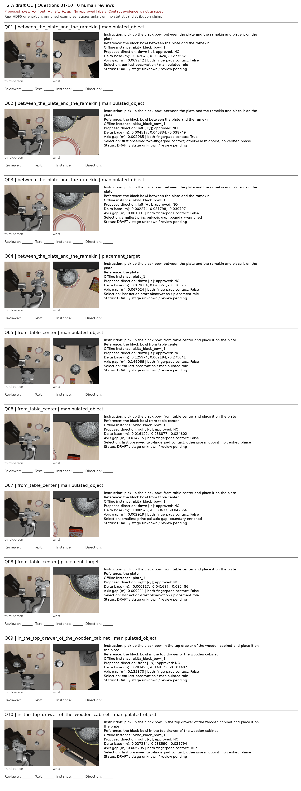

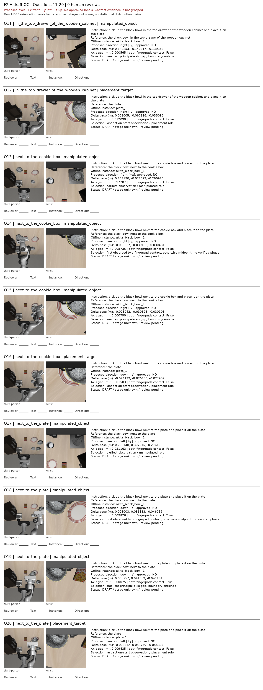

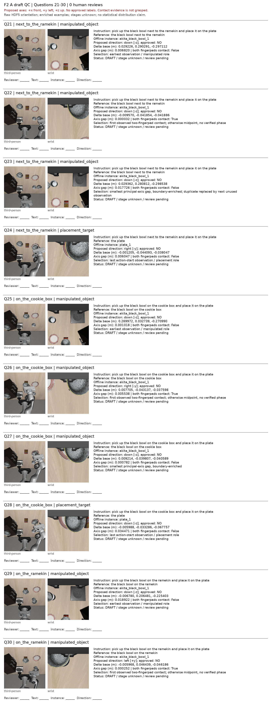

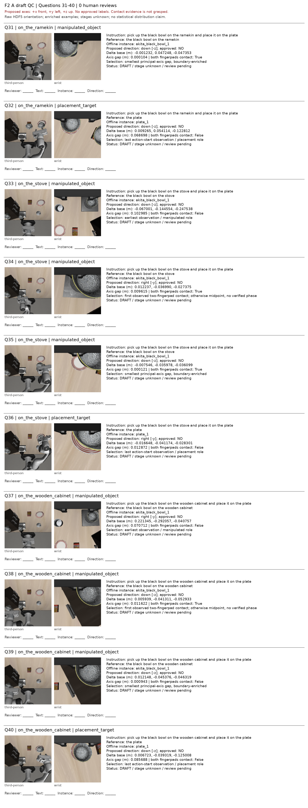

#### B：选样、特征合同和统计定义

[十观测及源图/副本hash对应JSON](review/b-observations.json) · [合同与既有统计JSON](review/b-contract-excerpt.json)。按原100观测清单的任务文件排序，每任务取**第一个同时已有两视图mapping和native-depth输出**的观测，共10个；没有按成功或特征数值选例，不声称语义阶段全覆盖。原始RGB从相同不可变HDF5的既有observation_row导出，逐像素校验；网格/深度PNG从已有文件逐字节复制，没有重跑教师或改变权重。100观测来源图与1,000观测统计的清单/合同hash分别保留，不混为同一分母。

合同摘要：固定FastVGGT commit `6526e275a29572653a034762bb3c6c9ce280ff55`，权重SHA256 `b08a43baa2db1aad9718e71e098831b8ad32f6f6826c802e9eb714aa34420969`；每次B=1/V=2，当前raw 128²图，教师518²/patch14，学生224²/patch14。取教师末端第24层聚合输出（0-based23，返回列表索引3），每视图排除5个特殊token后37²稠密网格，FP32 bilinear/align_corners=False映射16²、存FP16，不预先L2归一化。merging=0表示从首块启用，ratio=0.9，恢复稠密位置不撤销聚合。此处教师第24层不混同学生拟取第12层输出。全部是pilot合同，生产reader与自动精确恢复尚未完成。

以下定义直接摘自既有`feature_qc1000.py`，本轮未重算特征：对每个观测i、固定视图v、256个位置p，读取映射后FP16目标并转FP32为aᵢᵥₚ，令uᵢᵥₚ=aᵢᵥₚ/‖aᵢᵥₚ‖₂，μᵢᵥ=(1/256)Σₚuᵢᵥₚ。

- **空间RMS**：每观测/视图计算sqrt[(1/256)Σₚ‖uᵢᵥₚ−μᵢᵥ‖₂²]；先对2048通道平方求和，再对256位置平均、开根，不再除以通道数。表中中位数取该视图1,000个观测的RMS。
- **跨样本平均方向cosine**：先将每个μᵢᵥ单位化为mᵢᵥ，再计算mᵢᵥ·mᵢ₋₁,ᵥ。原脚本按分片首次出现及片内manifest顺序收集，当前写入顺序与manifest相同；`np.roll(...,1,axis=0)`使第一条与最后一条也配对。不是全配对或独立随机样本估计，包含时间/任务关联及任务边界，表中为这1,000对的中位数。
- **补充空间shift127 cosine**：对展平256位置序列，将u循环移动127个位置后与原位置点乘，汇总该视图全部观测/位置的分位数；不代表二维相邻patch相似度。

| 1,000观测既有统计 | 第三人称base | 腕部left_wrist |
|---|---:|---:|
| 跨样本平均方向cosine中位数 | 0.9934 | 0.8912 |
| 单位方向空间RMS中位数 | 0.2083 | 0.4636 |

高平均方向相似度不等于每个位置恒定；非恒定也不证明监督有效。这些描述性指标没有有效性通过阈值，不据此换教师、加权或新增探针。网格图蓝线为原图坐标中的教师37×37边界，红十字为学生16×16中心；保留raw OpenGL方向。已有深度图按**每张图自己的2%/98%分位数**映射灰度，不能跨图比较灰度为统一米制深度，也没有GT深度精度验收。下列源RGB为真实128×128内容，可点击PNG查看；网格512²、深度518²。

**B01｜原100观测索引 0** — pick up the black bowl between the plate and the ramekin and place it on the plate

| 视图 | 原始RGB | 双网格 | 原生深度可视化 |
|---|---|---|---|
| base_0_rgb | 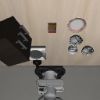 | 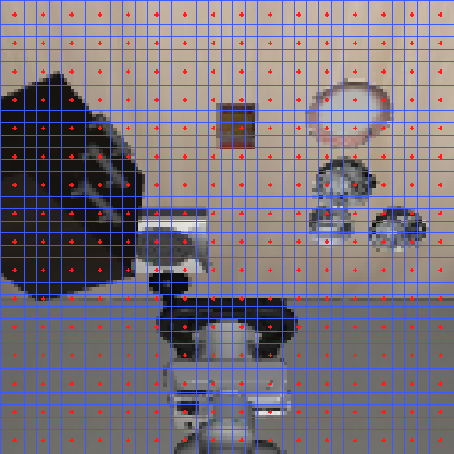 | 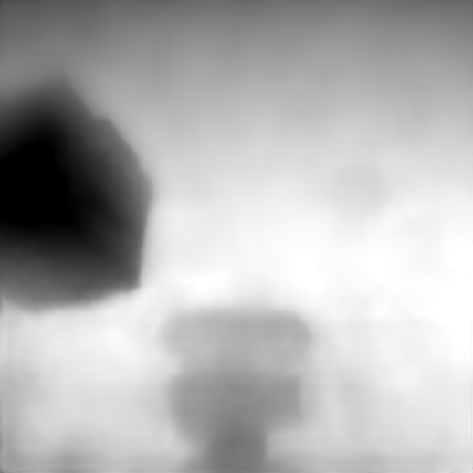 |
| left_wrist_0_rgb | 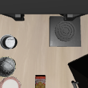 | 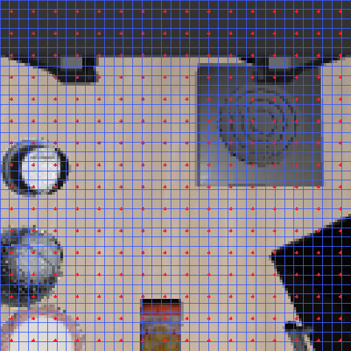 | 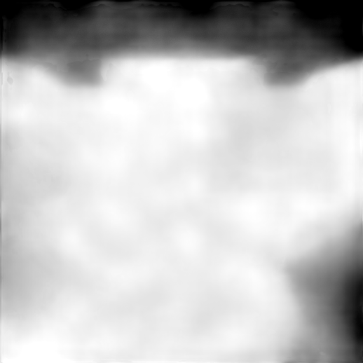 |

**B02｜原100观测索引 10** — pick up the black bowl from table center and place it on the plate

| 视图 | 原始RGB | 双网格 | 原生深度可视化 |
|---|---|---|---|
| base_0_rgb | 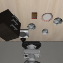 |  | 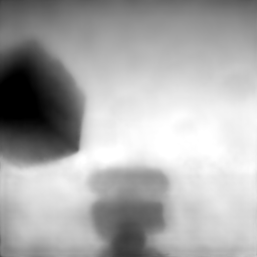 |
| left_wrist_0_rgb | 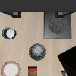 | 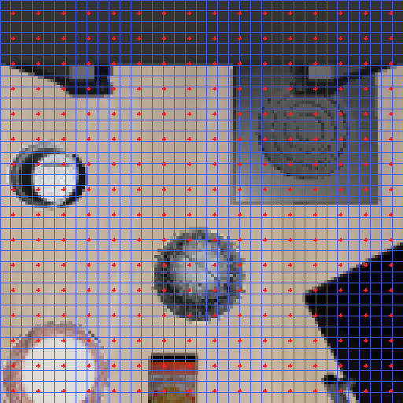 | 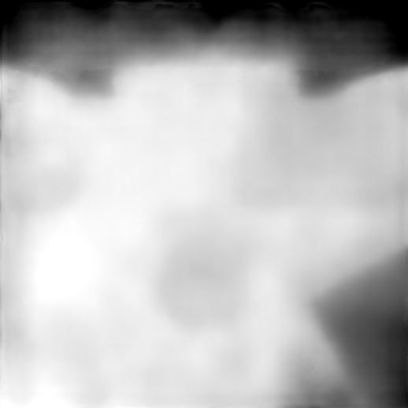 |

**B03｜原100观测索引 20** — pick up the black bowl in the top drawer of the wooden cabinet and place it on the plate

| 视图 | 原始RGB | 双网格 | 原生深度可视化 |
|---|---|---|---|
| base_0_rgb | 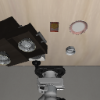 | 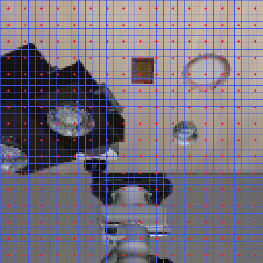 |  |
| left_wrist_0_rgb |  | 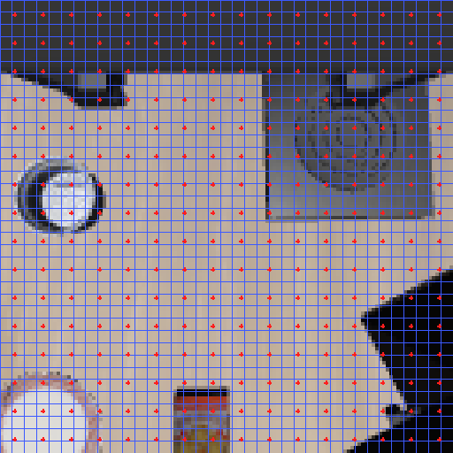 | 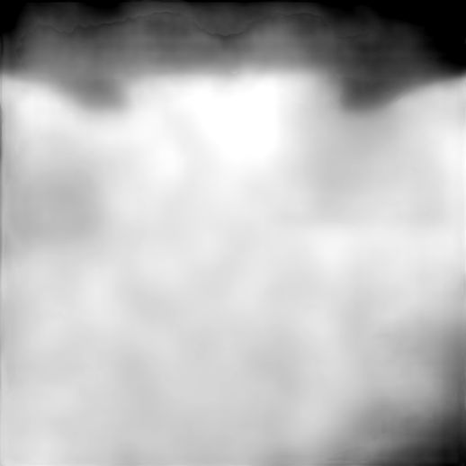 |

**B04｜原100观测索引 30** — pick up the black bowl next to the cookie box and place it on the plate

| 视图 | 原始RGB | 双网格 | 原生深度可视化 |
|---|---|---|---|
| base_0_rgb | 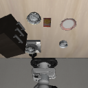 | 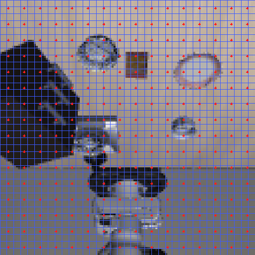 | 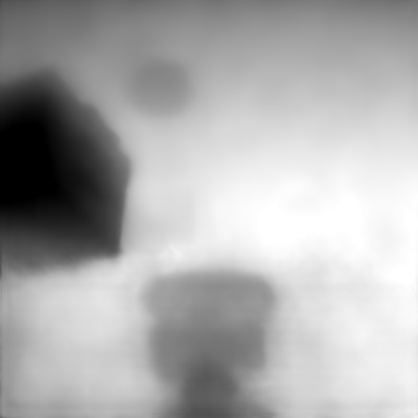 |
| left_wrist_0_rgb | 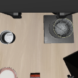 | 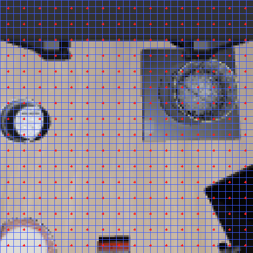 | 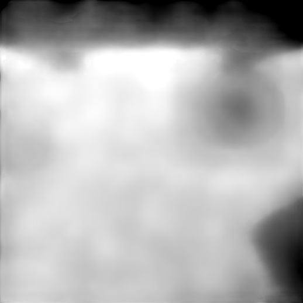 |

**B05｜原100观测索引 40** — pick up the black bowl next to the plate and place it on the plate

| 视图 | 原始RGB | 双网格 | 原生深度可视化 |
|---|---|---|---|
| base_0_rgb | 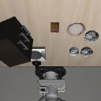 |  |  |
| left_wrist_0_rgb | 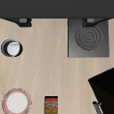 | 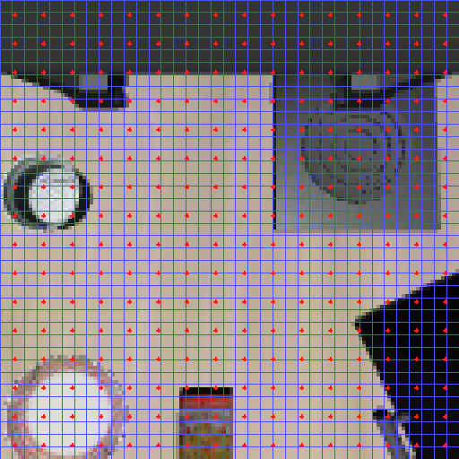 | 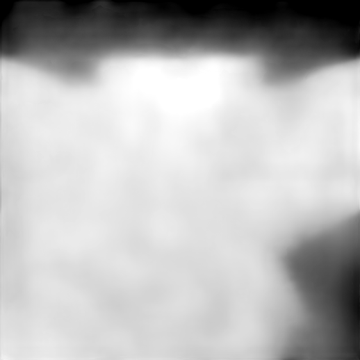 |

**B06｜原100观测索引 50** — pick up the black bowl next to the ramekin and place it on the plate

| 视图 | 原始RGB | 双网格 | 原生深度可视化 |
|---|---|---|---|
| base_0_rgb | 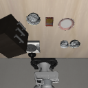 | 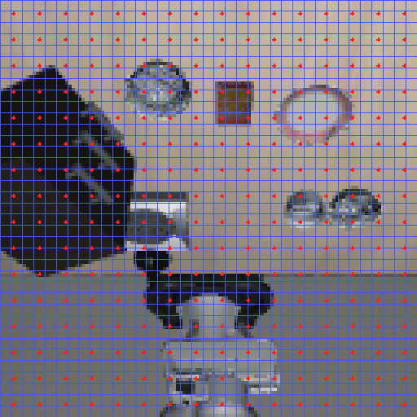 | 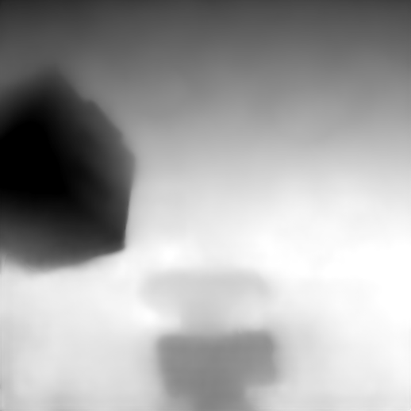 |
| left_wrist_0_rgb |  | 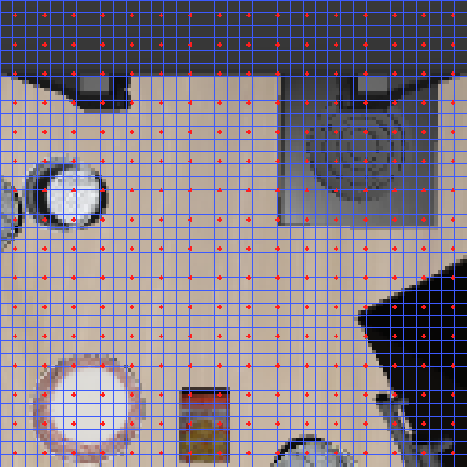 | 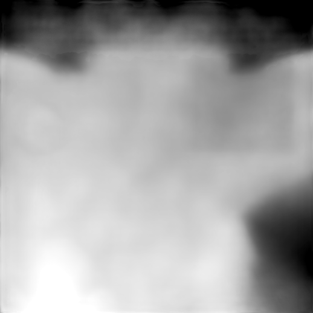 |

**B07｜原100观测索引 60** — pick up the black bowl on the cookie box and place it on the plate

| 视图 | 原始RGB | 双网格 | 原生深度可视化 |
|---|---|---|---|
| base_0_rgb | 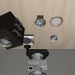 | 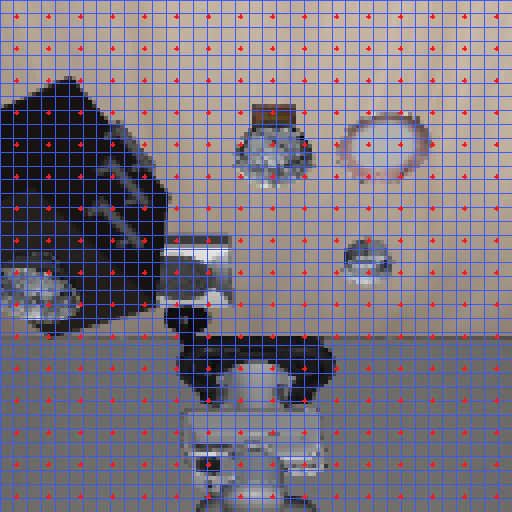 | 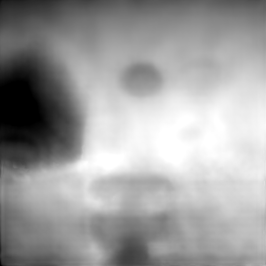 |
| left_wrist_0_rgb | 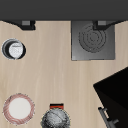 | 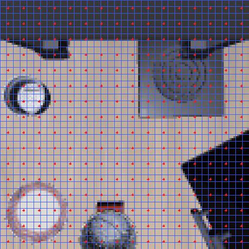 | 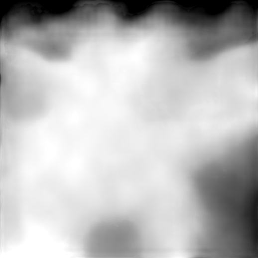 |

**B08｜原100观测索引 76** — pick up the black bowl on the ramekin and place it on the plate

| 视图 | 原始RGB | 双网格 | 原生深度可视化 |
|---|---|---|---|
| base_0_rgb | 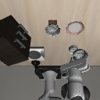 | 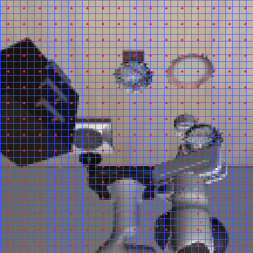 | 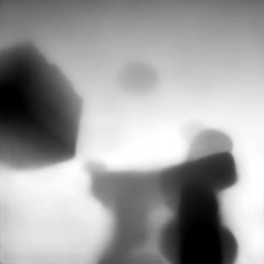 |
| left_wrist_0_rgb | 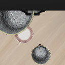 |  | 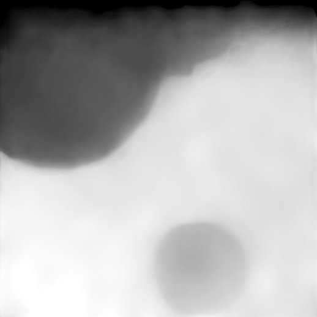 |

**B09｜原100观测索引 86** — pick up the black bowl on the stove and place it on the plate

| 视图 | 原始RGB | 双网格 | 原生深度可视化 |
|---|---|---|---|
| base_0_rgb | 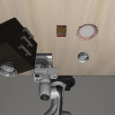 | 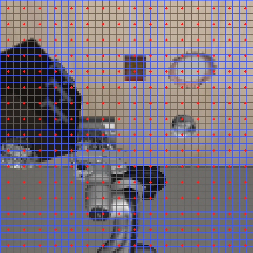 | 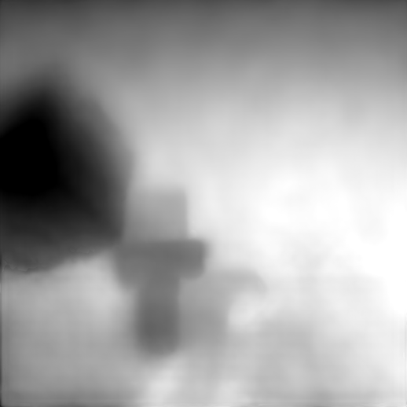 |
| left_wrist_0_rgb | 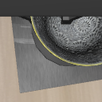 |  |  |

**B10｜原100观测索引 96** — pick up the black bowl on the wooden cabinet and place it on the plate

| 视图 | 原始RGB | 双网格 | 原生深度可视化 |
|---|---|---|---|
| base_0_rgb | 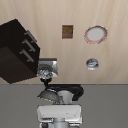 |  |  |
| left_wrist_0_rgb |  |  |  |

#### 发布核验与恢复边界

本机导出入口`export_review.py`仅处理授权副本，退出0：40题唯一键、审核栏空；10任务各1观测/两视图，20张raw RGB逐像素一致、44张现有PNG逐字节一致（A4+B网格/深度40）。共64个PNG及4份JSON，约7.02MB，无新模型/仿真/GPU作业。原件、完整试标和50个试缓存分片继续保留，不覆盖或搬迁。

本轮下一步仅等待对已发布材料的审阅；A参考点/边界/轴/抓持规则和B质量仍待采用决定。生产reader及自动恢复是全量前工程任务，未实现、不冒充可运行接口。本轮不重复实验，后续无新任务时不循环检查等待状态。文档/副本的格式、敏感内容、Git范围及推送后远端逐文件内容核验结果记最终交接。

发布前实际验证：`export_review.py`与`verify_local.py`均退出0；64张PNG可解码、4份JSON可读取，40题唯一且审核栏空，B十任务来源/两视图文件齐全，导出hash、相对链接和敏感路径扫描通过；`git diff --check`退出0。fetch核对远端与本地起点均为`c2880139fc2255e5bf97fbe670bb4dbcaa296625`。推送后再以固定提交原始文件地址逐文件下载、核对SHA256和实际PNG/JSON内容，结果留本机发布验证回执及最终回复，不把本机检查冒充远端检查。

### 2026-09-11｜后续技术审阅、2 mm候选统计与生产reader pilot

负责人审阅共享交接后确认：原S固定样本KV排查正式收口，不重复同样本/同精度对照；现有物体root body原点、`gripper0_grip_site`、固定基座轴和米制单位作为标签定义采用；`+x/front、+y/left、+z/up`及相反方向作为命名约定采用。采用约定不等于40题或全量方向标签已通过视觉/人工QC，G1保持PASS。

对既有`f2-work/annotations/trial-50-v1/labels.jsonl`执行CPU-only派生程序`boundary_candidate.py`，没有重放轨迹、推进物理时间、访问未来成功或改写原draft。新版本`direction-candidate-20260911-v2`按“身份/状态有效 → 已绑定操作对象当前双侧fingerpad接触候选grasped → 六方向主轴gap”判定，2 mm（0.002 m）仅为审阅提出的candidate dead zone：gap小于阈值才判candidate invalid，接触优先于该死区。原始`labels.jsonl`未覆盖，新candidate全部`approved_for_training=false`、`valid=false`、`label=null`。

输入12,548个槽位/6,274个样本唯一键检查通过。候选结果为12,181/12,548槽位`candidate_accepted`、367个槽位进入`invalid_boundary_dead_zone`；其中操作对象6,118接受（3,969非接触六方向、2,149双垫接触grasped），非接触操作对象总数为4,125，其中156个进入死区；放置目标6,063接受；样本层按任一槽位无效回退为action-only候选，5,925样本两槽位均接受、349样本action-only。受影响367个题键及任务/角色/接触分布在本机`boundary-candidate-v2/summary.json`，该文件较大且不发布。候选类别计数为down5,488、grasped2,149、left1,573、right1,553、front1,411、back7、invalid367；这不是最终训练分布，也不构成类别平衡依据。synthetic接触优先/阈值边界fixture退出0；全量派生退出0。阶段unknown、人工审核0、获准训练标签0保持不变。

上述实现保留了待解释的恢复eef与原记录差异（最大0.676 mm），不把它硬修为零；接触代理不证明稳定承载或未来成功。后续至少300题人工三层QC仍为BLOCKED_HUMAN，需按`sample_id+slot_index+协议版本`去重，并分别审文本指代、实例绑定、方向标签。

按新规则生成了内部300题质检准备包`qc-300-prep`：保留既有40题，按任务/角色/接触/候选状态以稳定SHA-256顺序从其余固定试标槽位补260题；题键绑定`direction-candidate-20260911-v2`，300题唯一，human_reviewed=0、approved_for_training=0、stage仍unknown。该准备包只含索引/候选字段和空审核栏，没有新图片，不计为三层人工QC，也未上传完整标签。

B生产reader新增本机`f2-teacher/production_reader.py`，测试入口为`f2-teacher/test_production_reader.py`。它对现有cache1000-v2的50个20-row分片按唯一shard只计算一次hash和结构校验，按manifest row_index核对payload ID/shape/dtype/q/非有限值，`get_many`保持调用方请求顺序；reader不加载教师模型、不重提特征。原子`ExactResumeState`绑定contract SHA和manifest SHA，完成ID只在调用方成功读取后写入`.partial`再rename；恢复时完成集和待处理序列不能重排。对已有1,000行、50片完整校验以及逆序5样本读取通过：hash计算50次、payload加载51次、教师提取调用0次。实际结果`f2-work/interfaces/production-reader-result.json`，测试退出0。

### 2026-09-11｜候选标签统计与生产reader精确恢复

reader负面fixture均通过：错误shard hash、`.partial`引用和篡改manifest hash均显式失败；首次恢复测试发现并修复了待处理列表被错误改成manifest顺序的问题，修复后保持显式请求顺序，失败记录保留在本机命令日志。该reader是pilot级读取/恢复实现，不宣称已接入全量生成、train/val生产缓存或A/B训练；没有重新生成1,000观测，没有全量缓存，没有GPU作业。

本轮实际验证命令与结果：`boundary_candidate.py --self-test`退出0；固定50轨迹候选派生退出0；`qc_prep.py`生成300题内部质检准备包退出0（保留旧40题、稳定分层新增260题，human_reviewed=0、approved_for_training=0、无新图片）；`test_production_reader.py --cache-root f2-teacher/cache1000-v2 --output <本机结果>`最终退出0，并额外验证A→B→A重复请求的顺序与内容保留；`python3 -m py_compile`对新增脚本退出0；文档`git diff --check`待发布前执行。新增脚本/候选结果/QC准备包仅在工作区工程目录，不上传完整标注或特征分片。下一步进入真实人工QC与A/B独立模块实现准备；本阶段仍不启动真实小训练、全量缓存或F3。

本轮最终产物摘要：候选规则脚本SHA256=`ca1867d7eaecb828a7d923654fd1047a168d35ebcf5a7dacf610dd36cefedefa`，候选协议SHA256=`db00be577d5593956c791914fae632b13eaf3544c43e66517613e936c38cb1bb`，candidate_labels SHA256=`8d844391caa85bb37df517fbcedd1338885285a3dd829b2635a21007f26ec71e`，候选summary SHA256=`8801f4b9ed1d715894e09bbe8c0fd28887ca7f7c91e4b0708fa7f7863b2b71c2`；reader脚本SHA256=`9df6ad1581ba9313752612c5d6fb6b42243af61f6a5596fa61e6229f609eb711`，reader测试SHA256=`3def4a9232300e07cd1db3b20aff3207aecb51d8ae7c434c2394682db7ead1c8`，测试结果SHA256=`e5dd03a33001a68f72884d78e8a0d1c3742893480fc64cbbe81ced8da7493963`；QC准备脚本SHA256=`f8754fa5df67ba1848c5aed02d5b26aa5b2626e474b434336c908c2ef1283797`，300题准备JSONL SHA256=`9bb180777b4b72aa9960ef6c83f6a056210ae8aa695c2fe2c014cd8032c7eced`，准备summary SHA256=`45813a20080dcc254a61aaa26c06394cf39347b58a6ad85ffa01ad6fcd5ee815`。最终GPU只读快照显示0—7均14/15 MiB、0%利用率，所有F2子作业已退出；没有活跃训练/教师/仿真进程。初次reader测试的两个失败（恢复顺序断言、临时目录mkdir）均保留于本机命令历史，修复后回归退出0。

### 2026-09-11｜A/B独立实现接口测试与真实B梯度检查

A独立实现位于本机`f2-work/a_module.py`：`DirectionSequenceBuilder`保持S的原Action段，A启用时将完整候选方向序列置于同一因果后缀，方向/动作loss mask和next-token target同步移位；无效监督返回action-only，不插假答案；`DirectionTrie`支持多token候选和完整边界；方向非法由`plan_action_only_fallback`返回全新的action-only prefill计划，半段方向token仅作为被丢弃记录。`test_a_module.py`合成CPU测试退出0，覆盖A关闭等价、multi-token、overflow拒绝、trie边界、回退和分样本损失分母。`test_a_tokenizer_real.py`使用固定本地tokenizer退出0：七类中`grasped`编码为2个子token，其余为1；S前缀长度51、Action段7 token，A关闭的token/mask逐项一致，加入`left,grasped`后Action段仍逐项一致；没有读取真实方向标签或训练。

B独立实现位于本机`f2-work/b_module.py`，只 gather审计的真实视图span `[0,256)`/`[256,512)`，不取占位`[512,768)`；FP32归一化/余弦按每样本有效位置均值再batch均值，教师stop_gradient，投影头为LN→Linear(1024)→GELU→Linear。`test_b_module.py`合成CPU测试退出0，覆盖q=0目标不变、均匀权重、学生/投影梯度和教师零梯度。

为取得真实学生第12层输出，在dirty的`upstream/openpi` checkout给Gemma `Module.__call__`增加可选`return_layer`路径：默认路径保持原行为；捕获路径在同一次层scan中只保留目标层输出，返回的是第12个Transformer block输出（0-based代码索引11、最终norm之前），没有保存全部层。当前dirty源码`gemma_fast.py` SHA256=`4b46624557fe4875499bc8599577b3cdebc35880f0ebd67e076861f643aa734f`，基线implementation commit仍为`16295beccf737e1e180718fe78af963cd8707999`；不向上游远端提交。默认S路径未改其调用参数/行为，后续F3仍需公共路径回归。

在物理GPU5（启动前两次14 MiB/0%/P8检查）运行`test_b_real.py`，最终作业退出0；前面四次尝试均在真实学生前向前失败并保留：reader导入路径、1步cosine日程、manifest无split字段、单样本目标缺batch维。最终只执行一次真实学生前向、一次反向和一次临时内存optimizer更新，未保存checkpoint，未读取A标签，教师提取调用0。

真实结果：sample为data-v2首样本，教师合同SHA256=`a804b68badfa14c2085b86d9f2249138c2f4a77c57b3a12f6a4b54b40f378b09`；目标单样本`[2,256,2048]`经batch包装后接入，q有效计数512；学生层输出`[1,896,2048]`，Gemma depth18，真实两视图spans和占位排除均符合trace。alignment loss=1.0069363，反向wall约22.83秒；十个共享LoRA叶子梯度均非零（最大约0.01158），projector梯度全局范数1.08560；临时更新后LoRA参数最大差异0.02417，冻结参数最大差异0。该证据证明本批alignment loss确实能到达共享LoRA并且B的真实视图/第12层接口可运行，不证明教师监督有效、连续训练稳定性或四组公平性。

本批A/B测试和实际单批更新均为接口/诊断，未形成可比较模型，未改F1 checkpoint、production BF16或科学协议；GPU5作业结束后的宿主快照为14 MiB/0%/P8，无活跃相关进程。A/B公共训练入口、训练恢复与投影头导出仍待集成；至少300题人工QC、B连续小训练、全量train/val缓存、SB无教师导出和F3仍未完成。

本批新增实现当前hash：`a_module.py`=`9b74c24a294da3ee83ac46b6338099be648a58398d893778aebb6b0cd42ca34d`，A合成测试=`53b4b76e76fae0c4333ad724524ffaf7b838e410b2e03b31aa479af7c2397e10`，A真实tokenizer测试=`6834eb98ac053aaffc214c33f3ad4ca60f65e979064328154a2616d5dcd8e832`；`b_module.py`=`0f1d6812fd7a1b563a1f8a9d61f249203f68901c401935b86369db7e04c059c9`，B合成测试=`171721bf99b67182dd22e20aff88f2fde468af28bfda450509e3dd959c0fdc92`，B真实测试脚本=`802b4cbee49305f251e415b8697d1527bf6622648be7e145e71403bf00bb01d6`，B真实结果=`e7a5faf0f4934df04e7f476579ec45f46babd9fa081d4c3ab95a8ac04c01763b`；dirty Gemma源码=`4b46624557fe4875499bc8599577b3cdebc35880f0ebd67e076861f643aa734f`，其diff证据=`f2-work/interfaces/gemma_fast-layer-capture.patch`（SHA256=`b08a82e5c7fbc15e653d0f6813b0408f6280ac438ba87ec6958439d5a9856003`）。这些实现和原始结果只保留本机，Vault仅发布本阶段文档摘要。

### 2026-09-11｜固定300题图文审阅与SA/SB入口恢复回归

本轮不重新生成或发布QC图片；固定的300题图文包仍为`review/qc300/`，当前审核数保持0。只在阶段日志明确审阅列：后续QC使用`qc_rule_version`及其`candidate_label/candidate_status`，旧`protocol_version/candidate_direction`仅作历史追溯，不可直接作为训练标签。已核对的分项口径保持：非接触操作对象4,125个，其中3,969个候选接受、156个进入2 mm死区；不修改原始labels或上一轮统计。

**SA/SB可执行诊断入口：**新增本机`f2-work/train_ab_diagnostic.py`，复用F1的`init_train_state`、数据pipeline、冻结过滤和Optax超参，并按`--variant sa|sb --mode run|resume`做输入校验。SA在固定三步schedule上使用synthetic方向`left,grasped`，真实模型前向中两槽位的顺序/分隔/动作段均进入同一loss；不读取A candidate/QC标签。SB使用已有cache覆盖的实际schedule `[0,44,89]`，同时计算非零动作loss与`0.1 * alignment_loss`，投影头与共享LoRA分别进入临时优化器；不扩充cache或读取未来信息。该CLI是F2 bounded diagnostics，不是正式效果训练入口。

SA `run`在第1—3次有效更新均完成，第2步保存完整诊断检查点；独立`resume`进程从第2步恢复并完成第3步。恢复后的sample index/ID、action/direction loss、LoRA trainable fingerprint和model optimizer fingerprint与run第3步逐项相同，外部比较脚本退出0。SA有效更新总数3，checkpoint写入1，resume执行1；无真实标签、无正式模型。

SB `run`在第1—3次有效更新均完成，第2步保存包含LoRA、projector、两个optimizer状态、step、schedule和RNG的诊断检查点；独立`resume`从第2步完成第3步。恢复后的sample index/ID、动作loss、alignment loss、LoRA/模型optimizer/projector/projector optimizer fingerprint逐项相同，比较退出0。SB第1步动作loss=15.3125、alignment=0.996945；第2步14.0/0.998881；第3步14.5625/0.991707；这些是接口诊断数值，不是收敛或效果结论。SA/SB检查点分别约266 MB/311 MB，均不进入正式主表、不覆盖F1 checkpoint。

恢复实现过程中保留并修复了真实阻断：SA首次保存使用相对路径被Orbax拒绝；随后发现Optax内部NNX State和namedtuple经直接恢复丢失类型，最终改为纯数组叶子加当前tree definition重建，v5恢复通过。SB首次使用cache未覆盖的索引50/12345而显式KeyError；第二次误用inference_batch使动作mask全0，动作loss=0，均未计为通过；改为带真实动作后缀的training_batch并按实际缓存sample_id重跑v3后通过。失败registration和不完整目录保留，不把失败尝试隐藏成成功。

**受影响公共S路径回归：**`test_public_layer_regression.py`在同一基础权重/真实训练样本上比较Gemma层捕获关闭与开启但不引入B损失的完整路径，最终pre-logits/logits/action loss差异均为0；替换一个有效动作后缀token后，层12视觉prefix 512 token最大差异和RMS也均为0。捕获输出为`[1,895,2048]`（前向去掉最后预测位），退出0；不读标签、不更新参数、不保存checkpoint。该结果支持当前可选层捕获不改变公共S路径，同时A/B正式入口仍需统一集成回归。

**A真实路径补充：**此前真实模型诊断继续保留一个公开前缀→受限七类方向生成→动作生成，以及受控错误→新action-only prefill；本轮没有重复同一生成。现有结果仅支持方向候选`left`和回退确实执行，正常/回退动作均返回严格`invalid_coefficient_length`；该错误按策略失败记录，不补零、不截断，不声称A完整推理通过。SA三步入口的两个synthetic槽位进一步覆盖了真实模型输入顺序和动作边界，但不替代自回归双槽位方向预测验收。

本轮实际验证：A/B helper合成测试、固定tokenizer smoke、QC准备包唯一性、生产reader回归、SA/SB三步run/resume、公共S层捕获回归均有退出0记录；所有GPU作业结束后宿主快照回到低占用，未留下本任务进程。当前剩余任务是：至少300题真实人工三层QC；将bounded诊断逻辑整理进正式共享SA/SB训练入口并保留动作/方向/对齐独立分母；A正式双槽位生成/回退回归；SB无教师导出；连续小训练；全量train/val缓存；F3四组集成与G2冻结。当前不启动正式长训练。

### 2026-09-11｜固定300题图文QC包与真实A生成/回退

按已固定的`qc-300-prep`集合导出F2审阅材料，没有重新选题、重放轨迹或生成新标签。每题从与candidate相同的train manifest `observation_row`读取两路128×128 RGB，按10题一组生成30张可读PNG，并生成一份300行`qc_questions.jsonl`和`index.json`；两路原图逐题读取校验600/600，30组PNG均可解析，所有审核栏为null，`human_reviewed=0`、`approved_for_training=0`、stage继续unknown。输出目录为`review/qc300/`，未包含HDF5、全量标签、权重、教师特征或内部路径。该材料现在可供逐题审阅，但发布不等于QC通过或训练许可。

本机导出验证退出0：固定300题唯一键、40题历史保留、10个任务均有样本、候选状态/接触/参考点字段齐全；30张分组图逐一解码。已抽查首组、中间组和末组，第三人称/腕部图与右侧字段可读，审核空栏和`candidate=invalid/grasped`状态清楚。完整文件hash与来源hash写在`qc300/checksums.json`和`qc300/index.json`，不把27 MB发布包的大小当作质量证据。

A真实模型诊断使用基础权重、固定公共原始指令/两路RGB/8维状态和全七类候选Trie，不读方向标签。模型自回归生成了完整合法方向候选`left`（token IDs `[1672,108]`，末token为答案边界），随后将这段模型自身输出接到256步FAST动作生成。触发受控方向错误后，丢弃3个方向token并重新用原始77-token action-only前缀prefill，再次运行FAST动作生成；`fallback_matches_original_prefix=true`。两次动作解码均为显式`invalid_coefficient_length`，没有补零、截断或送入仿真；这说明真实方向→动作和错误回退路径确实运行，不能当作策略成功或动作格式已稳定。该作业在物理GPU4启动前两次检查，最终退出0、有效更新0、无checkpoint；结束后GPU4回到12 MiB/0%/P8。

A真实路径的原始动作token来自上游采样器的float32容器，但所有值为整数，诊断通过与公共服务相同的显式int32适配后才调用严格FAST解码；非有限或非整数值会直接报错。首次因未做该适配而产生的`invalid_token_shape_or_dtype`已保留，不将适配错误混入模型解码结论。当前模型生成仍有长度错误，后续A回归需修复/报告，不能声称完整A推理通过。

本批新增QC/真实A产物只在本机工程目录保留：`f2-work/annotations/qc-300-prep`为无图片准备索引，`f2-work/publication/export_qc300.py`为可复用导出入口，`f2-work/interfaces/a-real-result.json`和registration为真实生成/回退回执，`f2-work/interfaces/b-real-result.json`为B单批回执。A真实脚本SHA256=`75c8594ee01508dda0d08dd2645ec6425b2d571803cce942498c39b34db8211b`，QC导出包26,081,379字节；精确hash见本机registration，公开文档不上传这些完整运行产物。

本轮状态：A真实模型路径已验证但动作长度仍失败；B真实单批梯度/冻结已验证；固定300题图文材料已发布供人工审阅；A/B公共训练入口、训练恢复、连续小训练、全量train/val缓存、至少300题人工三层QC、SB无教师导出和SAB/F3仍未完成。下一步不重复统计、reader或KV诊断，先处理真实QC反馈并把SA/SB接入同一公共入口，按每条诊断路径最多5次有效更新的边界执行。

本轮新增本机产物hash：`test_a_real.py`=`75c8594ee01508dda0d08dd2645ec6425b2d571803cce942498c39b34db8211b`，A真实结果=`cffb1caa938db1e41bfcf8c946370a11bf834b34702ae47c01daea12743a01ee`，QC导出脚本=`d0e4852d3aa1c70aeede8e2c5414a25508b7a523b3fce81338415e17176b8ec6`，QC300 JSONL=`c7d5ed972bb084df51b36ad27fc484c63a5c158ab5c6f7c78611b2ed6e2c876e`，QC300 index=`9e08658e89c9a13113154f9f0dbd0d93c882b5681441626b889e764fd90279fa`。A首次动作解码适配错误保留在历史registration，修正后最终诊断退出0。

发布核验：固定提交`db7db0044f342bf1913aa8090c8a1763e6a90a53`推送成功，远端`main`指向该SHA；从GitHub raw地址实际下载F2 PLAN/LOG及review下全部文件共103个，合计33,166,692字节，逐文件SHA256与本地提交内容一致，退出0。QC300 30张分组PNG、300行JSONL、index/checksums均包含在这103个文件中；审核栏仍空，发布不等于人工QC或训练许可。

本轮新增诊断回执hash：`train_ab_diagnostic.py`=`bfb7c7224b128b1e931dc2f1a9ed5a7fb52a9314ee5f27b7ad145bc82a13da05`；SA run/resume=`ffb51b1adee76e0a623389d823ad17e7888e07ae319eab68d577f6a190459fb4`/`fd3df2213294cfb0f187fd3defec7588d12e9e1e79714441ab7cdff19b56b00d`；SB run/resume=`e9f7ed63bd99c5a8c8a2d11fad5c943d4aaf19bffcd952c48d1be42520785fb7`/`e3fdabbe28b242b782f7caa1df7943d0484c4545fae8892e781a7c820652d966`；公共S回归脚本/结果=`c789d43058609c559805501c2f7583c26654f60fb8f5e4f71629c60c29ea7848`/`880d143c6db69b54f08c5d6497f1dbb24c72878ce79e12960b26fc9001a5272f`。SA/SB诊断checkpoint目录约266/311 MB，均为本机diagnostics，不进入Git或正式主表；详细registration、失败回执和恢复路径留本机。

### 2026-09-11｜共享入口语义修正、双槽位/导出脚本就绪（GPU恢复前记录）

依据最新技术审阅，未重新生成300题图文包、未重复B单批梯度或原S KV诊断。将原`train_ab_diagnostic.py`实现整理到本机`f2-work/ab_training_entry.py`，旧文件保留为兼容包装；SA/SB仍由同一variant-dispatch入口调用F1 `init_train_state`、公共pipeline、冻结过滤、损失和保存/恢复代码。该入口当前仍限定三次有效更新及第2步诊断保存，不是连续训练或正式效果模型。

入口补上了两项实际合同检查：每个训练样本的action target/mask必须有正的有效token数，误传只含推理前缀的batch会在反向前显式拒绝；SB的共享LoRA与projector虽然保留独立AdamW状态，但模型和projector梯度先在一次联合全局范数裁剪中统一缩放，再各自执行一次更新，并共用同一有效步schedule。诊断checkpoint schema升级为`xiyuan-ab-diagnostic-checkpoint-v2`，旧v5/v3检查点不会被错误当作新裁剪语义继续恢复。动作、方向、对齐仍使用各自有效位置分母，未获准真实方向标签仍不进入训练。

本机CPU/静态验证：`ab_training_entry.py`与兼容包装的`--help`、全`f2-work`编译检查、A/B合成测试、零action-mask拒绝和联合clip数值fixture均退出0；两槽位Trie的49个有序候选、分隔/结束token和固定样本公开prompt长度检查通过；SB导出脚本的AST导入隔离检查通过，脚本不导入教师reader、cache或方向标签。新增脚本SHA256为：`ab_training_entry.py`=`4680fb3a64ae9f4b3d0b9975084915df5cfd5867cf9d87a3e4ad2b369f9b7ec2`、兼容包装=`ea6269498611346ce79651b274dbdb5f640e0cf6cbc1958f063977ff8078f65f`、A双槽位=`549bd2bcaa0efd49878f867075c89f23682026e1576d87c6ad582cc5ac34e095`、SB导出=`1ae6ad7a82aec0ea0c353141c73492a37221dbf66c832edadbea32053236f178`。这些代码和测试回执只在本机工程目录保存，不上传完整数据、权重、缓存或诊断checkpoint。

当时的沙箱会话再次检查`nvidia-smi`失败（该隔离上下文没有可见设备，JAX仅发现CPU），因此共享入口裁剪语义修改后的SA/SB新run/resume、真实A双槽位自回归和SB无教师导出尚未运行；不把上述CPU检查写成模型通过。此前v5/v3真实GPU回执继续作为旧语义下的历史证据，待恢复获授权空闲GPU后，以新schema重新做每路径不超过5次有效更新的有限回归，再比较保存/恢复。A双槽位脚本在本次CPU探测中按预期登记资源失败，registration保留为未运行证据；没有生成部分checkpoint。

固定300题QC图文仍为`review/qc300/`，审核数和训练许可均为0；本批不重新发布、不将GPT/自动检查计作人工三层QC。全量train/val教师缓存、连续小训练、F3/SAB集成和正式作业继续未启动。当时记录为“恢复GPU后已准备、待实测”的命令；后续实际结果见本日志的GPU访问定位和新版有限回归一节。启动时先检查GPU、已有进程和输出目录，禁止覆盖旧diagnostics。

### 2026-09-11｜GPU访问定位及新版有限回归完成

一次性只读定位已区分执行上下文：在当前Codex沙箱中，`/usr/bin/nvidia-smi`返回原始错误“无法与NVIDIA驱动通信”并退出9，`/dev/nvidia*`不可见，JAX仅列出CPU；同一节点的实际项目执行环境中，535.274.02内核模块、`nvidia`/`nvidia_modeset`/`nvidia_drm`/`nvidia_uvm`均已加载，8张RTX A6000及设备节点可见，`nvidia-smi`查询退出0，JAX backend=`gpu`且8个设备、Torch CUDA可用。结论是沙箱设备映射限制，不是驱动未安装的证据；未重装驱动、重启或修改全局CUDA/JAX。完整脱敏诊断摘要和时间保留本机`f2-work/interfaces/gpu-access-diagnostic-20260911.json`（SHA256=`8bd2589bfe99a04204c6e0b7402a6801cbe6118a2cd887cab3ac3a43c277ed47`）。

使用实际项目环境空闲GPU 0（启动/结束均核对占用；未触碰当时其他作业）完成了新联合裁剪语义的SA/SB有限回归。SA `run`三次有效更新并在step-2保存`xiyuan-ab-diagnostic-checkpoint-v2`，独立`resume`完成step-3；三步loss/action/direction分别为`21.375/17.0/14.6875`、`19.75/15.5/14.3125`、`18.125/13.875/14.1875`，裁剪前全局范数为29.2257、42.5947、25.0764，缩放为0.034217、0.023477、0.039878。恢复后的sample、指标、LoRA指纹、优化器指纹及裁剪数值与run第3步逐项一致，比较退出0。结果`sa-run-v6.json` SHA256=`6dc8a0009bd80b31f323cc79c2d6ea39da8ed2dd9365dd44060135f5de6f1b26`、`sa-resume-v6.json` SHA256=`d52ae2fe3aaa81aedab00f05dc060297b911f8a75237922f7ae672a9f8cebf1e`。

SB同样三次更新、step-2保存、独立step-3恢复；三步总loss/action/alignment分别为`15.412194/15.3125/0.996945`、`14.099895/14.0/0.998946`、`14.661682/14.5625/0.991820`，联合LoRA+projector裁剪前范数为26.7692、19.9219、17.7917，缩放为0.037356、0.050196、0.056206。动作和对齐损失均实际进入同一更新，LoRA、projector、两个optimizer状态及sample顺序恢复逐项一致，比较退出0。结果`sb-run-v4.json` SHA256=`0945e3b59a82afd5558e5a91c2ff29ae0ee0905a37ebcd244f1263ceba64b152`、`sb-resume-v4.json` SHA256=`4047f062a9b5f45fa8f6adf5fe21f2c4fe4c23bf63a6d04d6d824ad522992d4b`。这些仍是bounded diagnostics，不是连续训练或效果模型。

真实双槽位A路径在同一公开输入上完成一次无更新诊断：模型在一条自回归流中生成`left; up`（49个有序候选中的一项，5个方向token，公开前缀加方向长度90），第二槽位承接第一槽位输出后才进入256步FAST动作段。动作token为float32整数容器，按公共适配显式转int32；FAST结果为`invalid_coefficient_length`，没有补零/截断，也没有因动作失败触发重试。另以独立受控方向格式错误丢弃4个半段token，action-only前缀恢复为原85-token前缀并重新prefill；该回退不是动作失败重试，回退动作同样严格记录其解码状态。脚本SHA256=`9da056b3e131e1025af6a9a257a076d38f93e93f9a1e50192ee7c3dc8c9c9042`，结果`a-real-two-slot-result.json` SHA256=`eebf86ed89b1c4e17157b36eea107b9fc0f635938302ff4a8730a0b99297edd1`，退出0、无checkpoint、无标签读取。

SB无教师导出完成：首次运行发现并保留了样本ID应从manifest record读取的脚本错误，无partial导出；修正后从SB新schema step-2诊断checkpoint导出仅含外部base引用、学生trainable参数和公共logits指纹的导出物。导出公共logits shape为`[1,127,257152]`，fingerprint=`d86e9dab69a87dcfd9a0d3f6fff634f5adfb74c12bd89f012e97e49dc086bc26`；独立新进程在不导入teacher reader、不读取cache/projector/方向标签时加载导出，禁用字段为空，fingerprint逐字节一致，退出0。导出和验证结果SHA256分别为`7ecb9fae365d45378875bb7329001c8298446d09392f7ce867fefa8ef060e6de`与`6fb11d76bc1f928979e6a5f6e5d6d8242d005f8c11f323fc2b1b7a4adc06f670`，脚本SHA256=`407da4ec4772b34cc44ec762401a0d6d0d0ca307e7b71ec7b5c6708e5f8a3b88`。

本次新增实测均为非正式效果比较的有限诊断：SA/SB各3次有效更新、A双槽位0更新、SB导出0更新；其中SA使用合成方向监督，SB使用真实动作和教师特征。GPU作业结束后已释放，未启动全量缓存、连续小训练、正式效果比较或F3/SAB。固定300题图文包继续保持`human_reviewed=0`、`approved_for_training=0`，人工三层QC仍为BLOCKED_HUMAN。此前记录“已准备、待GPU实测”的命令属于当时状态；本节记录了其后实际执行结果。F2剩余边界是人工QC、完整可信标签/缓存、正式全数据SA/SB入口及小训练，完成后再进入F3。

### 2026-09-11｜真实数据入口与教师生成恢复接入（未启动连续训练/全量提取）

根据后续技术审阅，未新增模型诊断或重复GPU补测。现有`f2-work/ab_training_entry.py`（当前SHA256=`81880e9761ee1cf979e4882d5079a2848be7b5597a83f40d8cc453f4727f08b6`）继续作为SA/SB唯一训练实现，新增`--config-kind real`和`--mode validate/run/resume`：真实模式从显式manifest与split筛选样本，用稳定seed生成可保存的sample schedule，支持physical batch拆为等大小microbatch后按样本数累计梯度；动作、方向、对齐损失仍分别按有效位置归一化，累计后对LoRA与projector联合全局裁剪，再各自执行一次AdamW更新。诊断模式的synthetic方向、短schedule和固定非零λ不流入真实模式；真实SB的λ_B使用2,000有效更新warmup。SA真实训练需要匹配标签文件的文件级approval manifest和统一协议版本；批准版本内可靠槽位进入方向监督，明确invalid槽位以action-only保留动作，未批准、损坏或版本不匹配仍拒绝。

真实入口还明确了数据覆盖边界：SB显式`sample_pool=manifest`时若缓存未覆盖整个split会拒绝，不会静默缩小为pilot；只有显式`sample_pool=pilot --max-samples=N`才允许读取已有试缓存子集。CPU `validate`使用2个物理样本、1个microbatch、2步计划和3个cache样本退出0，首个microbatch的动作有效token数为21/18，保存manifest SHA、teacher contract SHA、schedule SHA和累计配置摘要；使用当前未批准candidate标签运行SA被明确拒绝（exit 1），使用不完整cache的SB manifest池也明确拒绝（缺54,682行，exit 1）。新增混合SA batch验证显示可靠样本方向mask为5、invalid样本方向mask为0，但两者动作mask均为正；同一approval manifest改为未批准后拒绝。验证结果`real-sb-plan-validation.json` SHA256=`feea21bdd3dcd80c0b54550ac76ac4aee811512660ec4bfd0e7d673b5872e11a`，拒绝日志与代码保留本机。

教师侧在既有`production_reader.py`中加入`GenerationShardStore`，而不是另建生成器：它按固定manifest顺序识别完整final、验证partial前缀、允许完整partial原子提升、拒绝完整分片覆盖和损坏payload，并在全部分片完成后原子补全manifest；`probe1000.py --resume`接入同一组件，固定selection/contract不一致时拒绝，默认pilot仍拒绝覆写既有输出。扩展后的`test_production_reader.py`继续验证原有cache1000-v2的50片、逆序/重复读取、坏hash/partial/manifest负面情况，并在隔离synthetic fixture中验证5行/2片的partial续写、完整partial提升、部分manifest扩展、完整覆盖拒绝和损坏final保留，退出0；未重新提取1,000观测或启动全量缓存。结果`production-reader-result-v6.json` SHA256=`0701b5efccee880f421ac945c713d3e65bc22d96b7abf63914e07f45d34b6056`，当前脚本SHA256分别为`production_reader.py`=`ce41d13690295c3a5a971071a14e8d5aaef72a7244bb05473de069bc74025616`、`test_production_reader.py`=`835f9a9a564e7793469169b54e8ebe0535e091c810c48d5eed69bd0a4a7fe4bb`、`probe1000.py`=`81a6788120ce3cbf54ceae187d2f28a0dde5d59be6cb87c74b1f33bf968b880a`。

本批仅完成入口/恢复能力和CPU合同检查：真实SA方向监督仍因300题QC未完成而不可用；真实SB全manifest也因缺少完整train/val缓存而不可用。没有运行真实模式模型更新，没有生成连续小训练checkpoint，没有生成全量train/val教师缓存，没有进入F3。固定300题继续沿用既有图文材料，人工三层QC和B网格质量采用仍为待人工事项。

按交接请求将现有`review/`目录原样压缩为本机`F2-review-20260911.tar.gz`（103个条目、30,865,103 bytes，SHA256=`80f3aaea9d9081d77236870db3c3dc21ff5b9ff8584a03e4bda838455e7898d5`），包含`qc300/`、对应JSONL及既有B图像/合同；未重新生成或修改其中材料，也未提交压缩包到公开仓库。

### 2026-09-11｜GPT技术复核采纳、完整A监督与B全缓存启动

负责人提供的审阅记录确认：固定300题已完成逐题GPT图文技术复核，规则计算与图文对应未发现共性错误；复核集合包含292个观测、50条演示、10个任务，操作对象186题、放置目标114题，候选`down/grasped/right/front/left/invalid`计数为72/63/25/16/14/110。`up`和`back`在该富集审阅集合中没有出现，不能宣称真实类别覆盖完整；QC037保留有限实例可见性；`grasped`仍仅是当前双侧fingerpad接触代理。B二十个视图（10观测×两视图）网格位置未见明显交换/翻转/裁剪错位，深度图仅支持粗结构可见、细粒度几何偏弱，不更换当前FastVGGT合同。该结论记录为AI辅助技术质检：`gpt_technical_reviewed=300`、`human_reviewed=0`，不写成真人盲审或真人准确率；完整摘要在本机`f2-work/annotations/qc-300-prep/gpt_technical_review.json`与`b_teacher_gpt_review.json`。

按已采纳规则，使用现有`trial.py`对原始data-v2完整manifest逐记录恢复`states[i+1]`并提取当前状态，train 450条episode/55,682个动作样本/111,364个槽位，val 50条episode/6,068个动作样本/12,136个槽位；两个split均原子提交`labels.jsonl`，时序错误为0，原draft不覆盖。`boundary_candidate.py --adopt`生成`direction-adopted-20260911-v1`版本：train有效方向槽位108,210、invalid槽位3,154、action-only样本3,071；val有效11,833、invalid303、action-only296。文件级`approval.json`绑定candidate/label/review hash并标记负责人采纳，invalid槽位`valid=false,label=null`但`approved_for_training=true`，训练入口按整样本action-only保留动作。完整A序列审计通过：train/val最大总长度均100（上限128）、无溢出、动作尾部0 mismatch；采用标签哈希分别为`5a2f86b6539bc478ce860af0bb5ffc26eba146434b4edff07259515eabdb5b81`和`d6e1677b338f2eedded7fc7d76b7eaae320deca01528bc57206fe751f4211fe0`，序列审计结果`a-sequence-length-audit-full-v1.json` SHA256=`8433744602cc54ab92c35080ca2ca8bb5f77379ff1345c3268a8bbe99b0fd6c9`。

为后续有限pilot固定500动作样本池：10个任务各50条，按完整train manifest稳定linspace选取，不因invalid删除动作；其中方向监督样本475、action-only样本25。清单`pilot-500-manifest.jsonl` SHA256=`67c8aa68036bf27468350f0c26998355f7462e58d8354767a2a1b534b2e632f6`，摘要`pilot-500-summary.json` SHA256=`710fe0dd924e6bbcae84bed50ad7ed690593caca3556356743df91080d028215`。该清单是pilot固定池，不进入formal主表。

教师全量缓存已在B质量审阅采纳后启动，未重复既有1,000观测：train作业登记GPU 6、val作业登记GPU 5，分别输出到独立`full-train-v1`/`full-val-v1`目录，使用`probe1000.py --count full --manifest ... --split ... --quality-review ...`和原子可恢复`GenerationShardStore`。启动时 train/val 尚未提交manifest，后续heartbeat显示已写入 train 720/55,682、val 400/6,068 观测（各20行分片）；这只是进行中状态，不是完整缓存通过。两条作业不读A方向标签、不启动学生训练；完成后还需逐ID覆盖、contract/hash、读回和无partial核验，任一失败停止相应作业并保留partial。

本轮没有启动3,000步pilot；需等待train/val缓存完整校验后，按固定500池、有效batch16、B前2,000更新warmup启动一次有边界SA/SB pilot。严格真人QC仍单独保持0；若最终交付要求真人盲审，继续标`BLOCKED_HUMAN`，GPT复核与负责人采纳不替代该事实。

### 2026-09-12｜按后续审阅继续全量缓存并完成SA pilot启动检查

读取负责人对提交`8cc1a08c30f93237fba699a75737eec516fa7d8a`的后续审阅后，按原selection/contract继续既有B全量缓存作业，不重复启动同名任务。val作业已写出完整`manifest.jsonl`（6,068行、304片，最后合法尾片为`0303`且8行）和`summary.json`；独立严格读回校验已在与教师作业相同的项目库路径中启动，未把`heartbeat.completed==count`单独当作通过。train作业仍在原GPU作业中推进，快照为18,680/55,682，尚未产生完整manifest；不覆盖已有分片或补重复尾片。首次从不含教师进程库路径的环境运行val校验时，`torch`导入因`libnvJitLink`读取失败退出1；失败保留，随后改用运行中教师进程的已确认库路径重试，属于环境库路径差异，不修改系统驱动或项目依赖。

固定500动作样本池的SA真实数据合同检查已完成：使用`ab_training_entry.py --config-kind real --mode validate`、pilot manifest、已采纳train方向labels及匹配`approval.json`，physical batch=16、microbatch=4、seed=0、计划2步且不更新模型；退出0。输出`f2-work/interfaces/real-sa-pilot-validation.json`，SHA256=`231c5ee6c5f8a2cd651dd2fb4a72eb0f08d73f1a8b4b9c7290cc7c9c84656985`。结果确认500个动作样本均保留，首个计划批次动作有效token数均为正，方向监督样本与action-only样本按批准版本连接；这不是GPU训练或学习效果证据。SB相同pilot合同检查待train全量缓存严格校验完成后执行。

当前仍未启动3,000步SA/SB pilot、连续训练或F3；待train/val缓存完成并通过逐ID、合同/hash、shape/数值和无partial核验后，在同一固定500池上各运行一次3,000个有效更新，再做相同20个开发单元闭环。上述pilot获得的GPT技术复核采用不改写为真人审核：`gpt_technical_reviewed=300`、`human_reviewed=0`继续保持。

### 2026-09-12｜val验收、train续跑与学生启动前发现的实际阻断

本轮按负责人后续审阅先查原作业，没有重新提取val或启动重复train。实际服务器上旧train/val进程均已退出；train旧启动器使用`timeout 28800`，无退出码文件或异常日志，停在1,659个final分片、旧heartbeat 33,160；不声称确定为超时或OOM。对照代码hash与原合同一致后，用同一`probe1000.py --count full --split train --resume`、原selection/contract/输出目录和已确认teacher环境恢复，当前限时57,600秒，日志及退出码单独保存，不覆盖原run.log。源码SHA256仍为`f50057d49fa04bf284e4a13d5a6df9b7dc637e2b4add77ca4fb77e17b294fcfa`；进程和精确环境留本机registration。

**val完成范围：**上轮启动的complete-resume已留下`RESUMED_COMPLETE_NO_TEACHER_EXTRACTION`、6,068观测、pending=0、重新提取0次。该分支调用既有`ProductionTeacherCache.validate_all()`；本轮复用该严格hash/shape/数值/读回证据，另与原data-v2逐ID比较file/episode/obs/state/action/raw hash和split、contract，6,068行全部一致，304片、最后8行及无partial检查通过，CPU命令退出0。manifest SHA256=`c7281cdf024ebc019ecfa4857a6cb58de6b103100401cec89554476e588c1bdb`，contract SHA256=`dfc72346e8e1d38a3cce3702d2cc7e51258f1ff7d9ff4a328a7a5e052bb38c40`。原registration已更新COMPLETE_VERIFIED。必须披露记录缺口：上轮complete-resume把原生成summary替换成恢复摘要，当前文件已无原逐样本耗时；本轮不再覆盖它，不凭恢复耗时推算原生成成本，也不伪造旧进程退出码。原始库路径失败保留。

**A受影响路径：**在固定pilot首样本上，调用真实`ProjectSPipeline`与现有`_make_sa_observation`做tokenizer对照（方向`left/up`明确synthetic，0模型更新），训练前缀55 token仅含原Task/State；双槽位推理脚本前缀85 token含两个问题和置于State之前的Answer标记。两者实际token不一致；训练Answer段位于因果后缀，但训练中没有对应问题。进一步按实际源码核对：`_constrained_direction_generation`仅返回tokens/meta，丢失所用cache；调用者随后调用`sample_actions`，后者执行新的prefill，而非接续原cache。错误回退传入的`prefix_tokens`也来自带问题的85-token前缀，所谓“与原前缀一致”只对比自身，并非原始指令下55-token的S前缀。

这三项违反已有训练/推理一致、一次prefill续写和真正action-only回退要求。因此历史`left; up`以及显式FAST错误仍是真实执行结果，但**不能再据此声称完整A路径符合协议**；F2相应待修复项恢复未勾选，G1和原S KV结论不动。实际对照退出0表示成功记录了不一致，不是A回归通过。审计结果`pilot-prelaunch-a-contract-audit.json` SHA256=`13c521fc8f00feb32067f00064cea36c4c3f72e154151a047f47efcff881ff14`；源入口SHA256=`8b04497f90ddf950525e90f73cc966a1c193d9c60f3caeeddac3aaa672f3236c`。原代码副本已按hash保留。旧最大长度100审计仍对旧打包成立，修复实际问题前缀后需检查受影响长度，不能直接复用旧结论。

**共享训练配置：**现有real分支为LR warmup=2,000、peak/end=`2.5e-5/2.5e-6`、weight_decay=`1e-10`；F1实际resolved config及现手册对应为1,000、`3e-5/3e-6`、`0.01`。B辅助损失的2,000步warmup与学习率warmup是两回事。现有真实入口还仅把训练行保留在内存，结束才写result，未落实本次要求的逐步落盘、心跳和耗时。配置对照`pilot-prelaunch-config-audit.json` SHA256=`80a35b46869c52f6b16460cdbb026d160e73f338acf8afbc4a9186936349ab03`；本轮没有悄悄改超参或启动学生模型。上述为现有入口的具体修复项，不新增方法、审阅数量或诊断模型。

统计口径同步：train样本级方向监督52,611/55,682（94.48%），action-only 3,071；标注有效槽位108,210，但整样本回退后实际使用105,222个方向槽位，另2,988个有效槽位随同伴invalid一起不参与方向损失。val对应5,772/6,068（95.12%）、296 action-only，实际方向槽位11,544，另289个有效槽位被整样本回退排除。500池是每任务50个动作起点，475样本方向监督、25 action-only；每模型3,000×16=48,000次曝光，平均96次/独立样本。这些均非准确率。

当前按“发现正确性异常，停止受影响学生作业并报告”执行：train教师恢复继续，val通过，学生0次真实pilot更新、0个本轮学习checkpoint、0个pilot开发回合。没有启动SAB/F3或正式作业，没有重复原S KV、旧三步GPU诊断或QC图文生成；本轮交接是具体阻断及恢复点，尚不是用户要求的pilot最终结果。

### 2026-09-12｜修复A公共前缀、缓存接续和真实配置，完成受影响回归

依照本轮审阅，未改A标签、方向语义、B教师合同或原S KV结论。`f2-work/a_module.py`新增唯一的`build_direction_prompt(instruction)`：只由当前原始指令生成两个固定角色问题，不带`Answer:`；训练`_make_sa_observation`与真实单/双槽位推理均调用它，`Answer:`、分隔和换行只由同一`DirectionSequenceBuilder`/候选Trie放在状态前缀之后。无效标签训练仍保留问题前缀并采用action-only；推理方向错误则另用原始指令构造S action-only前缀。

训练入口的real配置恢复为已批准公共设置：学习率`3e-5→3e-6`、学习率warmup 1,000、AdamW weight decay 0.01、β=(0.9,0.95)、eps=`1e-8`、累计后联合全局裁剪1.0；B辅助权重仍独立按前2,000次有效更新升至0.1。真实模式强制统一`max_token_len=144`，因为共享问题前缀下完整train/val审计各有2条129-token样本，旧128会溢出，144下0溢出。训练real入口新增resolved-config、逐更新metrics JSONL、atomic heartbeat和registration；这些诊断/试验产物留本机，不覆盖既有F1 checkpoint。

CPU真实tokenizer/入口验证：固定pilot 500池在统一问题前缀下训练/推理前缀84 token逐项一致，原始S action-only回退前缀55 token且与问题前缀区分；SA real `--mode validate`使用`max_token_len=144`退出0，结果`real-sa-pilot-validation-v2.json` SHA256=`de2350f76fd9f7c12e097915e6abf8ae33740332a150b519507a66cc83a4aae6`；A合成测试和全文件py_compile退出0。全量A打包长度审计使用同一真实tokenizer、train/val adopted labels及实际动作尾段，结果`a-sequence-length-audit-question-prefix-v2.json` SHA256=`15b7b437434a6b4387f9587c3c77d136b276821d7e309bef974f3e0a809397ab`：train 55,682/52,611方向监督/3,071 action-only，max/p50/p95/p99=129/109/120/123；val 6,068/5,772/296，max/p50/p95/p99=129/109/120/124；两 split 各2条超过128、各0条超过144，动作尾段0 mismatch。该审计覆盖完整清单，旧128报告保留为历史版本，不再冒充当前容量。

修复后的真实模型单槽位和双槽位回归均在空闲GPU各执行一次，0次更新、无checkpoint、不读取方向GT。单槽位生成`up`（5个方向token），双槽位生成`up; up`（8个方向token，49个有序组合之一）；两者均记录`cache_returned=true`、`normal_path_cache_reused=true`、`second_prefill=false`，动作阶段实际接续方向阶段返回的KV状态，动作生成预算为256。严格FAST仍报告基础模型的`invalid_coefficient_length`，没有补零、截断或动作失败重试；受控方向错误另用原始S 55-token前缀重新prefill，`fallback_matches_original_s_action_only_prefix=true`。结果分别为`a-real-result-v2.json` SHA256=`075d93fb6c71d3ad76fbb06d6e23d823aeb6c926a0eca9ce4e4078df1c541710`和`a-real-two-slot-result-v2.json` SHA256=`13734215c6af665672791b4f5bddc02ee7bbeeecfd695ca4758b9cb1cbfabb0b`；这证明结构、缓存和回退规则已复回归，不证明未训练基础模型的动作格式成功。

本轮没有启动真实SA/SB pilot。原因从“接口不符合协议”缩小为两个待完成前置：train教师缓存仍在同一可恢复作业生成，及需要再次检查B真实pilot cache contract；此前健康分片、val完整验收和当前train恢复作业均保留。进入pilot前还需用修复后的入口启动一次SB数据合同校验，确认train缓存完整且实际student loader读取；随后才可使用同一500池、seed/顺序、有效batch16各执行3,000有效更新。旧错误审计、失败和耗时缺口不覆盖。
