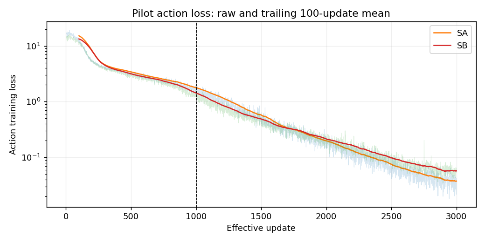
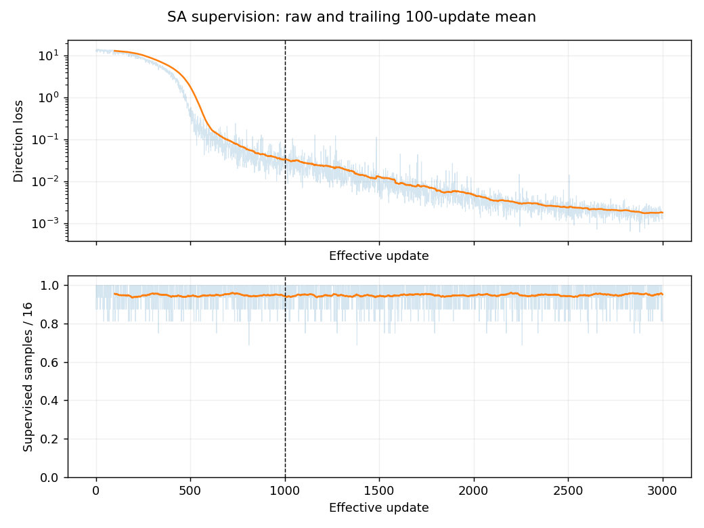
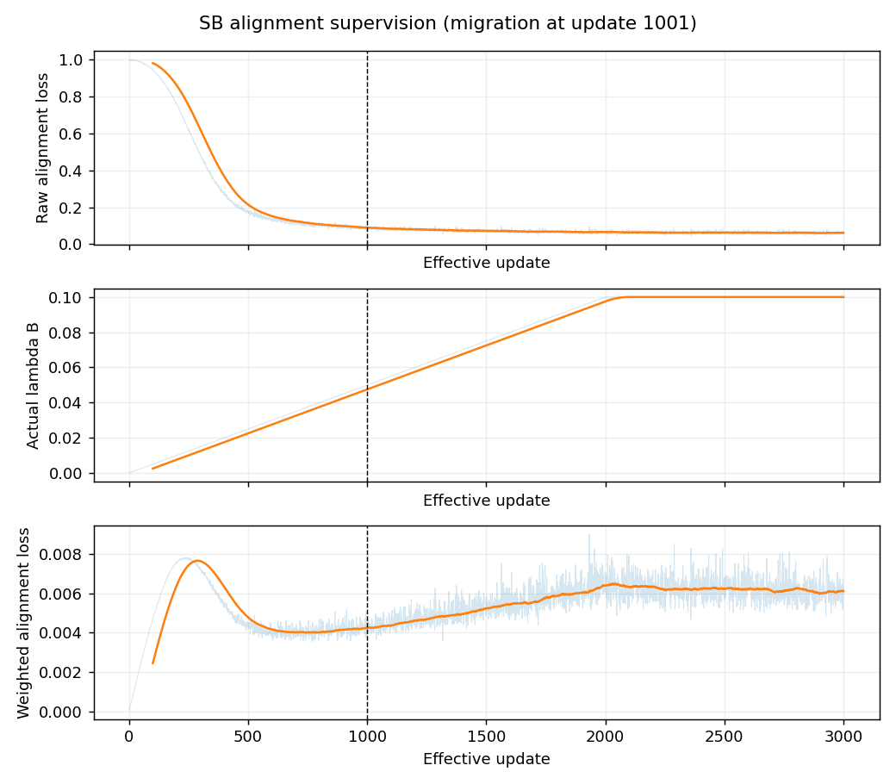

# F2：AB模块实现——阶段日志

## 当前进展

最后核对：2026-09-15（中期诊断已停止并交付）。**F2=IN_PROGRESS／未验收，G1=PASS；F3、SAB、四组400步/24 GPU小时继续未授权。** 本批预算4次加载/80生成/8批前向；实际4加载、60生成、6批前向。SA-1000加载后被诊断读取守卫误拦代码导入，0生成/0前向且未重载；其余三个checkpoint完成，3000结果复用。该错误是诊断工具缺口，不记作模型失败或完整执行通过。

自然动作格式：SA train1000未执行/2000为8/10/3000为8/10，val未执行/6/10/5/10；SB train5/10→10/10→10/10、val3/10→4/10→2/10。每时间点固定同10train+10val，按sample_id记录合法/非法转变。SA两个action-only训练例独立列出；零闭环，合法率不能替代控制能力。该小集合不证明唯一原因是过拟合、遗忘或λ，亦不证明A/B效果。

注册窗口382.137秒（含失败修正间隔，约0.10615 GPU小时），模型进程区间合计303.620秒，低于单卡1小时；本轮全部进程已退出，无训练更新或机器人评测。原有效SA/SB闭环0/20、服务回归、六checkpoint、监督与缓存均保持；GPT技术复核300题及human_reviewed=0保留，独立备份仍未确认。

下一步只提交本次部分诊断及首选后续提案：匹配既有SB的单个S-500参照，以区分共同小池/训练安排与B辅助条件影响，需另行技术审阅和训练/闭环预算批准。当前不执行新训练、不增加第五次加载、不自动补跑或恢复F3许可。SA1000缺失及三时点不能完整比较的限制明确保留。

## 执行记录

迁移时原占位记录（2026-09-07）：尚无本阶段实际执行记录。

### 2026-09-08｜F2计划细化与执行暂停

负责人接受F1收尾结论并提出F2推进顺序，随后明确要求“先完成plan，然后push，交给GPT审阅没问题再继续”。本次以最新指令为准：只交付待审计划和阶段入口，不将最初的实验推进授权继续用于当前执行。

开始时读取工作区/仓库规则、README、F1收尾和F2现有PLAN/LOG，核对文档仓库干净，HEAD为`d80775b1e91682b12f35605984c3abaa5d874c34`。现有工程HEAD为`16295beccf737e1e180718fe78af963cd8707999`，其未跟踪的规则入口保留。本轮不修改公共模型、tokenizer或训练入口。

暂停前已发生的操作如实保留：宿主只读查询显示8张RTX A6000，3张当时空闲；没有据此启动GPU实验或认领持续资源。教师侧只读源码检查及一次权重下载先于计划审阅发生，下载现已停止，退出130；本机保留707,600,384字节的`.partial`，没有完整教师权重或缓存验收。KV侧生成独立诊断草稿、编译检查退出0，但未做真实前向。源码提示默认计算/缓存精度为BF16，历史诊断将输出转换为FP32不能证明全程FP32；这只是后续受控诊断线索，不是残差归因结论。

本轮修改范围仅README及F2的PLAN/LOG：继承data-v2和F1基础；细化公共接口、逐记录状态试标、30—50问题首批材料、至少300问题人工QC、教师100/1,000观测及网格/分视图检查、全量缓存前置、A/B独立测试和小训练、F3交接边界。实验步骤均保持未勾选；没有新增管理文件、没有重分数据、没有改变科学协议或F1历史。README改为F2计划待审入口，F1既有阶段总结直接引用。

文档验证：`git diff --check`、相对Markdown链接存在性与计划未误勾选检查；三项均通过、退出0；此次仅文档改动，未运行模型或实验测试。Git目录归属检查使用临时精确路径配置解决，不修改全局信任。公开文档不含本机完整路径、GPU UUID、PID、私人规则、原始数据/权重或本轮未获发布授权的QC材料。

发布前核对：沙箱网络下首次`git fetch origin main`连接失败；切换获准的宿主网络执行后退出0。远端HEAD仍为本次起点提交，未覆盖远端更新；本轮只暂存上述三个文档文件并正常提交/推送，推送结果以最终交接中的远端核验为准。

### 2026-09-08｜方案审阅通过与首批授权

负责人审阅提交`51e53e809cee61a54604e0975ab17db5cdd08d26`后批准方案，要求定点修订后执行首批。已纠正第12层输出的编号（1-based=12、0-based=11），明确F2只做SB实际无教师导出、SAB组合留F3；补充演示内实例身份、固定参考点、不推进时间刷新、教师批次隔离、真实学生batch读缓存、QC去重和统计分母。原计划方法/质检数量不变，本批明确排除全量缓存及真实小训练。

公共接口源码核对：现有`AlignedHDF5Dataset`→`ProjectSPipeline.training_batch`输出`(Observation, actions)`，`train_s.py`显式限定F1，尚无A/B训练CLI。不能把手册schema草案直接传给该入口。本批先固定host-only监督连接合同，公共请求四键不变；A/B损失入口和单层输出仍标PLANNED，后续实现复用累计/冻结/恢复基础。data-v2清单、norm及spec登记的哈希已实际匹配，核对脚本退出0；原始源码指纹和接口合同留本机工程目录。

### 2026-09-08｜首批A真实状态材料、公共批次和KV定点结果

**A真实试标（DRAFT，不用于训练）：**固定每任务按数字排序的前5条train轨迹，共50条完整轨迹、6,274个动作起点、12,548个槽位，保留data-v2原sample_id。CPU逐状态提取实测65.45秒，无renderer/GPU；`states[i+1]`恢复后完整状态精确一致，`sim.forward()`不推进仿真时间。对象取已绑定实例root body原点，夹爪取`gripper0_grip_site`，基座取`robot0_base`；以BDDL目标操作数提供离线绑定证据，演示内不随位置重选实例，在线完整指代函数不接收GT。

几何有限且绝对值主轴非精确并列为12,548/12,548，这不是可靠标签覆盖率：边界阈值尚未采用，最小轴差约0.000000702米。草案轴符号计数为−z 6,604、+x 1,521、+y 1,895、−y 2,520、−x 8、+z 0；候选轴词映射为+x/front、+y/left、+z/up及相反方向，仍待审。双指垫接触证据2,149槽位，均在操作对象，不据此直接判grasped。获准训练标签、人审数均为0。

40个去重题目已从全集按早期、首次双垫接触（缺则中段）、最小主轴差和最后放置目标选出，覆盖10任务；题键为sample_id+槽位+协议版本，80张原图副本逐像素读回一致。它是有意富集边界/接触的审阅集合，不用于估计总体覆盖。阶段均保留unknown，选例代理不冒称已核定接近/抓持/放置阶段。另生成4张脱敏合图和配套40题表，审核栏空、明确DRAFT；公开发布另行申请，不把本机材料存在写成远端已可阅。

恢复夹爪参考点与原记录`ee_pos`存在非零差异：中位0.373毫米、最大0.676毫米；尚未归因，不随意放宽容差，不认定所有接触/边界方向可靠。该差异、对象绑定/轴语义、边界阈值和当前抓持判据构成本批集中审阅材料；A试标不改变动作样本或F1结论。

**公共输入和B读取：**2个真实样本经过已有学生`training_batch`及确定性预处理，三个相机张量均为[2,224,224,3]，第三占位attention仍为true；额外task_id、方向、教师特征、sample_id四类公共请求键均被拒绝。首次本机检查脚本因preprocess参数顺序写反退出1，纠正独立脚本后退出0，未改公共实现。3个KV固定样本另核对训练/推理prefix token、图像、state和image masks精确一致，prefix长度55/54/55与动作loss首位置对应，退出0。

实际已完成前向的trace记录三相机依次各输出[1,256,2048]，视觉总长768、文本容量128、合并长896，Gemma共18层；真实视图spans为[0,256)、[256,512)，占位为[512,768)。从100观测试缓存已提交分片取2个真实样本，逆manifest顺序按ID读取后接入现有学生训练打包入口，核对源图hash、视图、q、[2,2,256,2048]目标、[2,2,256]有效mask及上述真实视觉布局；缺ID/错源hash/错split/错合同均显式失败，检查退出0。这只证明实际数据打包和缓存连接，B loss/optimizer及SAB组合尚未实现验收。

**有限KV诊断：**同F1最终3,000步checkpoint、3固定训练样本、每样本9个logits位置，保持原权重数值、输入、位置与mask；比较计算精度，0训练更新。四个作业全部退出0，合计单卡进程占用250.46秒（约0.0696 GPU·小时，含加载/编译，不是kernel吞吐）。

| 受控设置 | 修正offset=0的suffix RMS（3样本） |
|---|---|
| 生产BF16路径 | 0.117986 / 0.168774 / 0.119567 |
| 模型计算FP32，原checkpoint参数dtype | 0.030730 / 0.032533 / 0.035901 |
| FP32计算与highest矩阵精度，原参数dtype | 0.028444 / 0.028727 / 0.032432 |
| 所有浮点参数转FP32并highest | 0.000035653 / 0.000020858 / 0.000030058 |

最后一项27/27 argmax一致、最大绝对差≤0.0003014；旧offset=1同设置suffix RMS仍为0.395376/0.461563/0.765549。该证据支持固定样本主要残差来自低精度计算路径，原位置修正仍必要；综合dtype控制不唯一归因到某一个embedding运算。不修改生产BF16、checkpoint或协议，不重评F1、不扩大容差。此S定点遗留项已有实质解释依据，不声称全输入逐位等价；A新增后缀/完整生成仍须在F3/G2前回归。

原始证据分别保留在本机A试标目录、接口检查目录和KV诊断目录，含selection、protocol草稿、逐题结果、registration、源码/hash、退出码及恢复信息；公开摘要不是直接可执行命令。已验证入口包括`trial.py --fixture`、`trial.py --limit-episodes 50 --output <本机试标目录>`、`check_pipeline.py --output <本机结果>`和`check_teacher_batch.py --cache-root <试缓存> --contract-hash <实际hash> --embed-trace <实测trace> --output <本机结果>`，此处含占位符，精确命令见本机registration。没有新训练checkpoint或全量缓存。

KV补充元数据核查：原checkpoint的input_embedding实际dtype为BF16、shape为[257152,2048]。CPU沙箱元数据首读长时间无输出，停止本项目查询后退出143；宿主CPU限时读取0.65秒退出0，失败与成功均保留。它支持存在低精度入口，不把该元数据单独当作唯一原因证明。

### 2026-09-08｜教师100观测与1,000试缓存启动

FastVGGT固定commit为`6526e275a29572653a034762bb3c6c9ce280ff55`。之前中断的权重已续传，完整文件5,026,885,758字节，与官方LFS SHA256匹配后才加载。teacher环境仅补固定h5py依赖并记录实际依赖/导入修复；未升级学生或仿真环境。

单观测smoke及100观测真实检查均退出0，严格权重加载无缺失参数。教师实际输入为[1,2,3,518,518]，每次只处理一个当前双视图观测，不跨sample_id拼场景/共享状态；源图实际128×128，启动前已纠正早期256假设。末端聚合特征为[1,2,1374,2048]，排除前5个特殊token得到每视图37×37网格，FP32双线性中心映射到学生16×16后保存FP16，输出[2,256,2048]。此处reshape仅恢复已验证稠密网格，映射用插值，不靠shape硬配。

实际合并设置merging=0、ratio=0.9，0表示从首块启用而非关闭；固定上游恢复稠密位置，但未撤销信息聚合。各真实视图有效位置等权，第三占位相机只在alignment中排除。教师无梯度，不读方向标注或未来图像。

100观测端到端58.30秒、1.715观测/秒（包含预热、40观测原生深度、100张图及写盘）；完整读回另0.992秒。峰值allocated约3.24GB、reserved约3.93GB。两视图均无NaN/零范数，原生深度80张均有限且非恒定，但没有GT深度精度验收。synthetic中心映射覆盖真实128方图resize及明确synthetic crop/padding/flip四项，真实方图最大误差约7.63×10⁻⁶原图像素；100张真实双网格叠图已生成并关联ID/源图hash，人工审核栏空。

特征分布须保留限制：第三人称/腕部的跨样本平均方向cosine均值约0.993/0.886，单位方向空间变化RMS中位约0.208/0.455。不是严格常量，但第三人称相似度很高；范数、shape和网格正确不证明监督有效，不据此换教师或加权。

100观测使用逐样本文件作接口pilot，不能作为全量默认。后续已登记启动的1,000观测试缓存采用每20个独立观测一片、manifest带row_index、校验后原子提交；只使用一张确认空闲卡，按固定1,000观测上限停止，不做全量。当前prototype遇已有manifest拒绝覆写，自动断点续写入口未实现，不能宣称已有生产全量自动恢复。已完成分片可由严格reader校验保留。

1,000格式也已从实际分片取2样本接入真实学生pipeline，ID/source hash/q/布局及4项负面检查退出0；另有row合同/视图序/row越界/payload ID/坏片hash/缺片/构造合同7项负面检查通过。完成时另补最终吞吐/覆盖；原始精确命令和心跳在本机registration，不用估算冒充实测完成。

本批关键产物SHA256（原件留本机，文件摘要不是验收替代）：

| 产物 | SHA256 |
|---|---|
| A固定试标清单 | `6e850eb8d4d49fb6a6227b57c53fd70bb0adeb486866c1e3754376cb2032f774` |
| A草案协议 | `c62bf955537185cb37aa99d71f84cbabc653d906523ffbc8197ce0ec4019e555` |
| A40题审阅清单 | `abe5eb49991da957eb00b9715b0360efac8e9bdb4c998d26feda03762f73450e` |
| B100合同 | `e96c0025f426260573e0c7c6e59e58b8d3ead17941c74cb30b836a0d1fdfe8d4` |
| B1000合同 | `a804b68badfa14c2085b86d9f2249138c2f4a77c57b3a12f6a4b54b40f378b09` |
| KV综合FP32结果 | `f28b241d474dcd3091b27977399dbae4b0837adc5c4c7e2400151c358bbfcec6` |

### 2026-09-08｜1,000试缓存全流程收口与本批交接

1,000观测全部提取、写入并逐ID严格读回，作业退出0，GPU释放。完整50片共2,098,104,180字节；提取写入循环436.764秒、末尾严格读回61.709秒，完整端到端498.473秒、2.006观测/秒。循环内预处理34.125秒、提取/映射330.557秒、写入/校验51.433秒；其余20.649秒包含原生深度、图像与QC等未单独细分，不伪造分段计时。去前10观测的稳态提取/映射均值0.3299秒/观测，仅描述该部分。

每片20个独立双视图观测，全部1,000个sample_id唯一；分片只是存储容器，教师仍逐样本B=1/V=2前向，不跨时刻共享输入。原子完整分片和manifest保留，可严格读取；生成器未实现自动断点续写，后续生产reader/恢复流程仍待实现及验证。逐ID读取重复计算整片SHA约41.96GB及读取payload约41.94GB，为逻辑访问量而非实测物理磁盘流量，不能把这份prototype称为已优化生产缓存。

按本次相同路径线性外推61,750观测，约8.55小时、129.56GB（十进制），仅为粗估，包含重复pilot排错和当前低效读回口径；不是全量benchmark，也不构成全量执行授权。正式全量前须完成质量审阅、完整合同/版本绑定、生产读取和恢复检查，按改进后的实测重估。

本轮文档仅更新README、现有F2 PLAN/LOG，实验实现与原始材料保留本机工程目录。两种缓存格式的真实学生批次连接均通过，未以桥接测试替代B训练和梯度验收。方案中已完成的接口、固定试标、草案/统计、试缓存及映射材料条目据证据勾选；状态/图像精确对应的eef残差、人工QC、全量、模块训练和F3均不勾选。新QC发布申请未获答复时不上传图片。

本轮验证与发布前检查：实际试标、KV四项、教师smoke/100/1,000及CPU桥接最终均退出0；脚本参数顺序失败和元数据查询中止记录保留。Markdown相对链接、敏感路径扫描和`git diff --check`通过。发布前fetch确认远端仍为`51e53e809cee61a54604e0975ab17db5cdd08d26`；仅提交本次相关文档，不改F1历史或科学协议，发布结果以最终回复中的远端核验为准。

1,000观测分视图收尾：各256,000个目标位置有限且非零；单位方向空间RMS中位为base0.2083/wrist0.4636，跨样本平均方向cosine中位为0.9934/0.8912。全部CPU汇总也已退出0，无后续活跃作业。完整manifest SHA256为`4fa9a0f58b747dd08eea2857906724fcb59d7a2a53d61a3caec66453b3c315dd`；summary SHA256为`7056413e26369695d326750bfd00f92dbb20b77b5c3abd0ed317a32323d05c6f`。

### 2026-09-08｜首批审阅结论、原S缓存事项收口与材料发布

负责人完整审阅`c2880139fc2255e5bf97fbe670bb4dbcaa296625`后认可首批接口/试标/试缓存的限定完成范围，并接受原S固定样本缓存残差解释项收口：修正位置的高精度suffix RMS约2—4×10⁻⁵、27/27 argmax一致，而旧偏移同精度仍明显不一致。审阅依据是既有仓库记录，不是负责人重新运行实验。本轮没有重复KV诊断，不改变生产BF16、checkpoint、F1结果或失败记录；A新增后缀、分段生成和回退缓存的回归属于新增实现测试。

本轮明确授权下列审阅副本。只更新F2 PLAN/LOG并加入review材料，README及两份主文档不改；未发布完整标注、HDF5、权重、特征缓存、私人规则、凭据或完整运行日志。发布与语义/质量采用、人审签收分开，F2尚未完成，G1仍PASS。

#### A：40题草稿与参考点证据

[直接读取40题JSON](review/a-questions.json) · [方向草案协议摘录](review/a-protocol-excerpt.json)。题表保留sample_id、槽位、协议版本、完整指代、固定离线实例、具体参考点/坐标、候选方向、主轴差、当前接触、不确定原因、选例依据及对应合图；reviewer和三层审核结论均为null。只复制原40题，不上传全部12,548槽位。合图与服务器审批候选逐字节一致，未重新生成标签。

参考点来源摘录：当前仿真工具以`sim.data.body_xpos[env.obj_body_id[instance]]`取物体root body原点，以`sim.data.site_xpos[robot.eef_site_id]`取`gripper0_grip_site`，`robot0_base`旋转给定基座轴，单位米。固定环境`SingleArm._setup_observables`中的`eef_pos`也读取`site_xpos[self.eef_site_id]`；这只核实当前源码参考点，不证明原始HDF5采集时的更新时刻/字段提取过程与恢复路径完全相同。既有最大0.676毫米差异仍未归因，不修改时序/参考点、也不要求硬修到零。

当前`_check_grasp`对gripper默认取left_fingerpad和right_fingerpad两组接触几何，并要求**每组至少一个几何体与目标contact_geoms接触**；它没有检验未来抬起/成功，也没有在这条检查中加入持续时间、承载力或稳定抓持判据。本材料据此仅称“双垫接触证据”，不直接采用grasped。+x/front、+y/left、+z/up为待审草案；boundary_threshold仍为null，几何非并列不等于高置信标签。阶段仍unknown，不为覆盖率猜标签。

#### B：选样、特征合同和统计定义

[十观测及源图/副本hash对应JSON](review/b-observations.json) · [合同与既有统计JSON](review/b-contract-excerpt.json)。按原100观测清单的任务文件排序，每任务取**第一个同时已有两视图mapping和native-depth输出**的观测，共10个；没有按成功或特征数值选例，不声称语义阶段全覆盖。原始RGB从相同不可变HDF5的既有observation_row导出，逐像素校验；网格/深度PNG从已有文件逐字节复制，没有重跑教师或改变权重。100观测来源图与1,000观测统计的清单/合同hash分别保留，不混为同一分母。

合同摘要：固定FastVGGT commit `6526e275a29572653a034762bb3c6c9ce280ff55`，权重SHA256 `b08a43baa2db1aad9718e71e098831b8ad32f6f6826c802e9eb714aa34420969`；每次B=1/V=2，当前raw 128²图，教师518²/patch14，学生224²/patch14。取教师末端第24层聚合输出（0-based23，返回列表索引3），每视图排除5个特殊token后37²稠密网格，FP32 bilinear/align_corners=False映射16²、存FP16，不预先L2归一化。merging=0表示从首块启用，ratio=0.9，恢复稠密位置不撤销聚合。此处教师第24层不混同学生拟取第12层输出。全部是pilot合同，生产reader与自动精确恢复尚未完成。

以下定义直接摘自既有`feature_qc1000.py`，本轮未重算特征：对每个观测i、固定视图v、256个位置p，读取映射后FP16目标并转FP32为aᵢᵥₚ，令uᵢᵥₚ=aᵢᵥₚ/‖aᵢᵥₚ‖₂，μᵢᵥ=(1/256)Σₚuᵢᵥₚ。

- **空间RMS**：每观测/视图计算sqrt[(1/256)Σₚ‖uᵢᵥₚ−μᵢᵥ‖₂²]；先对2048通道平方求和，再对256位置平均、开根，不再除以通道数。表中中位数取该视图1,000个观测的RMS。
- **跨样本平均方向cosine**：先将每个μᵢᵥ单位化为mᵢᵥ，再计算mᵢᵥ·mᵢ₋₁,ᵥ。原脚本按分片首次出现及片内manifest顺序收集，当前写入顺序与manifest相同；`np.roll(...,1,axis=0)`使第一条与最后一条也配对。不是全配对或独立随机样本估计，包含时间/任务关联及任务边界，表中为这1,000对的中位数。
- **补充空间shift127 cosine**：对展平256位置序列，将u循环移动127个位置后与原位置点乘，汇总该视图全部观测/位置的分位数；不代表二维相邻patch相似度。

| 1,000观测既有统计 | 第三人称base | 腕部left_wrist |
|---|---:|---:|
| 跨样本平均方向cosine中位数 | 0.9934 | 0.8912 |
| 单位方向空间RMS中位数 | 0.2083 | 0.4636 |

高平均方向相似度不等于每个位置恒定；非恒定也不证明监督有效。这些描述性指标没有有效性通过阈值，不据此换教师、加权或新增探针。网格图蓝线为原图坐标中的教师37×37边界，红十字为学生16×16中心；保留raw OpenGL方向。已有深度图按**每张图自己的2%/98%分位数**映射灰度，不能跨图比较灰度为统一米制深度，也没有GT深度精度验收。下列源RGB为真实128×128内容，可点击PNG查看；网格512²、深度518²。

**B01｜原100观测索引 0** — pick up the black bowl between the plate and the ramekin and place it on the plate

| 视图 | 原始RGB | 双网格 | 原生深度可视化 |
|---|---|---|---|
| base_0_rgb |  |  |  |
| left_wrist_0_rgb |  |  |  |

**B02｜原100观测索引 10** — pick up the black bowl from table center and place it on the plate

| 视图 | 原始RGB | 双网格 | 原生深度可视化 |
|---|---|---|---|
| base_0_rgb |  |  |  |
| left_wrist_0_rgb |  |  |  |

**B03｜原100观测索引 20** — pick up the black bowl in the top drawer of the wooden cabinet and place it on the plate

| 视图 | 原始RGB | 双网格 | 原生深度可视化 |
|---|---|---|---|
| base_0_rgb |  |  |  |
| left_wrist_0_rgb |  |  |  |

**B04｜原100观测索引 30** — pick up the black bowl next to the cookie box and place it on the plate

| 视图 | 原始RGB | 双网格 | 原生深度可视化 |
|---|---|---|---|
| base_0_rgb |  |  |  |
| left_wrist_0_rgb |  |  |  |

**B05｜原100观测索引 40** — pick up the black bowl next to the plate and place it on the plate

| 视图 | 原始RGB | 双网格 | 原生深度可视化 |
|---|---|---|---|
| base_0_rgb |  |  |  |
| left_wrist_0_rgb |  |  |  |

**B06｜原100观测索引 50** — pick up the black bowl next to the ramekin and place it on the plate

| 视图 | 原始RGB | 双网格 | 原生深度可视化 |
|---|---|---|---|
| base_0_rgb |  |  |  |
| left_wrist_0_rgb |  |  |  |

**B07｜原100观测索引 60** — pick up the black bowl on the cookie box and place it on the plate

| 视图 | 原始RGB | 双网格 | 原生深度可视化 |
|---|---|---|---|
| base_0_rgb |  |  |  |
| left_wrist_0_rgb |  |  |  |

**B08｜原100观测索引 76** — pick up the black bowl on the ramekin and place it on the plate

| 视图 | 原始RGB | 双网格 | 原生深度可视化 |
|---|---|---|---|
| base_0_rgb |  |  |  |
| left_wrist_0_rgb |  |  |  |

**B09｜原100观测索引 86** — pick up the black bowl on the stove and place it on the plate

| 视图 | 原始RGB | 双网格 | 原生深度可视化 |
|---|---|---|---|
| base_0_rgb |  |  |  |
| left_wrist_0_rgb |  |  |  |

**B10｜原100观测索引 96** — pick up the black bowl on the wooden cabinet and place it on the plate

| 视图 | 原始RGB | 双网格 | 原生深度可视化 |
|---|---|---|---|
| base_0_rgb |  |  |  |
| left_wrist_0_rgb |  |  |  |

#### 发布核验与恢复边界

本机导出入口`export_review.py`仅处理授权副本，退出0：40题唯一键、审核栏空；10任务各1观测/两视图，20张raw RGB逐像素一致、44张现有PNG逐字节一致（A4+B网格/深度40）。共64个PNG及4份JSON，约7.02MB，无新模型/仿真/GPU作业。原件、完整试标和50个试缓存分片继续保留，不覆盖或搬迁。

本轮下一步仅等待对已发布材料的审阅；A参考点/边界/轴/抓持规则和B质量仍待采用决定。生产reader及自动恢复是全量前工程任务，未实现、不冒充可运行接口。本轮不重复实验，后续无新任务时不循环检查等待状态。文档/副本的格式、敏感内容、Git范围及推送后远端逐文件内容核验结果记最终交接。

发布前实际验证：`export_review.py`与`verify_local.py`均退出0；64张PNG可解码、4份JSON可读取，40题唯一且审核栏空，B十任务来源/两视图文件齐全，导出hash、相对链接和敏感路径扫描通过；`git diff --check`退出0。fetch核对远端与本地起点均为`c2880139fc2255e5bf97fbe670bb4dbcaa296625`。推送后再以固定提交原始文件地址逐文件下载、核对SHA256和实际PNG/JSON内容，结果留本机发布验证回执及最终回复，不把本机检查冒充远端检查。

### 2026-09-11｜后续技术审阅、2 mm候选统计与生产reader pilot

负责人审阅共享交接后确认：原S固定样本KV排查正式收口，不重复同样本/同精度对照；现有物体root body原点、`gripper0_grip_site`、固定基座轴和米制单位作为标签定义采用；`+x/front、+y/left、+z/up`及相反方向作为命名约定采用。采用约定不等于40题或全量方向标签已通过视觉/人工QC，G1保持PASS。

对既有`f2-work/annotations/trial-50-v1/labels.jsonl`执行CPU-only派生程序`boundary_candidate.py`，没有重放轨迹、推进物理时间、访问未来成功或改写原draft。新版本`direction-candidate-20260911-v2`按“身份/状态有效 → 已绑定操作对象当前双侧fingerpad接触候选grasped → 六方向主轴gap”判定，2 mm（0.002 m）仅为审阅提出的candidate dead zone：gap小于阈值才判candidate invalid，接触优先于该死区。原始`labels.jsonl`未覆盖，新candidate全部`approved_for_training=false`、`valid=false`、`label=null`。

输入12,548个槽位/6,274个样本唯一键检查通过。候选结果为12,181/12,548槽位`candidate_accepted`、367个槽位进入`invalid_boundary_dead_zone`；其中操作对象6,118接受（3,969非接触六方向、2,149双垫接触grasped），非接触操作对象总数为4,125，其中156个进入死区；放置目标6,063接受；样本层按任一槽位无效回退为action-only候选，5,925样本两槽位均接受、349样本action-only。受影响367个题键及任务/角色/接触分布在本机`boundary-candidate-v2/summary.json`，该文件较大且不发布。候选类别计数为down5,488、grasped2,149、left1,573、right1,553、front1,411、back7、invalid367；这不是最终训练分布，也不构成类别平衡依据。synthetic接触优先/阈值边界fixture退出0；全量派生退出0。阶段unknown、人工审核0、获准训练标签0保持不变。

上述实现保留了待解释的恢复eef与原记录差异（最大0.676 mm），不把它硬修为零；接触代理不证明稳定承载或未来成功。后续至少300题人工三层QC仍为BLOCKED_HUMAN，需按`sample_id+slot_index+协议版本`去重，并分别审文本指代、实例绑定、方向标签。

按新规则生成了内部300题质检准备包`qc-300-prep`：保留既有40题，按任务/角色/接触/候选状态以稳定SHA-256顺序从其余固定试标槽位补260题；题键绑定`direction-candidate-20260911-v2`，300题唯一，human_reviewed=0、approved_for_training=0、stage仍unknown。该准备包只含索引/候选字段和空审核栏，没有新图片，不计为三层人工QC，也未上传完整标签。

B生产reader新增本机`f2-teacher/production_reader.py`，测试入口为`f2-teacher/test_production_reader.py`。它对现有cache1000-v2的50个20-row分片按唯一shard只计算一次hash和结构校验，按manifest row_index核对payload ID/shape/dtype/q/非有限值，`get_many`保持调用方请求顺序；reader不加载教师模型、不重提特征。原子`ExactResumeState`绑定contract SHA和manifest SHA，完成ID只在调用方成功读取后写入`.partial`再rename；恢复时完成集和待处理序列不能重排。对已有1,000行、50片完整校验以及逆序5样本读取通过：hash计算50次、payload加载51次、教师提取调用0次。实际结果`f2-work/interfaces/production-reader-result.json`，测试退出0。

### 2026-09-11｜候选标签统计与生产reader精确恢复

reader负面fixture均通过：错误shard hash、`.partial`引用和篡改manifest hash均显式失败；首次恢复测试发现并修复了待处理列表被错误改成manifest顺序的问题，修复后保持显式请求顺序，失败记录保留在本机命令日志。该reader是pilot级读取/恢复实现，不宣称已接入全量生成、train/val生产缓存或A/B训练；没有重新生成1,000观测，没有全量缓存，没有GPU作业。

本轮实际验证命令与结果：`boundary_candidate.py --self-test`退出0；固定50轨迹候选派生退出0；`qc_prep.py`生成300题内部质检准备包退出0（保留旧40题、稳定分层新增260题，human_reviewed=0、approved_for_training=0、无新图片）；`test_production_reader.py --cache-root f2-teacher/cache1000-v2 --output <本机结果>`最终退出0，并额外验证A→B→A重复请求的顺序与内容保留；`python3 -m py_compile`对新增脚本退出0；文档`git diff --check`待发布前执行。新增脚本/候选结果/QC准备包仅在工作区工程目录，不上传完整标注或特征分片。下一步进入真实人工QC与A/B独立模块实现准备；本阶段仍不启动真实小训练、全量缓存或F3。

本轮最终产物摘要：候选规则脚本SHA256=`ca1867d7eaecb828a7d923654fd1047a168d35ebcf5a7dacf610dd36cefedefa`，候选协议SHA256=`db00be577d5593956c791914fae632b13eaf3544c43e66517613e936c38cb1bb`，candidate_labels SHA256=`8d844391caa85bb37df517fbcedd1338885285a3dd829b2635a21007f26ec71e`，候选summary SHA256=`8801f4b9ed1d715894e09bbe8c0fd28887ca7f7c91e4b0708fa7f7863b2b71c2`；reader脚本SHA256=`9df6ad1581ba9313752612c5d6fb6b42243af61f6a5596fa61e6229f609eb711`，reader测试SHA256=`3def4a9232300e07cd1db3b20aff3207aecb51d8ae7c434c2394682db7ead1c8`，测试结果SHA256=`e5dd03a33001a68f72884d78e8a0d1c3742893480fc64cbbe81ced8da7493963`；QC准备脚本SHA256=`f8754fa5df67ba1848c5aed02d5b26aa5b2626e474b434336c908c2ef1283797`，300题准备JSONL SHA256=`9bb180777b4b72aa9960ef6c83f6a056210ae8aa695c2fe2c014cd8032c7eced`，准备summary SHA256=`45813a20080dcc254a61aaa26c06394cf39347b58a6ad85ffa01ad6fcd5ee815`。最终GPU只读快照显示0—7均14/15 MiB、0%利用率，所有F2子作业已退出；没有活跃训练/教师/仿真进程。初次reader测试的两个失败（恢复顺序断言、临时目录mkdir）均保留于本机命令历史，修复后回归退出0。

### 2026-09-11｜A/B独立实现接口测试与真实B梯度检查

A独立实现位于本机`f2-work/a_module.py`：`DirectionSequenceBuilder`保持S的原Action段，A启用时将完整候选方向序列置于同一因果后缀，方向/动作loss mask和next-token target同步移位；无效监督返回action-only，不插假答案；`DirectionTrie`支持多token候选和完整边界；方向非法由`plan_action_only_fallback`返回全新的action-only prefill计划，半段方向token仅作为被丢弃记录。`test_a_module.py`合成CPU测试退出0，覆盖A关闭等价、multi-token、overflow拒绝、trie边界、回退和分样本损失分母。`test_a_tokenizer_real.py`使用固定本地tokenizer退出0：七类中`grasped`编码为2个子token，其余为1；S前缀长度51、Action段7 token，A关闭的token/mask逐项一致，加入`left,grasped`后Action段仍逐项一致；没有读取真实方向标签或训练。

B独立实现位于本机`f2-work/b_module.py`，只 gather审计的真实视图span `[0,256)`/`[256,512)`，不取占位`[512,768)`；FP32归一化/余弦按每样本有效位置均值再batch均值，教师stop_gradient，投影头为LN→Linear(1024)→GELU→Linear。`test_b_module.py`合成CPU测试退出0，覆盖q=0目标不变、均匀权重、学生/投影梯度和教师零梯度。

为取得真实学生第12层输出，在dirty的`upstream/openpi` checkout给Gemma `Module.__call__`增加可选`return_layer`路径：默认路径保持原行为；捕获路径在同一次层scan中只保留目标层输出，返回的是第12个Transformer block输出（0-based代码索引11、最终norm之前），没有保存全部层。当前dirty源码`gemma_fast.py` SHA256=`4b46624557fe4875499bc8599577b3cdebc35880f0ebd67e076861f643aa734f`，基线implementation commit仍为`16295beccf737e1e180718fe78af963cd8707999`；不向上游远端提交。默认S路径未改其调用参数/行为，后续F3仍需公共路径回归。

在物理GPU5（启动前两次14 MiB/0%/P8检查）运行`test_b_real.py`，最终作业退出0；前面四次尝试均在真实学生前向前失败并保留：reader导入路径、1步cosine日程、manifest无split字段、单样本目标缺batch维。最终只执行一次真实学生前向、一次反向和一次临时内存optimizer更新，未保存checkpoint，未读取A标签，教师提取调用0。

真实结果：sample为data-v2首样本，教师合同SHA256=`a804b68badfa14c2085b86d9f2249138c2f4a77c57b3a12f6a4b54b40f378b09`；目标单样本`[2,256,2048]`经batch包装后接入，q有效计数512；学生层输出`[1,896,2048]`，Gemma depth18，真实两视图spans和占位排除均符合trace。alignment loss=1.0069363，反向wall约22.83秒；十个共享LoRA叶子梯度均非零（最大约0.01158），projector梯度全局范数1.08560；临时更新后LoRA参数最大差异0.02417，冻结参数最大差异0。该证据证明本批alignment loss确实能到达共享LoRA并且B的真实视图/第12层接口可运行，不证明教师监督有效、连续训练稳定性或四组公平性。

本批A/B测试和实际单批更新均为接口/诊断，未形成可比较模型，未改F1 checkpoint、production BF16或科学协议；GPU5作业结束后的宿主快照为14 MiB/0%/P8，无活跃相关进程。A/B公共训练入口、训练恢复与投影头导出仍待集成；至少300题人工QC、B连续小训练、全量train/val缓存、SB无教师导出和F3仍未完成。

本批新增实现当前hash：`a_module.py`=`9b74c24a294da3ee83ac46b6338099be648a58398d893778aebb6b0cd42ca34d`，A合成测试=`53b4b76e76fae0c4333ad724524ffaf7b838e410b2e03b31aa479af7c2397e10`，A真实tokenizer测试=`6834eb98ac053aaffc214c33f3ad4ca60f65e979064328154a2616d5dcd8e832`；`b_module.py`=`0f1d6812fd7a1b563a1f8a9d61f249203f68901c401935b86369db7e04c059c9`，B合成测试=`171721bf99b67182dd22e20aff88f2fde468af28bfda450509e3dd959c0fdc92`，B真实测试脚本=`802b4cbee49305f251e415b8697d1527bf6622648be7e145e71403bf00bb01d6`，B真实结果=`e7a5faf0f4934df04e7f476579ec45f46babd9fa081d4c3ab95a8ac04c01763b`；dirty Gemma源码=`4b46624557fe4875499bc8599577b3cdebc35880f0ebd67e076861f643aa734f`，其diff证据=`f2-work/interfaces/gemma_fast-layer-capture.patch`（SHA256=`b08a82e5c7fbc15e653d0f6813b0408f6280ac438ba87ec6958439d5a9856003`）。这些实现和原始结果只保留本机，Vault仅发布本阶段文档摘要。

### 2026-09-11｜固定300题图文审阅与SA/SB入口恢复回归

本轮不重新生成或发布QC图片；固定的300题图文包仍为`review/qc300/`，当前审核数保持0。只在阶段日志明确审阅列：后续QC使用`qc_rule_version`及其`candidate_label/candidate_status`，旧`protocol_version/candidate_direction`仅作历史追溯，不可直接作为训练标签。已核对的分项口径保持：非接触操作对象4,125个，其中3,969个候选接受、156个进入2 mm死区；不修改原始labels或上一轮统计。

**SA/SB可执行诊断入口：**新增本机`f2-work/train_ab_diagnostic.py`，复用F1的`init_train_state`、数据pipeline、冻结过滤和Optax超参，并按`--variant sa|sb --mode run|resume`做输入校验。SA在固定三步schedule上使用synthetic方向`left,grasped`，真实模型前向中两槽位的顺序/分隔/动作段均进入同一loss；不读取A candidate/QC标签。SB使用已有cache覆盖的实际schedule `[0,44,89]`，同时计算非零动作loss与`0.1 * alignment_loss`，投影头与共享LoRA分别进入临时优化器；不扩充cache或读取未来信息。该CLI是F2 bounded diagnostics，不是正式效果训练入口。

SA `run`在第1—3次有效更新均完成，第2步保存完整诊断检查点；独立`resume`进程从第2步恢复并完成第3步。恢复后的sample index/ID、action/direction loss、LoRA trainable fingerprint和model optimizer fingerprint与run第3步逐项相同，外部比较脚本退出0。SA有效更新总数3，checkpoint写入1，resume执行1；无真实标签、无正式模型。

SB `run`在第1—3次有效更新均完成，第2步保存包含LoRA、projector、两个optimizer状态、step、schedule和RNG的诊断检查点；独立`resume`从第2步完成第3步。恢复后的sample index/ID、动作loss、alignment loss、LoRA/模型optimizer/projector/projector optimizer fingerprint逐项相同，比较退出0。SB第1步动作loss=15.3125、alignment=0.996945；第2步14.0/0.998881；第3步14.5625/0.991707；这些是接口诊断数值，不是收敛或效果结论。SA/SB检查点分别约266 MB/311 MB，均不进入正式主表、不覆盖F1 checkpoint。

恢复实现过程中保留并修复了真实阻断：SA首次保存使用相对路径被Orbax拒绝；随后发现Optax内部NNX State和namedtuple经直接恢复丢失类型，最终改为纯数组叶子加当前tree definition重建，v5恢复通过。SB首次使用cache未覆盖的索引50/12345而显式KeyError；第二次误用inference_batch使动作mask全0，动作loss=0，均未计为通过；改为带真实动作后缀的training_batch并按实际缓存sample_id重跑v3后通过。失败registration和不完整目录保留，不把失败尝试隐藏成成功。

**受影响公共S路径回归：**`test_public_layer_regression.py`在同一基础权重/真实训练样本上比较Gemma层捕获关闭与开启但不引入B损失的完整路径，最终pre-logits/logits/action loss差异均为0；替换一个有效动作后缀token后，层12视觉prefix 512 token最大差异和RMS也均为0。捕获输出为`[1,895,2048]`（前向去掉最后预测位），退出0；不读标签、不更新参数、不保存checkpoint。该结果支持当前可选层捕获不改变公共S路径，同时A/B正式入口仍需统一集成回归。

**A真实路径补充：**此前真实模型诊断继续保留一个公开前缀→受限七类方向生成→动作生成，以及受控错误→新action-only prefill；本轮没有重复同一生成。现有结果仅支持方向候选`left`和回退确实执行，正常/回退动作均返回严格`invalid_coefficient_length`；该错误按策略失败记录，不补零、不截断，不声称A完整推理通过。SA三步入口的两个synthetic槽位进一步覆盖了真实模型输入顺序和动作边界，但不替代自回归双槽位方向预测验收。

本轮实际验证：A/B helper合成测试、固定tokenizer smoke、QC准备包唯一性、生产reader回归、SA/SB三步run/resume、公共S层捕获回归均有退出0记录；所有GPU作业结束后宿主快照回到低占用，未留下本任务进程。当前剩余任务是：至少300题真实人工三层QC；将bounded诊断逻辑整理进正式共享SA/SB训练入口并保留动作/方向/对齐独立分母；A正式双槽位生成/回退回归；SB无教师导出；连续小训练；全量train/val缓存；F3四组集成与G2冻结。当前不启动正式长训练。

### 2026-09-11｜固定300题图文QC包与真实A生成/回退

按已固定的`qc-300-prep`集合导出F2审阅材料，没有重新选题、重放轨迹或生成新标签。每题从与candidate相同的train manifest `observation_row`读取两路128×128 RGB，按10题一组生成30张可读PNG，并生成一份300行`qc_questions.jsonl`和`index.json`；两路原图逐题读取校验600/600，30组PNG均可解析，所有审核栏为null，`human_reviewed=0`、`approved_for_training=0`、stage继续unknown。输出目录为`review/qc300/`，未包含HDF5、全量标签、权重、教师特征或内部路径。该材料现在可供逐题审阅，但发布不等于QC通过或训练许可。

本机导出验证退出0：固定300题唯一键、40题历史保留、10个任务均有样本、候选状态/接触/参考点字段齐全；30张分组图逐一解码。已抽查首组、中间组和末组，第三人称/腕部图与右侧字段可读，审核空栏和`candidate=invalid/grasped`状态清楚。完整文件hash与来源hash写在`qc300/checksums.json`和`qc300/index.json`，不把27 MB发布包的大小当作质量证据。

A真实模型诊断使用基础权重、固定公共原始指令/两路RGB/8维状态和全七类候选Trie，不读方向标签。模型自回归生成了完整合法方向候选`left`（token IDs `[1672,108]`，末token为答案边界），随后将这段模型自身输出接到256步FAST动作生成。触发受控方向错误后，丢弃3个方向token并重新用原始77-token action-only前缀prefill，再次运行FAST动作生成；`fallback_matches_original_prefix=true`。两次动作解码均为显式`invalid_coefficient_length`，没有补零、截断或送入仿真；这说明真实方向→动作和错误回退路径确实运行，不能当作策略成功或动作格式已稳定。该作业在物理GPU4启动前两次检查，最终退出0、有效更新0、无checkpoint；结束后GPU4回到12 MiB/0%/P8。

A真实路径的原始动作token来自上游采样器的float32容器，但所有值为整数，诊断通过与公共服务相同的显式int32适配后才调用严格FAST解码；非有限或非整数值会直接报错。首次因未做该适配而产生的`invalid_token_shape_or_dtype`已保留，不将适配错误混入模型解码结论。当前模型生成仍有长度错误，后续A回归需修复/报告，不能声称完整A推理通过。

本批新增QC/真实A产物只在本机工程目录保留：`f2-work/annotations/qc-300-prep`为无图片准备索引，`f2-work/publication/export_qc300.py`为可复用导出入口，`f2-work/interfaces/a-real-result.json`和registration为真实生成/回退回执，`f2-work/interfaces/b-real-result.json`为B单批回执。A真实脚本SHA256=`75c8594ee01508dda0d08dd2645ec6425b2d571803cce942498c39b34db8211b`，QC导出包26,081,379字节；精确hash见本机registration，公开文档不上传这些完整运行产物。

本轮状态：A真实模型路径已验证但动作长度仍失败；B真实单批梯度/冻结已验证；固定300题图文材料已发布供人工审阅；A/B公共训练入口、训练恢复、连续小训练、全量train/val缓存、至少300题人工三层QC、SB无教师导出和SAB/F3仍未完成。下一步不重复统计、reader或KV诊断，先处理真实QC反馈并把SA/SB接入同一公共入口，按每条诊断路径最多5次有效更新的边界执行。

本轮新增本机产物hash：`test_a_real.py`=`75c8594ee01508dda0d08dd2645ec6425b2d571803cce942498c39b34db8211b`，A真实结果=`cffb1caa938db1e41bfcf8c946370a11bf834b34702ae47c01daea12743a01ee`，QC导出脚本=`d0e4852d3aa1c70aeede8e2c5414a25508b7a523b3fce81338415e17176b8ec6`，QC300 JSONL=`c7d5ed972bb084df51b36ad27fc484c63a5c158ab5c6f7c78611b2ed6e2c876e`，QC300 index=`9e08658e89c9a13113154f9f0dbd0d93c882b5681441626b889e764fd90279fa`。A首次动作解码适配错误保留在历史registration，修正后最终诊断退出0。

发布核验：固定提交`db7db0044f342bf1913aa8090c8a1763e6a90a53`推送成功，远端`main`指向该SHA；从GitHub raw地址实际下载F2 PLAN/LOG及review下全部文件共103个，合计33,166,692字节，逐文件SHA256与本地提交内容一致，退出0。QC300 30张分组PNG、300行JSONL、index/checksums均包含在这103个文件中；审核栏仍空，发布不等于人工QC或训练许可。

本轮新增诊断回执hash：`train_ab_diagnostic.py`=`bfb7c7224b128b1e931dc2f1a9ed5a7fb52a9314ee5f27b7ad145bc82a13da05`；SA run/resume=`ffb51b1adee76e0a623389d823ad17e7888e07ae319eab68d577f6a190459fb4`/`fd3df2213294cfb0f187fd3defec7588d12e9e1e79714441ab7cdff19b56b00d`；SB run/resume=`e9f7ed63bd99c5a8c8a2d11fad5c943d4aaf19bffcd952c48d1be42520785fb7`/`e3fdabbe28b242b782f7caa1df7943d0484c4545fae8892e781a7c820652d966`；公共S回归脚本/结果=`c789d43058609c559805501c2f7583c26654f60fb8f5e4f71629c60c29ea7848`/`880d143c6db69b54f08c5d6497f1dbb24c72878ce79e12960b26fc9001a5272f`。SA/SB诊断checkpoint目录约266/311 MB，均为本机diagnostics，不进入Git或正式主表；详细registration、失败回执和恢复路径留本机。

### 2026-09-11｜共享入口语义修正、双槽位/导出脚本就绪（GPU恢复前记录）

依据最新技术审阅，未重新生成300题图文包、未重复B单批梯度或原S KV诊断。将原`train_ab_diagnostic.py`实现整理到本机`f2-work/ab_training_entry.py`，旧文件保留为兼容包装；SA/SB仍由同一variant-dispatch入口调用F1 `init_train_state`、公共pipeline、冻结过滤、损失和保存/恢复代码。该入口当前仍限定三次有效更新及第2步诊断保存，不是连续训练或正式效果模型。

入口补上了两项实际合同检查：每个训练样本的action target/mask必须有正的有效token数，误传只含推理前缀的batch会在反向前显式拒绝；SB的共享LoRA与projector虽然保留独立AdamW状态，但模型和projector梯度先在一次联合全局范数裁剪中统一缩放，再各自执行一次更新，并共用同一有效步schedule。诊断checkpoint schema升级为`xiyuan-ab-diagnostic-checkpoint-v2`，旧v5/v3检查点不会被错误当作新裁剪语义继续恢复。动作、方向、对齐仍使用各自有效位置分母，未获准真实方向标签仍不进入训练。

本机CPU/静态验证：`ab_training_entry.py`与兼容包装的`--help`、全`f2-work`编译检查、A/B合成测试、零action-mask拒绝和联合clip数值fixture均退出0；两槽位Trie的49个有序候选、分隔/结束token和固定样本公开prompt长度检查通过；SB导出脚本的AST导入隔离检查通过，脚本不导入教师reader、cache或方向标签。新增脚本SHA256为：`ab_training_entry.py`=`4680fb3a64ae9f4b3d0b9975084915df5cfd5867cf9d87a3e4ad2b369f9b7ec2`、兼容包装=`ea6269498611346ce79651b274dbdb5f640e0cf6cbc1958f063977ff8078f65f`、A双槽位=`549bd2bcaa0efd49878f867075c89f23682026e1576d87c6ad582cc5ac34e095`、SB导出=`1ae6ad7a82aec0ea0c353141c73492a37221dbf66c832edadbea32053236f178`。这些代码和测试回执只在本机工程目录保存，不上传完整数据、权重、缓存或诊断checkpoint。

当时的沙箱会话再次检查`nvidia-smi`失败（该隔离上下文没有可见设备，JAX仅发现CPU），因此共享入口裁剪语义修改后的SA/SB新run/resume、真实A双槽位自回归和SB无教师导出尚未运行；不把上述CPU检查写成模型通过。此前v5/v3真实GPU回执继续作为旧语义下的历史证据，待恢复获授权空闲GPU后，以新schema重新做每路径不超过5次有效更新的有限回归，再比较保存/恢复。A双槽位脚本在本次CPU探测中按预期登记资源失败，registration保留为未运行证据；没有生成部分checkpoint。

固定300题QC图文仍为`review/qc300/`，审核数和训练许可均为0；本批不重新发布、不将GPT/自动检查计作人工三层QC。全量train/val教师缓存、连续小训练、F3/SAB集成和正式作业继续未启动。当时记录为“恢复GPU后已准备、待实测”的命令；后续实际结果见本日志的GPU访问定位和新版有限回归一节。启动时先检查GPU、已有进程和输出目录，禁止覆盖旧diagnostics。

### 2026-09-11｜GPU访问定位及新版有限回归完成

一次性只读定位已区分执行上下文：在当前Codex沙箱中，`/usr/bin/nvidia-smi`返回原始错误“无法与NVIDIA驱动通信”并退出9，`/dev/nvidia*`不可见，JAX仅列出CPU；同一节点的实际项目执行环境中，535.274.02内核模块、`nvidia`/`nvidia_modeset`/`nvidia_drm`/`nvidia_uvm`均已加载，8张RTX A6000及设备节点可见，`nvidia-smi`查询退出0，JAX backend=`gpu`且8个设备、Torch CUDA可用。结论是沙箱设备映射限制，不是驱动未安装的证据；未重装驱动、重启或修改全局CUDA/JAX。完整脱敏诊断摘要和时间保留本机`f2-work/interfaces/gpu-access-diagnostic-20260911.json`（SHA256=`8bd2589bfe99a04204c6e0b7402a6801cbe6118a2cd887cab3ac3a43c277ed47`）。

使用实际项目环境空闲GPU 0（启动/结束均核对占用；未触碰当时其他作业）完成了新联合裁剪语义的SA/SB有限回归。SA `run`三次有效更新并在step-2保存`xiyuan-ab-diagnostic-checkpoint-v2`，独立`resume`完成step-3；三步loss/action/direction分别为`21.375/17.0/14.6875`、`19.75/15.5/14.3125`、`18.125/13.875/14.1875`，裁剪前全局范数为29.2257、42.5947、25.0764，缩放为0.034217、0.023477、0.039878。恢复后的sample、指标、LoRA指纹、优化器指纹及裁剪数值与run第3步逐项一致，比较退出0。结果`sa-run-v6.json` SHA256=`6dc8a0009bd80b31f323cc79c2d6ea39da8ed2dd9365dd44060135f5de6f1b26`、`sa-resume-v6.json` SHA256=`d52ae2fe3aaa81aedab00f05dc060297b911f8a75237922f7ae672a9f8cebf1e`。

SB同样三次更新、step-2保存、独立step-3恢复；三步总loss/action/alignment分别为`15.412194/15.3125/0.996945`、`14.099895/14.0/0.998946`、`14.661682/14.5625/0.991820`，联合LoRA+projector裁剪前范数为26.7692、19.9219、17.7917，缩放为0.037356、0.050196、0.056206。动作和对齐损失均实际进入同一更新，LoRA、projector、两个optimizer状态及sample顺序恢复逐项一致，比较退出0。结果`sb-run-v4.json` SHA256=`0945e3b59a82afd5558e5a91c2ff29ae0ee0905a37ebcd244f1263ceba64b152`、`sb-resume-v4.json` SHA256=`4047f062a9b5f45fa8f6adf5fe21f2c4fe4c23bf63a6d04d6d824ad522992d4b`。这些仍是bounded diagnostics，不是连续训练或效果模型。

真实双槽位A路径在同一公开输入上完成一次无更新诊断：模型在一条自回归流中生成`left; up`（49个有序候选中的一项，5个方向token，公开前缀加方向长度90），第二槽位承接第一槽位输出后才进入256步FAST动作段。动作token为float32整数容器，按公共适配显式转int32；FAST结果为`invalid_coefficient_length`，没有补零/截断，也没有因动作失败触发重试。另以独立受控方向格式错误丢弃4个半段token，action-only前缀恢复为原85-token前缀并重新prefill；该回退不是动作失败重试，回退动作同样严格记录其解码状态。脚本SHA256=`9da056b3e131e1025af6a9a257a076d38f93e93f9a1e50192ee7c3dc8c9c9042`，结果`a-real-two-slot-result.json` SHA256=`eebf86ed89b1c4e17157b36eea107b9fc0f635938302ff4a8730a0b99297edd1`，退出0、无checkpoint、无标签读取。

SB无教师导出完成：首次运行发现并保留了样本ID应从manifest record读取的脚本错误，无partial导出；修正后从SB新schema step-2诊断checkpoint导出仅含外部base引用、学生trainable参数和公共logits指纹的导出物。导出公共logits shape为`[1,127,257152]`，fingerprint=`d86e9dab69a87dcfd9a0d3f6fff634f5adfb74c12bd89f012e97e49dc086bc26`；独立新进程在不导入teacher reader、不读取cache/projector/方向标签时加载导出，禁用字段为空，fingerprint逐字节一致，退出0。导出和验证结果SHA256分别为`7ecb9fae365d45378875bb7329001c8298446d09392f7ce867fefa8ef060e6de`与`6fb11d76bc1f928979e6a5f6e5d6d8242d005f8c11f323fc2b1b7a4adc06f670`，脚本SHA256=`407da4ec4772b34cc44ec762401a0d6d0d0ca307e7b71ec7b5c6708e5f8a3b88`。

本次新增实测均为非正式效果比较的有限诊断：SA/SB各3次有效更新、A双槽位0更新、SB导出0更新；其中SA使用合成方向监督，SB使用真实动作和教师特征。GPU作业结束后已释放，未启动全量缓存、连续小训练、正式效果比较或F3/SAB。固定300题图文包继续保持`human_reviewed=0`、`approved_for_training=0`，人工三层QC仍为BLOCKED_HUMAN。此前记录“已准备、待GPU实测”的命令属于当时状态；本节记录了其后实际执行结果。F2剩余边界是人工QC、完整可信标签/缓存、正式全数据SA/SB入口及小训练，完成后再进入F3。

### 2026-09-11｜真实数据入口与教师生成恢复接入（未启动连续训练/全量提取）

根据后续技术审阅，未新增模型诊断或重复GPU补测。现有`f2-work/ab_training_entry.py`（当前SHA256=`81880e9761ee1cf979e4882d5079a2848be7b5597a83f40d8cc453f4727f08b6`）继续作为SA/SB唯一训练实现，新增`--config-kind real`和`--mode validate/run/resume`：真实模式从显式manifest与split筛选样本，用稳定seed生成可保存的sample schedule，支持physical batch拆为等大小microbatch后按样本数累计梯度；动作、方向、对齐损失仍分别按有效位置归一化，累计后对LoRA与projector联合全局裁剪，再各自执行一次AdamW更新。诊断模式的synthetic方向、短schedule和固定非零λ不流入真实模式；真实SB的λ_B使用2,000有效更新warmup。SA真实训练需要匹配标签文件的文件级approval manifest和统一协议版本；批准版本内可靠槽位进入方向监督，明确invalid槽位以action-only保留动作，未批准、损坏或版本不匹配仍拒绝。

真实入口还明确了数据覆盖边界：SB显式`sample_pool=manifest`时若缓存未覆盖整个split会拒绝，不会静默缩小为pilot；只有显式`sample_pool=pilot --max-samples=N`才允许读取已有试缓存子集。CPU `validate`使用2个物理样本、1个microbatch、2步计划和3个cache样本退出0，首个microbatch的动作有效token数为21/18，保存manifest SHA、teacher contract SHA、schedule SHA和累计配置摘要；使用当前未批准candidate标签运行SA被明确拒绝（exit 1），使用不完整cache的SB manifest池也明确拒绝（缺54,682行，exit 1）。新增混合SA batch验证显示可靠样本方向mask为5、invalid样本方向mask为0，但两者动作mask均为正；同一approval manifest改为未批准后拒绝。验证结果`real-sb-plan-validation.json` SHA256=`feea21bdd3dcd80c0b54550ac76ac4aee811512660ec4bfd0e7d673b5872e11a`，拒绝日志与代码保留本机。

教师侧在既有`production_reader.py`中加入`GenerationShardStore`，而不是另建生成器：它按固定manifest顺序识别完整final、验证partial前缀、允许完整partial原子提升、拒绝完整分片覆盖和损坏payload，并在全部分片完成后原子补全manifest；`probe1000.py --resume`接入同一组件，固定selection/contract不一致时拒绝，默认pilot仍拒绝覆写既有输出。扩展后的`test_production_reader.py`继续验证原有cache1000-v2的50片、逆序/重复读取、坏hash/partial/manifest负面情况，并在隔离synthetic fixture中验证5行/2片的partial续写、完整partial提升、部分manifest扩展、完整覆盖拒绝和损坏final保留，退出0；未重新提取1,000观测或启动全量缓存。结果`production-reader-result-v6.json` SHA256=`0701b5efccee880f421ac945c713d3e65bc22d96b7abf63914e07f45d34b6056`，当前脚本SHA256分别为`production_reader.py`=`ce41d13690295c3a5a971071a14e8d5aaef72a7244bb05473de069bc74025616`、`test_production_reader.py`=`835f9a9a564e7793469169b54e8ebe0535e091c810c48d5eed69bd0a4a7fe4bb`、`probe1000.py`=`81a6788120ce3cbf54ceae187d2f28a0dde5d59be6cb87c74b1f33bf968b880a`。

本批仅完成入口/恢复能力和CPU合同检查：真实SA方向监督仍因300题QC未完成而不可用；真实SB全manifest也因缺少完整train/val缓存而不可用。没有运行真实模式模型更新，没有生成连续小训练checkpoint，没有生成全量train/val教师缓存，没有进入F3。固定300题继续沿用既有图文材料，人工三层QC和B网格质量采用仍为待人工事项。

按交接请求将现有`review/`目录原样压缩为本机`F2-review-20260911.tar.gz`（103个条目、30,865,103 bytes，SHA256=`80f3aaea9d9081d77236870db3c3dc21ff5b9ff8584a03e4bda838455e7898d5`），包含`qc300/`、对应JSONL及既有B图像/合同；未重新生成或修改其中材料，也未提交压缩包到公开仓库。

### 2026-09-11｜GPT技术复核采纳、完整A监督与B全缓存启动

负责人提供的审阅记录确认：固定300题已完成逐题GPT图文技术复核，规则计算与图文对应未发现共性错误；复核集合包含292个观测、50条演示、10个任务，操作对象186题、放置目标114题，候选`down/grasped/right/front/left/invalid`计数为72/63/25/16/14/110。`up`和`back`在该富集审阅集合中没有出现，不能宣称真实类别覆盖完整；QC037保留有限实例可见性；`grasped`仍仅是当前双侧fingerpad接触代理。B二十个视图（10观测×两视图）网格位置未见明显交换/翻转/裁剪错位，深度图仅支持粗结构可见、细粒度几何偏弱，不更换当前FastVGGT合同。该结论记录为AI辅助技术质检：`gpt_technical_reviewed=300`、`human_reviewed=0`，不写成真人盲审或真人准确率；完整摘要在本机`f2-work/annotations/qc-300-prep/gpt_technical_review.json`与`b_teacher_gpt_review.json`。

按已采纳规则，使用现有`trial.py`对原始data-v2完整manifest逐记录恢复`states[i+1]`并提取当前状态，train 450条episode/55,682个动作样本/111,364个槽位，val 50条episode/6,068个动作样本/12,136个槽位；两个split均原子提交`labels.jsonl`，时序错误为0，原draft不覆盖。`boundary_candidate.py --adopt`生成`direction-adopted-20260911-v1`版本：train有效方向槽位108,210、invalid槽位3,154、action-only样本3,071；val有效11,833、invalid303、action-only296。文件级`approval.json`绑定candidate/label/review hash并标记负责人采纳，invalid槽位`valid=false,label=null`但`approved_for_training=true`，训练入口按整样本action-only保留动作。完整A序列审计通过：train/val最大总长度均100（上限128）、无溢出、动作尾部0 mismatch；采用标签哈希分别为`5a2f86b6539bc478ce860af0bb5ffc26eba146434b4edff07259515eabdb5b81`和`d6e1677b338f2eedded7fc7d76b7eaae320deca01528bc57206fe751f4211fe0`，序列审计结果`a-sequence-length-audit-full-v1.json` SHA256=`8433744602cc54ab92c35080ca2ca8bb5f77379ff1345c3268a8bbe99b0fd6c9`。

为后续有限pilot固定500动作样本池：10个任务各50条，按完整train manifest稳定linspace选取，不因invalid删除动作；其中方向监督样本475、action-only样本25。清单`pilot-500-manifest.jsonl` SHA256=`67c8aa68036bf27468350f0c26998355f7462e58d8354767a2a1b534b2e632f6`，摘要`pilot-500-summary.json` SHA256=`710fe0dd924e6bbcae84bed50ad7ed690593caca3556356743df91080d028215`。该清单是pilot固定池，不进入formal主表。

教师全量缓存已在B质量审阅采纳后启动，未重复既有1,000观测：train作业登记GPU 6、val作业登记GPU 5，分别输出到独立`full-train-v1`/`full-val-v1`目录，使用`probe1000.py --count full --manifest ... --split ... --quality-review ...`和原子可恢复`GenerationShardStore`。启动时 train/val 尚未提交manifest，后续heartbeat显示已写入 train 720/55,682、val 400/6,068 观测（各20行分片）；这只是进行中状态，不是完整缓存通过。两条作业不读A方向标签、不启动学生训练；完成后还需逐ID覆盖、contract/hash、读回和无partial核验，任一失败停止相应作业并保留partial。

本轮没有启动3,000步pilot；需等待train/val缓存完整校验后，按固定500池、有效batch16、B前2,000更新warmup启动一次有边界SA/SB pilot。严格真人QC仍单独保持0；若最终交付要求真人盲审，继续标`BLOCKED_HUMAN`，GPT复核与负责人采纳不替代该事实。

### 2026-09-12｜按后续审阅继续全量缓存并完成SA pilot启动检查

读取负责人对提交`8cc1a08c30f93237fba699a75737eec516fa7d8a`的后续审阅后，按原selection/contract继续既有B全量缓存作业，不重复启动同名任务。val作业已写出完整`manifest.jsonl`（6,068行、304片，最后合法尾片为`0303`且8行）和`summary.json`；独立严格读回校验已在与教师作业相同的项目库路径中启动，未把`heartbeat.completed==count`单独当作通过。train作业仍在原GPU作业中推进，快照为18,680/55,682，尚未产生完整manifest；不覆盖已有分片或补重复尾片。首次从不含教师进程库路径的环境运行val校验时，`torch`导入因`libnvJitLink`读取失败退出1；失败保留，随后改用运行中教师进程的已确认库路径重试，属于环境库路径差异，不修改系统驱动或项目依赖。

固定500动作样本池的SA真实数据合同检查已完成：使用`ab_training_entry.py --config-kind real --mode validate`、pilot manifest、已采纳train方向labels及匹配`approval.json`，physical batch=16、microbatch=4、seed=0、计划2步且不更新模型；退出0。输出`f2-work/interfaces/real-sa-pilot-validation.json`，SHA256=`231c5ee6c5f8a2cd651dd2fb4a72eb0f08d73f1a8b4b9c7290cc7c9c84656985`。结果确认500个动作样本均保留，首个计划批次动作有效token数均为正，方向监督样本与action-only样本按批准版本连接；这不是GPU训练或学习效果证据。SB相同pilot合同检查待train全量缓存严格校验完成后执行。

当前仍未启动3,000步SA/SB pilot、连续训练或F3；待train/val缓存完成并通过逐ID、合同/hash、shape/数值和无partial核验后，在同一固定500池上各运行一次3,000个有效更新，再做相同20个开发单元闭环。上述pilot获得的GPT技术复核采用不改写为真人审核：`gpt_technical_reviewed=300`、`human_reviewed=0`继续保持。

### 2026-09-12｜val验收、train续跑与学生启动前发现的实际阻断

本轮按负责人后续审阅先查原作业，没有重新提取val或启动重复train。实际服务器上旧train/val进程均已退出；train旧启动器使用`timeout 28800`，无退出码文件或异常日志，停在1,659个final分片、旧heartbeat 33,160；不声称确定为超时或OOM。对照代码hash与原合同一致后，用同一`probe1000.py --count full --split train --resume`、原selection/contract/输出目录和已确认teacher环境恢复，当前限时57,600秒，日志及退出码单独保存，不覆盖原run.log。源码SHA256仍为`f50057d49fa04bf284e4a13d5a6df9b7dc637e2b4add77ca4fb77e17b294fcfa`；进程和精确环境留本机registration。

**val完成范围：**上轮启动的complete-resume已留下`RESUMED_COMPLETE_NO_TEACHER_EXTRACTION`、6,068观测、pending=0、重新提取0次。该分支调用既有`ProductionTeacherCache.validate_all()`；本轮复用该严格hash/shape/数值/读回证据，另与原data-v2逐ID比较file/episode/obs/state/action/raw hash和split、contract，6,068行全部一致，304片、最后8行及无partial检查通过，CPU命令退出0。manifest SHA256=`c7281cdf024ebc019ecfa4857a6cb58de6b103100401cec89554476e588c1bdb`，contract SHA256=`dfc72346e8e1d38a3cce3702d2cc7e51258f1ff7d9ff4a328a7a5e052bb38c40`。原registration已更新COMPLETE_VERIFIED。必须披露记录缺口：上轮complete-resume把原生成summary替换成恢复摘要，当前文件已无原逐样本耗时；本轮不再覆盖它，不凭恢复耗时推算原生成成本，也不伪造旧进程退出码。原始库路径失败保留。

**A受影响路径：**在固定pilot首样本上，调用真实`ProjectSPipeline`与现有`_make_sa_observation`做tokenizer对照（方向`left/up`明确synthetic，0模型更新），训练前缀55 token仅含原Task/State；双槽位推理脚本前缀85 token含两个问题和置于State之前的Answer标记。两者实际token不一致；训练Answer段位于因果后缀，但训练中没有对应问题。进一步按实际源码核对：`_constrained_direction_generation`仅返回tokens/meta，丢失所用cache；调用者随后调用`sample_actions`，后者执行新的prefill，而非接续原cache。错误回退传入的`prefix_tokens`也来自带问题的85-token前缀，所谓“与原前缀一致”只对比自身，并非原始指令下55-token的S前缀。

这三项违反已有训练/推理一致、一次prefill续写和真正action-only回退要求。因此历史`left; up`以及显式FAST错误仍是真实执行结果，但**不能再据此声称完整A路径符合协议**；F2相应待修复项恢复未勾选，G1和原S KV结论不动。实际对照退出0表示成功记录了不一致，不是A回归通过。审计结果`pilot-prelaunch-a-contract-audit.json` SHA256=`13c521fc8f00feb32067f00064cea36c4c3f72e154151a047f47efcff881ff14`；源入口SHA256=`8b04497f90ddf950525e90f73cc966a1c193d9c60f3caeeddac3aaa672f3236c`。原代码副本已按hash保留。旧最大长度100审计仍对旧打包成立，修复实际问题前缀后需检查受影响长度，不能直接复用旧结论。

**共享训练配置：**现有real分支为LR warmup=2,000、peak/end=`2.5e-5/2.5e-6`、weight_decay=`1e-10`；F1实际resolved config及现手册对应为1,000、`3e-5/3e-6`、`0.01`。B辅助损失的2,000步warmup与学习率warmup是两回事。现有真实入口还仅把训练行保留在内存，结束才写result，未落实本次要求的逐步落盘、心跳和耗时。配置对照`pilot-prelaunch-config-audit.json` SHA256=`80a35b46869c52f6b16460cdbb026d160e73f338acf8afbc4a9186936349ab03`；本轮没有悄悄改超参或启动学生模型。上述为现有入口的具体修复项，不新增方法、审阅数量或诊断模型。

统计口径同步：train样本级方向监督52,611/55,682（94.48%），action-only 3,071；标注有效槽位108,210，但整样本回退后实际使用105,222个方向槽位，另2,988个有效槽位随同伴invalid一起不参与方向损失。val对应5,772/6,068（95.12%）、296 action-only，实际方向槽位11,544，另289个有效槽位被整样本回退排除。500池是每任务50个动作起点，475样本方向监督、25 action-only；每模型3,000×16=48,000次曝光，平均96次/独立样本。这些均非准确率。

当前按“发现正确性异常，停止受影响学生作业并报告”执行：train教师恢复继续，val通过，学生0次真实pilot更新、0个本轮学习checkpoint、0个pilot开发回合。没有启动SAB/F3或正式作业，没有重复原S KV、旧三步GPU诊断或QC图文生成；本轮交接是具体阻断及恢复点，尚不是用户要求的pilot最终结果。

### 2026-09-12｜局部修复后的 A 回归与共享容量审计

依照后续审阅，在 train 教师缓存继续生成期间完成局部修复与 CPU/GPU 受影响回归。`a_module.py` 新增共享 `build_direction_prompt`，训练 `_make_sa_observation`、单槽位和双槽位真实推理统一调用；训练/推理都把 `Answer:` 放在状态前缀之后的因果方向段。真实方向生成现在返回完整 decode state（KV、有效长度、位置和容量），动作阶段通过同一缓存继续，不再重新调用原始 `sample_actions` 做第二次公共 prefill；方向错误回退改为重新构造原始指令的 S action-only observation。动作段 FAST 解码失败仍只登记失败，不触发额外重试。

共享问题前缀下的全量 train/val 真实 tokenizer 分块审计完成，输出 `f2-work/interfaces/a-sequence-length-audit-question-prefix-v2.json`（SHA256=`15b7b437434a6b4387f9587c3c77d136b276821d7e309bef974f3e0a809397ab`）：train 55,682（52,611 方向监督、3,071 action-only），val 6,068（5,772、296）；两 split 最大长度均129、p50/p95/p99分别为109/120/123与109/120/124，旧128各有2条溢出，统一144容量为0溢出；动作尾部 mismatch均0。由此真实 pilot及后续统一四组 resolved config 使用 `max_token_len=144`，旧 F1 128 审计保留为历史 S 结果。固定500池 CPU 前缀回归输出 `a-shared-prefix-regression-v1.json`（SHA256=`1b9d2ca746387be01d8b91d2d9a8f482e48abba187f00ad34cdcd813b8a7da27`）：训练/推理方向前缀均84 token逐项一致，原始S action-only前缀55 token且明确不同。

真实 SA pilot 数据合同在144容量下重新 `--mode validate` 退出0，输出 `real-sa-pilot-validation-v2.json`（SHA256=`de2350f76fd9f7c12e097915e6abf8ae33740332a150b519507a66cc83a4aae6`）；A 合成测试、real配置断言和全文件py_compile均退出0。真实单槽位和双槽位模型回归分别在空闲GPU各执行一次、0次更新、无checkpoint：单槽位生成`up`，双槽位生成`up; up`；均记录 `cache_returned=true`、`normal_path_cache_reused=true`、`second_prefill=false`，方向错误回退与原始S action-only前缀一致，结果均保留基础模型 `invalid_coefficient_length`，没有补零/截断或动作失败重试。v2结果SHA256分别为 `075d93fb6c71d3ad76fbb06d6e23d823aeb6c926a0eca9ce4e4078df1c541710` 与 `13734215c6af665672791b4f5bddc02ee7bbeeecfd695ca4758b9cb1cbfabb0b`。

真实入口当前代码hash：`ab_training_entry.py`=`71f832c9736c3a2a37c429c68a2c9fe1e2a7f61d70de5fd1306fee810583eed4`、`a_module.py`=`fca3d2fc5e218f24198bbb56ba7608377dcd3af4ea4620f4c2fafd7a0031e96b`、`test_a_real.py`=`3847452e674f9535c2a9b7c772a08094ea5dd7f745c37cd97f97d4cce4523405`、`test_a_real_two_slot.py`=`7f4d73f4ea9c28a8ba339238fbe816a5642d5c5eac84df6a3eb84253812731a9`。当前学生 pilot 仍为0次更新，等待 train cache 最终manifest及逐ID/contract/shape/value读回校验；随后先执行 SB固定500池合同检查，再按批准配置启动 SA/SB各3,000有效更新。原始 train cache 续跑仍由已登记作业负责，不因本轮代码修复重新启动或改变教师输入。

### 2026-09-12｜invalid 方向样本恢复基础 S action-only 打包

根据最新审阅，核对并修复 `_make_sa_observation` 的缺标分支。有效方向样本继续使用统一问题前缀、方向后缀和动作；任一必需槽位invalid/合法缺标时，分支现在直接保留原始指令调用项目S的action-only训练打包，不携带空间问题、空`Answer`或假方向。该修复没有改变sample_id、原始动作、approval或标签有效性，也没有改推理方向错误回退（仍从原始S action-only前缀重新prefill）。

在固定train真实观测上使用144容量和相同动作目标，对invalid样本的实际SA入口与`ProjectSPipeline.training_batch`逐字段比较：`tokenized_prompt`、`tokenized_prompt_mask`、`token_ar_mask`、`token_loss_mask`均完全一致；方向mask=0、动作mask=25，prompt不含问题或`Answer:`。结果`f2-work/interfaces/sa-invalid-action-only-baseline-regression-v1.json` SHA256=`7c60b62c441eb185d1d93421cccfeec7a5b197dfc4c3f7a9e811a2dcd587da63`，修复时`ab_training_entry.py` SHA256=`b076a77cf5e96bf0544468892feea13833829c12941a84207ecfc2ef48332579`，CPU命令退出0。此证据覆盖一个真实invalid样本和完整S打包字段，未重做GPU生成、QC、标签或教师缓存。

由于invalid分支的前缀从问题版变回S版，先前基于“所有样本保留问题前缀”的全量长度统计只保留为旧实现审计；train/val受影响打包长度将在缓存完成后按当前分支重新汇总。当前学生pilot仍为0次更新，train全量生成器继续做最终manifest/读回，完成后再运行SB 500池合同检查并启动原定SA/SB各3,000有效更新。

### 2026-09-12｜修复A公共前缀、缓存接续和真实配置，完成受影响回归

依照本轮审阅，未改A标签、方向语义、B教师合同或原S KV结论。`f2-work/a_module.py`新增唯一的`build_direction_prompt(instruction)`：只由当前原始指令生成两个固定角色问题，不带`Answer:`；训练`_make_sa_observation`与真实单/双槽位推理均调用它，`Answer:`、分隔和换行只由同一`DirectionSequenceBuilder`/候选Trie放在状态前缀之后。无效标签训练仍保留问题前缀并采用action-only；推理方向错误则另用原始指令构造S action-only前缀。

训练入口的real配置恢复为已批准公共设置：学习率`3e-5→3e-6`、学习率warmup 1,000、AdamW weight decay 0.01、β=(0.9,0.95)、eps=`1e-8`、累计后联合全局裁剪1.0；B辅助权重仍独立按前2,000次有效更新升至0.1。真实模式强制统一`max_token_len=144`，因为共享问题前缀下完整train/val审计各有2条129-token样本，旧128会溢出，144下0溢出。训练real入口新增resolved-config、逐更新metrics JSONL、atomic heartbeat和registration；这些诊断/试验产物留本机，不覆盖既有F1 checkpoint。

CPU真实tokenizer/入口验证：固定pilot 500池在统一问题前缀下训练/推理前缀84 token逐项一致，原始S action-only回退前缀55 token且与问题前缀区分；SA real `--mode validate`使用`max_token_len=144`退出0，结果`real-sa-pilot-validation-v2.json` SHA256=`de2350f76fd9f7c12e097915e6abf8ae33740332a150b519507a66cc83a4aae6`；A合成测试和全文件py_compile退出0。全量A打包长度审计使用同一真实tokenizer、train/val adopted labels及实际动作尾段，结果`a-sequence-length-audit-question-prefix-v2.json` SHA256=`15b7b437434a6b4387f9587c3c77d136b276821d7e309bef974f3e0a809397ab`：train 55,682/52,611方向监督/3,071 action-only，max/p50/p95/p99=129/109/120/123；val 6,068/5,772/296，max/p50/p95/p99=129/109/120/124；两 split 各2条超过128、各0条超过144，动作尾段0 mismatch。该审计覆盖完整清单，旧128报告保留为历史版本，不再冒充当前容量。

修复后的真实模型单槽位和双槽位回归均在空闲GPU各执行一次，0次更新、无checkpoint、不读取方向GT。单槽位生成`up`（5个方向token），双槽位生成`up; up`（8个方向token，49个有序组合之一）；两者均记录`cache_returned=true`、`normal_path_cache_reused=true`、`second_prefill=false`，动作阶段实际接续方向阶段返回的KV状态，动作生成预算为256。严格FAST仍报告基础模型的`invalid_coefficient_length`，没有补零、截断或动作失败重试；受控方向错误另用原始S 55-token前缀重新prefill，`fallback_matches_original_s_action_only_prefix=true`。结果分别为`a-real-result-v2.json` SHA256=`075d93fb6c71d3ad76fbb06d6e23d823aeb6c926a0eca9ce4e4078df1c541710`和`a-real-two-slot-result-v2.json` SHA256=`13734215c6af665672791b4f5bddc02ee7bbeeecfd695ca4758b9cb1cbfabb0b`；这证明结构、缓存和回退规则已复回归，不证明未训练基础模型的动作格式成功。

本轮没有启动真实SA/SB pilot。原因从“接口不符合协议”缩小为两个待完成前置：train教师缓存仍在同一可恢复作业生成，及需要再次检查B真实pilot cache contract；此前健康分片、val完整验收和当前train恢复作业均保留。进入pilot前还需用修复后的入口启动一次SB数据合同校验，确认train缓存完整且实际student loader读取；随后才可使用同一500池、seed/顺序、有效batch16各执行3,000有效更新。旧错误审计、失败和耗时缺口不覆盖。

### 2026-09-13｜缓存验收、SB合同检查与SA/SB pilot启动

train全量教师缓存生成器已自然退出0。`manifest.jsonl`共55,682行、2,785个分片，最后分片`2784.npz`按合同保留2行；无partial。生成器自身已执行`ProductionTeacherCache.validate_all()`及逐选定ID读回，summary状态为`INTERFACE_AND_READBACK_TESTED_NOT_HUMAN_QC`、pending=0、missing/wrong-hash/wrong-split负面检查均为true。独立轻量验收进一步确认manifest与data-v2 train ID顺序和元数据逐项一致，结果`f2-teacher/full-train-v1/completion-verification-v2.json` SHA256=`858300241fa08712afe30bea3b7b8b723e6843a59d0a63789167e9871fc2bb72`；registration已更新为`COMPLETE_VERIFIED`。val的6,068行/304片完整验收直接复用既有通过记录。

SB固定500动作池经过实际`ab_training_entry.py --config-kind real --mode validate`检查，使用完整train教师合同、`sample_pool=pilot --max-samples=500`、144 token、physical batch=16/microbatch=4、seed=0，方向标签未读取、有效更新0、退出0。结果`f2-work/interfaces/real-sb-pilot-validation-v2.json` SHA256=`02bf94677b09c6a1f5890504976715b22ed95ea878dc19de20acfca14366bb21`；schedule SHA与SA相同为`d503545a9c5e6e549bae3e347fa674cf970dc10ffa23204f25c34007e1ed3b50`。当前版本的invalid分支/144容量受影响审计结果为`a-sequence-length-audit-current-v1.json` SHA256=`6120e8ed6d2b80c4c63d0ed528a9833117f6b00f5af36dff0206466b9d774672`：train/val各2条达到129、144下0溢出、动作尾部0 mismatch，invalid方向mask均0。

上述条件满足后，按持续授权在空闲GPU0/1启动两个独立F2 pilot：SA `runs/pilot/f2-sa-pilot-20260913-s0`，SB `runs/pilot/f2-sb-pilot-20260913-s0`。两组均从同一`pi0_fast_base`和seed0开始，500动作样本、有效batch16（microbatch4、累计4）、144 token、3,000有效更新、保存1000/2000/3000；SA读取已采纳方向labels/approval并保留25个action-only样本，SB读取完整train教师缓存且不读取方向labels。启动registration记录代码/输入hash、GPU、环境和停止条件；两组schedule SHA相同。

前6个有效更新均已增量落盘并通过启动检查。SA update1/2总loss为20.84375/20.65625，update6为20.125；动作loss为17.09375/16.5/16.171875，方向loss为12.4765625/13.84375/13.21875，方向有效样本14/16/15；SB update1/2总loss为14.7031745911/13.8438498974，update6为13.7346746922，动作loss为14.703125/13.84375/13.734375，对齐loss为0.9989122152/0.9993028641/0.9987078309，alignment有效位置均512。B实际权重λ_B在update1/2/6为0.00005/0.0001/0.0003；两组实际学习率为`2.9969669e-08`/`5.9939339e-08`/`1.7981984e-07`。联合裁剪、累计4次、相同sample_id顺序和heartbeat均已记录；未发现监督、数值、缓存或采样错误。pilot仍在运行，尚未有3,000步终点检查点或20个开发回合结果。

当前真人审核仍为0；GPT技术质检采用保持`gpt_technical_reviewed=300`、`human_reviewed=0`，不改写为真人盲审。F2不因pilot已启动自动通过，不启动SAB/F3或正式四组长训练。

### 2026-09-13｜按负责人要求暂停 SA/SB pilot 于 1,000 步

负责人要求两组 pilot 到达 1,000 步后暂停。本轮在实际服务器环境监控既有 `f2-sa-pilot-20260913-s0` 与 `f2-sb-pilot-20260913-s0`，未重新启动、换参数、换样本池或改变 GPU 分配。服务器侧监视器等待各自保存点完成后发送停止信号；SA 与 SB 均在写入完整 `step-1000` checkpoint 后暂停，没有停在半写分片或跨过目标后继续运行。

暂停核验结果：两组 `result-metrics.jsonl` 均为 1,000 行，最后一条 `effective_update=1000`；各自 `step-1000/_CHECKPOINT_METADATA` 存在，SA checkpoint 包含18个文件、SB包含20个文件。实际服务器进程状态均为 stopped（父 `timeout` 仍保持等待），无新的错误文件或失败 registration。heartbeat 有意保留 `status=RUNNING` 与 `effective_update=1000`，因为作业是暂停而非完成，不能据此写成 3,000 步完成。

本次只完成并验证 1,000 步暂停里程碑；没有生成 step-2000/step-3000，没有写最终 `result.json`，也没有进行开发闭环。恢复时应从两组各自完整 `step-1000` checkpoint 使用原 registration/resolved-config 和同一 schedule 执行 `--mode resume`，该命令本次未执行；恢复后继续至3,000有效更新，再分别完成相同20个开发单元。F2仍未通过，不进入F3或正式四组训练。

### 2026-09-13｜供 GPT 审阅的 SA/SB 1,000 步 pilot 报告

#### 审阅范围与阶段结论

这份报告只请求审阅 F2 当前两个独立 pilot 的配置、训练入口、1,000 步证据和暂停/恢复条件。它不请求批准 SAB、F3、正式四组长训练或新的研究分支。当前阶段结论是：**两组 pilot 已各完成并保存 1,000 个有效更新，随后暂停；F2 仍未完成。**尚未运行到 3,000 步，也没有执行 20 个开发闭环，因此不能从本报告得出 SA/SB 的控制效果或相对 S 的收益结论。

#### 固定输入与公平性合同

两组都从同一个 `pi0_fast_base`、seed 0 和同一个 500 动作样本池开始，manifest hash=`67c8aa68036bf27468350f0c26998355f7462e58d8354767a2a1b534b2e632f6`，sample schedule hash=`d503545a9c5e6e549bae3e347fa674cf970dc10ffa23204f25c34007e1ed3b50`。公共训练设置为 physical batch=16、microbatch=4、累计4次、`max_token_len=144`、目标3,000个有效更新；AdamW 为 β=(0.9,0.95)、weight decay=0.01、全局裁剪范数=1.0，学习率从`3e-5`线性 warmup 1,000 步后降至`3e-6`。`lambda_A=0.3`；`lambda_B=0.1`，前2,000个有效更新递增。

SA 读取已采纳的方向标签和 approval（标签 hash=`5a2f86b6539bc478ce860af0bb5ffc26eba146434b4edff07259515eabdb5b81`，approval hash=`1617d183f8ad872ac63ae097b0557f273085cb84ba9bfb312fc7be5b948de062`），500个动作样本中保留25个 action-only 样本。SB 读取固定教师缓存合同 hash=`6de0a7572ac45d080eb37338a2676f14eec1935c29d8d06c9c67d9ca436c8c2d`，不读取方向标签。两组使用同一入口脚本 hash=`b076a77cf5e96bf0544468892feea13833829c12941a84207ecfc2ef48332579`；pilot registration、resolved config、metrics 和 checkpoint 原件留在本机 run 目录。

#### 1,000 步实际训练证据

| 项目 | SA | SB |
|---|---:|---:|
| 有效更新 | 1,000 | 1,000 |
| metrics 行数 | 1,000 | 1,000 |
| 第一步总损失 | 20.84375 | 14.70317 |
| 第1,000步总损失 | 1.85938 | 1.54765 |
| 全程平均总损失 | 5.94207 | 4.35650 |
| 最后100步平均总损失 | 1.78920 | 1.44036 |
| 第1,000步动作损失 | 1.85156 | 1.54297 |
| 第1,000步辅助损失 | 方向 0.02621 | 对齐 0.09360 |
| 辅助损失全程平均 | 方向 4.05782 | 对齐 0.36152 |
| 辅助损失最后100步平均 | 方向 0.03385 | 对齐 0.08955 |
| 第一步学习率 → 第1,000步 | `2.997e-8 → 2.997e-5` | `2.997e-8 → 2.997e-5` |

SA 的方向监督在1,000次更新中累计15,168个样本曝光，平均每次更新15.168/16个，单次范围11—16；这与固定池中保留 action-only 样本的合同一致。SB 每次更新的对齐有效位置均为512。上述损失下降只说明入口在这批训练数据上进行了有效更新，**不是方向准确率、教师质量、仿真成功率或相对基线收益**。训练中没有发现全零动作 mask、缺缓存、非有限损失、冻结参数变化或 sample schedule 改写记录。

#### checkpoint 与暂停证据

两组均在写入完整 `step-1000/_CHECKPOINT_METADATA` 后暂停：SA checkpoint 目录约266 MB、18个文件；SB约310 MB、20个文件；两边均无 `.partial` 文件，最后一条 metrics 的 `effective_update` 都是1000。服务器侧两个训练子进程状态为 stopped，父 `timeout` 只保持等待；registration 仍写 `RUNNING` 是因为作业暂停而非完成，不能把它解释成已完成3,000步。当前没有 step-2000、step-3000 或最终 `result.json`。

本轮另做了 CPU Orbax 只读恢复探针，尝试直接加载两个 `step-1000` 目录；240秒后退出码124且没有输出。因此当前证据足以证明分片写入完成和指标边界正确，但**还不能把“独立恢复已验证”写成通过**。真正恢复时应使用原 resolved config、schedule 和 `--mode resume`，并在 GPU 上核对从1000步继续的 sample cursor、optimizer/projector 状态和下一批样本；本次没有发送恢复命令，也没有改变暂停作业。

#### GPT 请重点审阅的事项

1. 这套配置、同池 sample schedule、SA action-only 保留和 SB 无方向读取，是否满足继续到3,000步前的公平性与监督合同。
2. 训练曲线的下降、辅助损失和梯度裁剪比例是否显示需要在恢复前停止或修正的异常；请不要把它们当作效果结论。
3. checkpoint 目录标记完整但 CPU 恢复探针超时，是否应在恢复前增加一次针对真实入口的最小加载检查，或可直接用 GPU `--mode resume` 验证。
4. 继续运行至3,000步后，SA/SB 是否应严格使用相同的20个开发单元、同一失败分母和既定推理隔离；SB 推理不得加载教师、缓存或投影头。
5. 在完成终点 checkpoint 与两组20回合闭环之前，是否还有必须保持在 F2 的审阅项；无明确批准前不进入 SAB、F3 或正式长训。

当前建议保持暂停，等待 GPT 审阅后再决定是否恢复。无论审阅意见如何，F2 日志继续保留 `gpt_technical_reviewed=300`、`human_reviewed=0`，不把 GPT 技术复核改记为真人 QC。

### 2026-09-14｜真实恢复、SA性能定位与候选验证（SB验证进行中）

本轮按负责人完整性能方案执行：只用一张额外空闲RTX A6000，诊断累计上限2 GPU·小时，恢复/编译/测试均计入；独立源码快照和输出使用`<PERF_DIAG>`，原pilot源checkpoint和前1,000行metrics只读。文档起点`f8946964f8ab2303ed1009fb56eee628fb2f7b22`；原入口hash仍为`b076a77cf5e96bf0544468892feea13833829c12941a84207ecfc2ef48332579`；本机openpi为`16295beccf737e1e180718fe78af963cd8707999`加既有Gemma层捕获改动，完整文件与patch快照已保留。固定JAX 0.5.3、Flax 0.10.2、Orbax 0.11.13，未升级依赖或改变BF16/确定性设置。

**恢复实际证据。** 实际`PyTreeCheckpointer`继承同步`Checkpointer`；安装版本的`save`执行handler保存、finalize与提交同步后返回，项目随后将`.partial`重命名。因此本轮不只依赖marker存在。源SA/SB两组训练进程与父timeout当前均已不存在，本轮未终止它们；无实际退出码，保留“原启动时限86,400秒但退出原因未确认”。在当前可见GPU显式指定恢复sharding，复用原入口初始化/恢复语句并于更新循环前退出；SA初次全流程70.86秒、其中checkpoint元数据/数组恢复1.07秒，SB44.79秒、其中0.25秒。LoRA/optimizer及SB projector/optimizer与第1,000步指纹匹配；完整schedule、loop cursor、RNG和原resolved config核对通过，参数更新0次。后续热环境恢复另记各日志，不与初次耗时混用。原CPU240秒无输出的具体原因未复现，不能据此归因NFS读取慢。

原恢复代码把已恢复optimizer与`start_step`留在独立循环变量，`TrainState.step/opt_state`容器在第一次更新前仍为初始化值。实际原循环按恢复cursor和恢复optimizer继续，不因此重启warmup；独立诊断导出的容器显式同步到恢复值，未重建动量或改变参数。该表示差异保留为实现事实。

**源码排除项与热点。** `_loss_with_public_model`（原入口230—269行）每微批次共用一次Transformer前向，词表投影已截取143个文本目标位置；`_accumulate_real_gradients`（533—602行）在求导前使用`nnx.DiffState(...trainable_filter)`，SB另对projector求导，microbatch4没有拆成四次模型调用。故“整主干求梯度再丢弃”“视觉位置也投影词表”和“辅助loss重复完整前向”均不是本次根因。实际循环没有稳定外层JIT；每次有效更新4次求导，loss/metrics逐微批次取回、裁剪范数转float，SA/SB每步分别5/7次完整指纹（含冻结主干）。HDF5句柄已复用，编码/打包仍反复执行；教师reader只保留两个解压分片，hash已验证集合与解压payload缓存分开。

| SA实测对照（同step-1000、同schedule的1001—1005） | 中位秒/有效更新 | 范围 |
|---|---:|---:|
| P0 原版端到端 | 63.116 | 62.538—64.618 |
| P0 原版重复 | 62.853 | 62.566—63.257 |
| P1 主机预准备输入 | 62.225 | 61.970—63.098 |
| P2 输入预驻留GPU | 62.317 | 62.025—63.316 |
| P3 分离完整指纹审计 | 55.540 | 54.977—56.868 |

计时等待新参数、optimizer、projector及指标完成；参考数组导出和额外核验在计时外。P3仍保留原数学计算和标量落盘，是定位对照，不代表生产取消审计。原版五步重复的保存数组全部一致。五批SA方向监督样本数15/14/16/15/13，包含真实action-only混合，未替换采样。

首次默认Python trace达到1,000,000事件截断，只覆盖开头约0.74秒，保留但不用于整步归因。补采一条完整更新时使用安装版本的ProfilerOptions降低Python追踪粒度，并记录cProfile及编译日志：约71.998秒的带profile更新中，20次`jit(scan)`后端编译累计45.385秒；GPU活动区间并集6.672秒，完整指纹7.278秒。上述有嵌套/重叠关系，不能直接相加为吞吐；无profile P0用于速度比较。完整trace为306,127事件、33,056个GPU事件；D2H约334 MB，不能把每步主干指纹直接解释成每步重新传输整个冻结主干。代码位置、重复编译日志和P0—P3共同支持：**反复编译是主要瓶颈，完整审计是次要成本，SA读取/打包不是主要原因。**

**候选及采用纪律。** 首先测试稳定编译微批次求导、保留原累计和更新的候选；同状态梯度最大绝对差0.0340424，LoRA更新最大差2.27625e-5，部分更新相对L2差约8.8%—10.7%，超出现有判据，单步后停止，不做五步或恢复、不采用。不能把它归为可自动接受的BF16微差。

随后只启用项目私有的本地XLA持久编译缓存，保留原计算图/融合边界、四次顺序累计、loss/optimizer和每步完整审计。缓存是编译程序，不是教师或学生特征，不改变数据。SA冷缓存首步46.813秒；预热后五步端到端中位26.184秒（25.515—26.835），比P0快约2.41倍、每步节约36.932秒。第一次参考输入预准备11.177秒，后续缓存候选输入准备4.214秒，均为额外诊断准备且不隐藏在速度比里；候选每步计时仍实际读取和打包。

SA缓存候选与原版五步的分项指标、参数/optimizer、原始/裁剪后梯度及参数更新量均逐项一致，最大差0；在独立诊断目录同步保存1003步，再由新进程复用原恢复逻辑执行1004—1005，两步全部保存数组及指标与不中断分支一致。原run仍各1,000步，未被这些诊断增加。SB正在同一GPU顺序测量；两组均满足采用条件前，不迁移原pilot。

原始证据：`<PERF_DIAG>/source-inventory.json`、`source-audit.json`、`sa-restore.log`/`sb-restore.log`、`sa-measurements/*-timing.json`、`sa-profile-summary.json`及trace/cProfile、`sa-candidate-measurements/single-step-comparison.json`（拒绝候选）、`sa-cache-candidate-measurements/compare-P0-reference-P0-candidate.json`、`sa-candidate-resume-comparison.json`。精确路径、GPU和命令留本机registration。依据同时核对了固定安装源码与[JAX编译缓存文档](https://docs.jax.dev/en/latest/persistent_compilation_cache.html)、[Orbax显式sharding恢复说明](https://orbax.readthedocs.io/en/stable/guides/checkpoint/checkpointing_pytrees.html)；未拿网上新版本覆盖本机实现。

### 2026-09-14｜两组性能结论、精确执行迁移与真实续训

**结论：重复编译是主要原因；已采用保持原计算图的XLA编译缓存，真实续训已启动并核对。** 不采用数值不符的较大JIT边界候选，不改变训练数学、batch、精度、审计频率或监督。以下原版与候选步时均是不带profiler的完整有效更新，采用同一step-1000与原schedule的1001—1005；额外数组导出、输入指纹和checkpoint验证不算作生产稳态计算。

| 项目 | SA | SB |
|---|---:|---:|
| 原step-1000首次GPU零更新恢复，全流程 | 70.86秒，通过 | 44.79秒，通过 |
| 其中checkpoint元数据/数组恢复 | 1.07秒 | 0.25秒 |
| 原版端到端，中位秒/更新 | 63.116 | 66.286 |
| 原版五步重复，中位秒/更新 | 62.853 | 64.910 |
| 主机预准备输入，中位秒/更新 | 62.225 | 未单独运行；用端到端/设备驻留差值检查额外读取 |
| 原版设备驻留输入，中位秒/更新 | 62.317 | 62.817 |
| 分离完整指纹审计，中位秒/更新 | 55.540 | 56.275 |
| 完整profile中的后端编译 | 20次scan，45.385秒 | 20次scan，44.727秒 |
| profile中的GPU活动区间并集 | 6.672秒 | 6.712秒 |
| 候选实际改动 | 原图XLA编译缓存 | 原图XLA编译缓存 |
| 候选冷缓存首更新，含编译 | 46.813秒 | 62.189秒 |
| 候选前一次性诊断输入准备 | 4.214秒 | 50.795秒 |
| 候选端到端，中位秒/更新 | 26.184 | 28.589 |
| 候选五步步时范围 | 25.515—26.835秒 | 27.879—30.350秒 |
| 原版/候选端到端比值 | 2.41倍 | 2.32倍 |
| 原版五步重复/候选五步数值对照 | 全部保存数组、指标及Δθ逐项一致 | 全部保存数组、指标及Δθ逐项一致 |
| 候选1003保存→独立恢复1004—1005 | 全部数组及指标一致 | 全部数组及指标一致 |
| 缓存关闭/开启的输入与预处理合同 | 五批逐项一致，0模型更新 | 五批逐项一致，0模型更新 |
| 是否采用、实际生效步 | 已采用，从原pilot的1001步 | 已采用，从原pilot的1001步 |

冷缓存首更新是完整更新加编译，不能写成纯编译耗时；准备时间属于诊断阶段且另列，候选五步计时仍包含原reader/打包和完整审计。SB额外教师读取/解压仍存在，未以新增数据缓存消除；主要共同开销已由trace、源码和编译复用对照定位。按这五步中位数外推，两组各剩2,000步预计合计节省约41.46 GPU·小时，这是估计，真实续训/评测成本另记。不能从loss或提速推断控制收益。

采用设置为固定JAX版本支持的`jax_compilation_cache_dir=<PRIVATE_NODE_LOCAL_DIR>`、`jax_persistent_cache_min_compile_time_secs=0.0`、`jax_persistent_cache_min_entry_size_bytes=-1`。本地目录已核对容量与权限，编译结果不公开；没有缓存学生特征、梯度或logits，也未重新提取教师特征。原入口与A/B数学实现hash未变；新增`resume_ab_pilot_cache_v1.py`执行适配器SHA256=`cc367bc2a78398a8f0f1d6de51b6fb8c0bbfef91a874279e7ff948621b944fca`，调用原`ab_training_entry.py`的真实`--mode resume`入口。适配器只加已验证的编译缓存、显式目标设备sharding、采用证据/源hash检查和唯一写入锁；原resolved config、数据、标签与教师合同检查仍执行，未用忽略代码身份来强行加载。

迁移前核对两组原run无训练写入者，原暂停PID与父进程均已不存在，本轮无需发送终止或恢复信号。逐文件核对原step-1000 hash；前1,000行metrics和原launch/resolved config保留。新执行记录关联旧入口hash、新适配器hash、检查点hash、验证依据与唯一写入者；两组使用原500池、seed、完整schedule、microbatch4×累计4、144容量、原BF16/矩阵精度/确定性及日程，从1001开始，总目标3,000，不重启学习率或B的warmup。按照实测余量登记每组30小时时限（只扩充启动器时间余量，不增加更新预算）；目标预计约14.5/15.9 GPU小时/组，属按隔离五步测速的估计，并发与I/O变化需从实际续训记录核对。

真实启动核对快照：SA已到1004、SB到1003，1001开始的已写行与相应候选/原版诊断参考逐行一致（含sample_id顺序、分项loss/有效计数、实际lr/λ、裁剪、LoRA/optimizer及SB projector指纹）。两份原metrics前缀hash均不变，步号从1连续，无重复或跳步。源checkpoint不被诊断覆盖；下次保存仍是2000、3000。此项证明本次安全续接，不等于3,000步终点、两组20个开发单元或F2已完成。

诊断总预算按首个GPU探针启动到最后输入合同探针退出的整段窗口保守计6,524.52 GPU秒（1.812 GPU·小时），中间CPU分析与空闲也计入，未超过2 GPU·小时；全程最多一张额外GPU。诊断更新均在独立输出，不加到真实pilot。SB候选第一次启动因自动审批连接中断被拒绝，核对没有启动日志/状态改变后，同一有限请求重试通过；没有绕过审批或运行重复作业。首次`trace`事件截断和较大JIT边界的数值失败均保留，未据退出0冒充验证成功。

原始证据增加：`<PERF_DIAG>/sb-measurements/`、`sb-profile-summary.json`、两组`*-cache-candidate-measurements/compare-P0-reference-P0-candidate.json`、`*-candidate-resume-comparison.json`、`*-input-contract.json`、`performance-summary.json`、`production-resume-start-verification.json`及`harness-source-versions.json`。真实续训命令/环境、进程和恢复身份位于各原run的`resume-cache-v1-launch.json`、`execution-migration-cache-v1.json`和`resume-cache-v1.log`；原始trace、数组与权重留本机，不公开上传。GPT技术QC采纳和`human_reviewed=0`均保持，未重开原S KV、教师缓存或标签审核。

### 2026-09-14｜SA step-2000 完整检查点形成，SB pilot 继续

实时核对（2026-09-14T21:12:16+08:00）确认：SA heartbeat 为 `RUNNING`、`effective_update=2000`，并已出现完整磁盘检查点 `runs/pilot/f2-sa-pilot-20260913-s0/checkpoints/step-2000/_CHECKPOINT_METADATA`；此前完整 `step-1000` 仍保留。SB heartbeat 为 `RUNNING`、`effective_update=1908`，当前完整磁盘检查点仍为 `step-1000`，未把 heartbeat 步数当作恢复点。

本条只登记 SA 的阶段性完整保存证据，不表示 SA 训练已结束，也不改变 SB 的唯一写入作业。两组继续沿用已验收的编译缓存、原 sample schedule、唯一写入进程和总目标 3,000；不暂停、不重启、不追加更新。下一里程碑为 SB 的完整 `step-2000`，随后两组各自完整 `step-3000` 及相同20个开发单元评测。原始运行目录、heartbeat 和检查点元数据留在服务器，未将诊断结果混入正式效果结论。

### 2026-09-14｜SA/SB step-2000 完整检查点均已形成

实时核对（2026-09-14T21:59:04+08:00）确认：SA heartbeat 为 `RUNNING`、`effective_update=2100`，完整检查点包含 `step-2000`；SB heartbeat 为 `RUNNING`、`effective_update=2000`，也已出现完整磁盘检查点 `runs/pilot/f2-sb-pilot-20260913-s0/checkpoints/step-2000/_CHECKPOINT_METADATA`。两组此前的完整 `step-1000` 均保留。

本条登记两组的阶段性保存证据，不表示pilot已结束或F2已通过。两组继续使用原sample schedule、编译缓存、唯一写入进程和总目标3,000，下一里程碑为两组各自完整`step-3000`检查点，随后才进行相同20个开发单元评测。heartbeat步数与完整磁盘恢复点继续分开记录，训练中不进入SAB/F3。

发版前补核：实际续训1001—1005两组均与对应五步参考逐行一致，原1,000行prefix hash不变，步号连续；快照SA=1011、SB=1010，两组唯一写入进程实际存活，heartbeat为RUNNING。证据`<PERF_DIAG>/production-resume-live-verification.json`。当前完整磁盘恢复点仍为原step-1000，2000/3000及开发闭环尚未完成；没有将诊断checkpoint作为真实初始化源。

### 2026-09-14｜性能优化验收通过，保持原 pilot 继续运行

负责人审阅本轮性能报告后确认：重复后端编译为主要瓶颈；保持原计算图的私有编译缓存方案通过；较大JIT边界候选因更新差异被拒绝。两组五步数值、独立恢复和实际1001—1005续接证据足以支持这次迁移，不再暂停、重复性能诊断或重开原S KV/监督质检。G1保持PASS，F2仍未完成。

按最新决定，SA/SB继续使用唯一写入进程、原sample schedule、学习率及B权重日程，总目标各3,000个有效更新。当前性能诊断输出和被拒候选不进入pilot；私有编译缓存保持不清理，代码/数据/检查点身份核验继续执行。后续只汇总实际metrics的100—300步窗口，区分预热、稳态、保存和异常等待；不为正常波动重启或另开测速作业。

下一反馈节点为两组完整step-2000/step-3000 checkpoint及各自相同20个开发单元。heartbeat步数不能代替完整磁盘恢复点；不自动追加训练、不进入SAB/F3、不宣布F2通过。控制性能结论与本次执行提速分开报告，诊断成本保留在资源账本中。

### 2026-09-15｜SA/SB 3,000步终点与固定20回合 action-only 诊断

实时核对两组原pilot运行目录：SA与SB的`result-heartbeat.json`均为`status=COMPLETE`、`effective_update=3000`、`target_updates=3000`；两组均保留完整`step-1000`、`step-2000`、`step-3000`目录及`_CHECKPOINT_METADATA`，没有活跃训练或评测写入进程。终点元数据分别为：SA `cc4cfcd22f8a6166df61ebed439bb85aae89d3b5be19ef02aa3c4e5f15de5185`，SB `6afba1dca53d9c9f8b0017c44faf192fd66ccd3bce07a6e7edd487b58797c717`。`result.json`均保留真实入口、恢复步、manifest/schedule及逐更新metrics；状态名仍是`COMPLETE_REAL_ENTRY_DIAGNOSTIC_ONLY`，不写成正式效果模型。

训练按原批准配置完成：固定500动作样本池、seed=0、microbatch=4、累计4、有效batch=16、`max_token_len=144`、总计3,000有效更新、保存1000/2000/3000；SA保留25个action-only样本并使用已采纳方向监督，SB使用完整train教师缓存且不读取方向标签。运行目录和GPU登记为SA `runs/pilot/f2-sa-pilot-20260913-s0` / `GPU-2c620e6c-9639-2022-b573-9847dfa33769`，SB `runs/pilot/f2-sb-pilot-20260913-s0` / `GPU-414c52ba-72c6-fc45-95d6-1e9750bbc21b`。训练墙钟来自终点汇总约为SA 56,793秒、SB 62,398秒；这包含读取、编译缓存、保存及运行环境等待，不等同于GPU纯计算时间。

固定开发合同沿用F1的可复现实验单元：10个任务、每任务2行、共20个不同`unit_fingerprint`，`max_steps=220`、`warmup_steps=10`、`execution_horizon=5`；策略服务只接收当前RGB、腕部RGB、本体状态和原始指令。为避免把未实现的A推理写成结果，本轮使用明确标记的`serve_ab_action_only_dev.py`诊断服务器（脚本SHA256=`3e1fecb499cadb5510f7ba3e6003ab4178c634bbfd73209ee4f414a615a10522`）：SA/SB均加载各自step-3000真实入口checkpoint，SB不加载教师、缓存或projector，SA也不加载方向标签；该服务器明确声明`direction_inference_path=NOT_IMPLEMENTED_IN_THIS_DIAGNOSTIC_SERVER`。

| 变体 | 回合 | 成功 | 失败 | 失败状态 | 请求延迟中位数/均值 |
|---|---:|---:|---:|---|---:|
| SA | 20 | 0 | 20 | `POLICY_DECODE_FAILURE`（20） | 0.6806 / 1.1973 秒 |
| SB | 20 | 0 | 20 | `POLICY_DECODE_FAILURE`（20） | 0.6368 / 1.1013 秒 |

SA结果文件为`runs/eval/f2-sa-dev-20260915-action-only/result.json`（SHA256=`19cfd26179a6a0f5038a1d486b66897167e408685c0088aaa11616bfe4477942`），SB结果文件为`runs/eval/f2-sb-dev-20260915-action-only/result.json`（SHA256=`082c62ad27216cd474667b9296648394028e8b70f3c332188f7aefd7dc3e3499`），合并摘要为`runs/eval/f2-dev-20260915-summary.json`（SHA256=`c451953e4631bf3b0e3baafdcc5a6d42364b2c74bff365fb9f07bd4704d9393f`）。所有失败均发生在严格FAST动作解码阶段，未发送动作目标；没有补零、截断或动作失败后额外action-only重试。

本条完成了两组pilot终点保存和固定20回合的**action-only诊断**，不等同于完整A闭环：SA的“模型预测方向→动作”服务路径尚未在这20回合中实现，因此不能把SA结果称为A完整推理验收；SB结果只证明无教师/缓存/projector的公共推理入口能够加载并进入严格解码，不能证明控制收益。解码失败按失败分母保留，不从正式比较中挑除。F2尚未通过，下一项仍是完成A完整方向自回归开发闭环并汇总F2遗留，不启动SAB或F3。

### 2026-09-15｜补齐SA完整两槽位方向→动作开发诊断

为补齐上一条记录的A路径缺口，使用SA step-3000 checkpoint启动只读服务`f2-work/serve_sa_full_a_dev.py`（最终脚本SHA256=`d635be1fdb77b64a6a283ee8fb2bdf2377f7a15a95bcee5ef6876c0943427a7d`）。服务只接收固定开发客户端发送的当前RGB、腕部RGB、本体状态和原始指令；不加载方向labels、教师特征、未来状态或projector。每次请求由同一公开前缀开始，使用49个有序方向对Trie完成两个槽位的连续自回归生成，再从返回KV状态继续原FAST动作生成；动作段进入严格解码后若失败只记录失败，不改走action-only重试。

固定合同仍为10任务×每任务2个官方初态，共20个不同`unit_fingerprint`，`max_steps=220`、`warmup_steps=10`、`execution_horizon=5`。客户端实际完成20/20回合、26次公开请求；SA方向路径均能返回到动作阶段，未注入GT答案。6次动作请求解码为`ok`并执行了5或10步，20次动作请求返回`invalid_coefficient_length`；因此20回合最终均为`POLICY_DECODE_FAILURE`、0成功、20失败。没有补零、截断、删除失败或额外动作重试。

SA完整A结果写入`runs/eval/f2-sa-dev-20260915-full-a/result.json`，SHA256=`134d15e7d11cd96c01dd7644d55c744ca218add8c10cfda00f8817295b0f5cf8`；服务元数据声明`direction_inference_path=REAL_TWO_SLOT_AUTOREGRESSIVE`、`ordered_pair_candidate_count=49`、`direction_labels_loaded=false`。请求耗时中位数约21.907秒、均值约22.189秒。与此前SB action-only结果合并的最终摘要为`runs/eval/f2-dev-20260915-final-summary.json`，SHA256=`c385380da926377cd9a05ffe2e9a807f07102e1da9281d582ac8cd1a8a171e72`。

这项完成了A要求的“完整路径实际执行”开发诊断，但没有证明控制成功或方向语义正确；解码失败是当前step-3000模型的真实策略失败，不能在增强组获得额外动作重试。SA/SB的终点checkpoint、训练metrics、完整20回合记录和失败分母均保留。F2现有实现、缓存、终点pilot和两条独立推理诊断证据已齐；阶段是否收尾仍需按计划汇总遗留、供GPT复核，不自动进入F3或正式四组训练。

### 2026-09-15｜F2终点解码故障定点审计（零更新）

本轮按“先查合同和服务、再区分训练/泛化”的顺序执行，未修改训练协议、权重、标签、缓存或正式checkpoint，也未追加更新。三批原始评测保持独立：SA action-only为额外诊断，SB action-only为主要B开发结果，SA full-A为主要A开发结果；没有合并为40回合。固定逐请求表见`runs/audit/f2-decode-20260915-v1/request-table.jsonl`，最终汇总`summary-v3.json`（SHA256=`926ad8f705902bbd91dec0b84dafcfd2e3f6c1f29f3c3cafd8edbcaabf141d93`）。原20回合服务没有保存raw token，因此对应字段按缺失登记；本轮少量零更新审计补齐了raw token/EOS/Action边界/FAST span/系数数量。

**实际调用关系与版本。** action-only服务为`ProjectSPipeline.inference_batch`→`model.sample_actions`→浮点整数token的显式int32适配→`ProjectSPipeline.unpack`；脚本SHA256=`3e1fecb499cadb5510f7ba3e6003ab4178c634bbfd73209ee4f414a615a10522`。full-A服务为公开原始指令→`build_direction_prompt`→一次方向前缀prefill→49种有序两槽位Trie约束生成→同一KV状态的FAST动作续写→同一严格解码器；脚本SHA256=`d635be1fdb77b64a6a283ee8fb2bdf2377f7a15a95bcee5ef6876c094342a7d`。两个终点服务均只加载对应step-3000 trainable参数，不加载GT方向/教师特征/projector（SB action-only推理也不加载projector）。

**结果与请求分母。** 原始full-A评测仍是20回合、26次请求，其中6次`ok`、20次`invalid_coefficient_length`；20回合最终均失败，未发送动作的回合和已执行5/10步后再次失败的回合均保留。SB action-only原评测20回合、20次请求均返回通用`FastDecodeError`，原服务没有把底层子错误写入结果；SA action-only额外诊断同为20/20通用`FastDecodeError`。这三批路径没有覆盖或重试。

**专家动作完整回环（CPU）。** 从固定train/val样本的真实动作目标出发，经当前`ProjectSPipeline.pack`、FAST到语言模型token映射、当前严格Action/EOS抽取，再经`ProjectSPipeline.unpack`，6/6样本通过。每个样本均为唯一EOS、Action边界有效、预测合同为10×7、解码系数恰为70；执行horizon=5仅用于环境执行，不改变70系数合同。动作压缩token数按Action span内FAST token计数（不含Action marker和EOS），分别为16/26/28/17/25/12；最大反变换误差约0.0653，未出现补零/截断。证据`runs/audit/f2-decode-20260915-v1/expert-roundtrip.json`（SHA256=`29f3b6bfd8bad7bd46f92bce1af8b7f507d7ea68f3f031fc6809da174239a73e`）。

**终点模型的raw token审计。** 固定每任务一例，共10个train和10个独立val观测；生成预算256，所有已捕获序列均在预算内出现EOS，EOS后没有非零token，不能归因于预算耗尽。结果如下：

| 变体/集合 | 合法动作解码 | 严格错误分解 | 解码后系数（错误样本） |
|---|---:|---|---|
| SA train（full-A） | 8/10 | 1 `invalid_action_boundary`，1 `invalid_coefficient_length` | 71 |
| SA val（full-A） | 5/10 | 1 `invalid_action_boundary`，4 `invalid_coefficient_length` | 72、69、76、865 |
| SB train（action-only） | 10/10 | 0 | — |
| SB val（action-only） | 2/10 | 2 `invalid_action_boundary`，6 `invalid_coefficient_length` | 73、69、75、71、52、73 |

这批raw审计的SA train/val文件分别为`sa-train-10-model-audit.json`（SHA256=`acf36981031c9f0a44c716cb72dbbc37f1bae82c77b771e4f53f30eb536c156a`）和`sa-val-10-model-audit.json`（SHA256=`5010c7019a48ffcbb1d5a4427e8b3e4a7ff687e3c562a2bcf3f164f933d8d4d3`）；SB分别为`sb-train-10-model-audit.json`（SHA256=`ff3e0b503196590730ecc5ff5fd14da0bbe4deaa6d870291fdcf3e1df942d701`）和`sb-val-10-model-audit.json`（SHA256=`241c947f7d9786ca7ea1e847ac3963745714193093df5f3053463a4f1505301e`）。每个终点审计都核对了checkpoint trainable fingerprint与最后一行metrics；SA匹配且无projector，SB的LoRA与projector均匹配。

**F1公共路径对照。** 在两个固定val输入上，F1已审计S checkpoint的旧action路径两次均为`ok`；当前SB step-3000 action-only路径一次为`ok`、一次为`invalid_coefficient_length`（73个系数）。两套pipeline对同一原始输入的真实前缀token和mask均逐项一致（true prefix长度分别55和50）；F1与SB是不同checkpoint/容量，这只是定位公共服务差异的回归，不是效果比较。证据`runs/audit/f2-decode-20260915-v1/sb-vs-f1-public-path.json`（SHA256=`170946ed39a74b6385906e591ba0939ee50e72fb3cbdf6c6c344cc4a00b73fd3`）。在这两个样本上没有看到新的前缀/归一化错位，不能把它扩大成所有输入的等价证明。

**teacher-forcing与方向诊断。** 同一终点参数、固定10 train/10 val样本的一次前向结果：

| 变体/集合 | 动作teacher-forcing | 方向teacher-forcing | 自回归方向（SA） |
|---|---:|---:|---:|
| SA train | 187/187 = 1.00 | 64/64 = 1.00（8个可评分样本） | 16/16槽位、8/8 pair（2个样本GT invalid不计） |
| SA val | 74/200 = 0.37 | 74/80 = 0.925 | 14/20槽位、5/10 pair |
| SB train | 187/187 = 1.00 | 不适用 | 不适用 |
| SB val | 80/200 = 0.40 | 不适用 | 不适用 |

teacher-forcing证据为`sa-teacher-forcing-audit.json`（SHA256=`179392a90ae688f509c8dae586641f033bed4c7103b03208bf8dc4f0fe28aa97`）及`sb-teacher-forcing-audit.json`（SHA256=`6e226adf529c655e3a648916d30210f6c140707bd9e79b4e6d0ddcac40320a05`）；SA方向离线评分为`sa-direction-scoring.json`（SHA256=`b9b8de362b7dccff296dbfd390ce9e180161ec74fa88fc76cc43b119b6f485d8`），只对两个槽位都可靠有效的样本计分，GT没有进入自然生成请求。终点metrics另显示SA step-3000 action/direction loss=`0.04248/0.001293`、末100步动作loss均值=`0.03743`，SB step-3000 action/alignment loss=`0.06134/0.05708`、末100步均值=`0.05716/0.06124`；两组1—3000行均连续。

**审计结论。** 专家序列、EOS/Action合同和当前严格解码器通过；终点服务实际加载的LoRA（以及SB projector）与训练终点指纹一致；F1与SB固定输入的公共前缀也一致。因而本轮没有足够证据支持“服务加载或FAST合同存在共同实现错误”，不做生产修复，不重跑原20回合。自然生成在训练池与独立val之间出现明显落差（SA 8/10→5/10，SB 10/10→2/10），并伴随teacher-forcing到自由生成的差距；这与训练池覆盖/自由生成泛化不足相容，但仅是固定20个观测的诊断，不能写成正式泛化结论或A/B无效结论。保留所有失败、raw审计和旧版本；F2维持待审，不训练、不放宽FAST、不追加动作重试、不进入SAB/F3。

本轮成功GPU审计（含加载/编译/推理及一次F1对照）约1,043秒、0.29 GPU·小时，未超过2 GPU·小时；第一次审计器因动态jit参数和SA的`projector=None`字段出现的工具层错误已保留并排除，修正版结果才进入上述结论。完整原始代码、token和JSON均留在实际工程目录，未上传权重或数据。

### 2026-09-15｜最终补核：发现实际服务差异，保留F2待核；阶段结果整理

审阅基线与本轮起点为`381bfae52c493747ac78ee0a26bc423b3631ca4c`，文档工作树起点干净，未回滚有效改动。实现upstream commit仍为`16295beccf737e1e180718fe78af963cd8707999`，Gemma层捕获为dirty补丁（44行增加、8行删除），本轮保留补丁与源文件；文档提交、实现commit、源码SHA、checkpoint元数据SHA与参数fingerprint分别记账。未执行GPU计算或训练，也未重新生成监督。

**本轮判定：不能收尾F2。** 主计划§7.6.6的“开发闭环不出现结构性崩溃”保留；用户本轮允许在受控对照通过且无影响结论的服务差异时接受负结果，但本轮已定位实际action-only实现错误，不满足该前提。不得按“执行完成”把控制或服务验收改成PASS。

#### 实际服务差异与证据边界

保留两份服务原字节快照，当前action-only源码SHA=`3e1fecb499cadb5510f7ba3e6003ab4178c634bbfd73209ee4f414a615a10522`，与历史登记一致。`Policy.infer`没有调用`generated_token_ids`或任何int32适配；旧F1服务则调用该函数后才`pipeline.unpack`。严格解码器先检查dtype，尚未进入FAST span或系数长度检查就会拒绝float32。上轮审计`_decode_details`自行转换了float32整数，形成了不同调用路径。**旧LOG所写“action-only服务包含int32适配”错误，本条明确纠正；SB模型小审计的合法输出不能回填原服务的通过。**

CPU复现从实际两份源码AST提取原样`Policy.infer`及旧适配函数，未改包装函数；仅在模型返回边界注入已有`sb-vs-f1-public-path.json`中的两份F1原始float32输出（相同F1 step-3000），使用原固定val索引0、591对应公开观测。两路均使用144容量、同norm/tokenizer，分别执行`inference_batch`和自身输出包装。实际图像（含占位）、image masks、state、tokens及三类token mask精确一致；旧2/2严格解码合法，新2/2通用`FastDecodeError`，旁路只观察异常得到`invalid_token_shape_or_dtype`。仅观察异常、不替换服务返回。

复现边界：没有重新自然生成，不声称同权重GPU加载/首个logit/位置及attention全链对照通过；已有输出的原生成容量128，CPU包装均144，这只用于隔离输出包装。因已在模型之后定位影响结果的确定差异，按本轮失败停止规则不消耗GPU扩量。两批旧action-only评测的raw token缺失，历史每请求子错误仍未知；源码版本与实际输出dtype证据支持服务缺陷影响该路径，不能将20次历史通用错误逐项伪填为系数长度错误。SA full-A有独立适配，不把此缺陷自动扩大至它。

full-A源码当前SHA=`d635be1fdb77b64a6a283ee8fb2bdf2377f7a15a95bcee5ef6876c0943427a7d`（64字符），与早先完整A记录一致；解码审计段63字符写法为文档差异。本轮按当前字节计算并保存快照，没有独立历史源快照证明整个期间从未变动，不能靠补一个字符推导历史身份。

#### 来源与归档核对

本机 `<AUDIT>` 指已登记解码审计目录；所有路径/hash/字段定位及敏感性留`final-check/evidence-index.json`、`checkpoint-inventory.json`和`preservation-index.json`，公开仅聚合数据。

| 证据项 | 原件位置/版本 | 本轮检查与状态 | 用途 |
|---|---|---|---|
| 两组训练 | `<SA_RUN>/<SB_RUN>` metrics/config/result/registration/migration；原入口SHA `b076a77…` | 本轮读原件、1—3000连续且两组逐行顺序相同 | 端点/曝光/成本复算 |
| 三批评测 | `<EVAL>`三份result，各自hash见聚合来源索引 | 本轮逐请求复算；raw token/方向输出未保存，保持缺失 | 分母，不混成40回合 |
| 旧解码审计 | `<AUDIT>` summary-v3、request-table、四份raw/teacher-forcing/方向评分 | 本轮全读及hash；旧服务等价推断撤回 | 描述性诊断 |
| 真实包装 | `<AUDIT>/final-check-source/`、`wrapper-replay.json` | 本轮CPU两例明确FAIL差异；非完整GPU等价 | 第一处具体错误 |
| 六检查点 | 两run各step-1000/2000/3000 | 本轮文件集/大小/每文件SHA；恢复复用既有证据 | 恢复保护 |
| 教师全缓存 | 两split manifest/contract/completion回执 | 本轮读元数据、stat共130GB；历史全量读回复用，不重读payload | 缓存合同和规模 |
| 备份 | 315成员本机保护tar，逐成员校验；同NFS | 原件存在；独立容灾快照未确认 | 保存风险单列 |

保护副本约2.252 GB，不含整个教师缓存或基础权重；依赖原基础权重下载回执、norm、tokenizer路径及代码版本恢复。未把同NFS副本称为独立备份，不向外部云上传。代码与数据原件未覆盖；结果被旧脚本改写过hash的历史缺口按原件现状保留，不伪造原执行字节。

#### 复算解释及剩余限制

10个train样本全部在500池且两组确实曝光，按任务顺序次数为89、101、94、114、88、92、90、96、101、101；val十例曝光0，只表示本次未训练，不表示未见任务或预训练绝对未见。SA两例invalid训练action-only恰为full-A诊断失败，条件差异已在表5注明。多数类未在所读采用协议/旧评分文件找到固定值，因此本轮后补计算，按全train逐槽位valid标签：槽位0 down=19,114，槽位1 down=29,204；并列字典序规则本轮固定，不声称预注册。

原raw 865系数例重解析：FAST span [3,14)、EOS位置15、11个合法FAST ID，前段为`Action: `、尾段`|`，无非动作token混入；865是原序列BPE展开长度，不是预算256耗尽，也不从该例解释旧回合缺失token。专家回环约0.0653为反归一化和AbsoluteActions之后相对原动作的跨7分量最大误差，不是连续动作零误差或统一米制值。

额外代码核对：旧`audit_teacher_forcing_gpu.py`在SB分支也打开train/val方向标签文件（未用于SB动作前向），违反SB不读方向的隔离约束；其数值保留作诊断，不声明隔离通过。旧审计比较的是checkpoint内fingerprint和metrics，尚未独立比较真正调用模型的整个可训练树；不以它替代遗漏的同权重服务回归。

### 表1：A监督（原件复算）

| split | 动作样本 | 槽位 | invalid槽位 | action-only样本 |
|---|---:|---:|---:|---:|
| train | 55682 | 111364 | 3154 | 3071 |
| val | 6068 | 12136 | 303 | 296 |

规则 `direction-adopted-20260911-v1`；GPT技术复核300题、真人0题；接触代理/2 mm死区/阶段unknown限制沿用。

### 表2：B监督（manifest及文件stat）

| split | 行数 | 分片 | NPZ实际字节 |
|---|---:|---:|---:|
| train | 55682 | 2785 | 116826664458 |
| val | 6068 | 304 | 12731310432 |

固定FastVGGT末端聚合特征，37×37→16×16，两真实视图、2048维，学生第12层输出；本轮读合同/完成回执并核对大小，不重读全缓存。第三人称高相似度及深度细节偏弱限制保留。

### 表3：训练端点与末100步（平均训练损失）

| 组 | 步/窗口 | 动作 | 方向/对齐 | 实际λ | LR | 裁剪前范数 |
|---|---|---:|---:|---:|---:|---:|
| sa | 1 | 17.09375 | 12.47656 | 0.3 | 2.996967e-08 | 21.55885 |
| sa | 1000 | 1.851562 | 0.0262146 | 0.3 | 2.997003e-05 | 7.424055 |
| sa | 2000 | 0.2252197 | 0.004138947 | 0.3 | 1.65212e-05 | 7.857091 |
| sa | 3000 | 0.04248047 | 0.001292944 | 0.3 | 3.000017e-06 | 2.295732 |
| sa | last100 | 0.03742516 | 0.001807864 | 0.3 | 3.056282e-06 | 2.290554 |
| sb | 1 | 14.70312 | 0.9989122 | 5e-05 | 2.996967e-08 | 15.35204 |
| sb | 1000 | 1.542969 | 0.09360349 | 0.05 | 2.997003e-05 | 7.945 |
| sb | 2000 | 0.182373 | 0.06243378 | 0.1 | 1.65212e-05 | 5.806997 |
| sb | 3000 | 0.06134033 | 0.05707548 | 0.1 | 3.000017e-06 | 3.553395 |
| sb | last100 | 0.05716187 | 0.06124106 | 0.1 | 3.056282e-06 | 2.388357 |

共享500池、seed0、pi0_fast_base初始化、microbatch4×累计4、有效batch16、容量144；AdamW β=0.9/0.95、eps1e-8、weight_decay0.01、联合裁剪1；LR warmup1000、3e-5→3e-6；A λ0.3，B前2000步到0.1。两组1—3000连续、逐行sample_id顺序相同，各48,000次实际曝光、500个独立样本。有效监督计数和逐步权重见聚合JSON/CSV。

### 表4：三批开发评测（不合并）

| 路径 | 回合 | 请求 | 合法请求 | 失败请求 | 成功回合 | 执行动作步数 | 延迟中位/均值秒 |
|---|---:|---:|---:|---:|---:|---:|---|
| sa-action-only | 20 | 20 | 0 | 20 | 0 | 0 | 0.68057/1.1973 |
| sb-action-only | 20 | 20 | 0 | 20 | 0 | 0 | 0.63683/1.1013 |
| sa-full-a | 20 | 26 | 6 | 20 | 0 | 30 | 21.907/22.189 |

SA action-only仅额外诊断。两批action-only结果受缺少token类型适配影响，原始子错误未知；不能写成模型系数长度负结果。full-A保持原20回合/26请求，6/26合法约23.1%，回合成功0/20；合法不等于任务成功。

### 表5：故障及有限方向诊断

| 证据 | 结果/限制 |
|---|---|
| 专家6例 | 6/6合法、70系数；最大物理动作分量误差约0.0653，是有损编码后跨7分量最大绝对误差（混合平移/旋转/夹爪单位），不是归一化误差或统一米制误差 |
| 实际包装重放 | 相同已保存F1输出、相同输入和144容量，旧2/2合法，新2/2类型错误；非新自然生成/模型层等价证明 |
| checkpoint指纹 | 复用旧审计：checkpoint内LoRA与末行指纹一致；不等于实际调用对象的独立全树校验 |
| 自然生成审计 | SA train8/10、val5/10；SB经审计器int32适配后train10/10、val2/10，不能替原服务背书 |
| teacher-forcing | 动作SA train187/187、val74/200；SB187/187、80/200。SB旧诊断脚本误读取未使用A标签文件，其“SB不读方向”隔离未通过；指标仅描述性保留 |
| SA条件差异 | train两个action-only样本恰为full-A的两次失败；8个有效方向训练样本8/8合法。teacher-forcing和自由生成的这两例打包条件不同 |
| train 方向/多数类 | 模型槽位 16/16、pair 8/8；多数类槽位 10/16、pair 3/8 |
| val 方向/多数类 | 模型槽位 14/20、pair 5/10；多数类槽位 11/20、pair 4/10 |

多数类为两槽位均down，由全train逐槽位valid标签补算，并列按标签字典序；属于事后诊断。沿用pair-valid：train排除两例、val全部纳入；不按预测筛选。不作显著性检验。865系数从原LM token重解析：Action span内FAST ID均有效，未混入非动作token，EOS与边界完整；不重生成。

### 表6：成本与恢复

| 项 | SA | SB |
|---|---|---|
| resume heartbeat秒（1001—3000） | 56781.238 | 62387.397 |
| 历史五步基准（原/缓存） | 63.116/26.184秒 | 66.286/28.589秒 |
| step-1000/2000/3000 | 原件逐文件hash本轮核对 | 原件逐文件hash本轮核对 |
| 逐步时长分布 | metrics无逐步时间戳，未绘图 | 同左 |
| 原暂停占卡/前1000全成本 | 未完整记录，不补造 | 同左 |
| 本轮新增GPU | 0 | 0 |

56,793/62,398秒旧汇总属于恢复启动器区间，非全训练成本；本轮采用训练进程heartbeat分别56,781.238/62,387.397秒。均覆盖1001—3000，含加载/保存/等待。前1000及暂停占卡另计未知；五步基准和预计节省41.46 GPU小时不作为实结。旧诊断1,043秒只汇总有记录的片段，不能当失败/加载全覆盖成本。失败请求长度不同，不用21.9/0.637推出固定在线倍率。

#### 可复画图及数据

[聚合JSON](review/final-evidence/aggregates.json)与[逐步标量CSV](review/final-evidence/curves.csv)来自本轮只读脚本；绑定原件hash和脚本SHA，原始日志/样本ID/权重不公开。实现为`<AUDIT>/final_check.py`、`render_final.py`，原始输出仍在审计目录。三图细线为原始值、实线为尾随100步均值，虚线1001为编译缓存迁移；损失非正式收益比较。无可靠逐步计时，第四张步时图不制作。

#### 当前停止位置与后续问题

本批完成原件复算、图表、保护和首个真实差异定位；**F2保持BLOCKED，不能依据本轮限定性收尾授权标DONE。** 不自动修改生产服务或启动重评/重训。下一项是action-only的类型适配与子错误传播修复、实际同权重端到端回归；之后才能决定受影响结果处理和F2收尾。上轮宣告审计goal完成不能代替这一缺口。

长期遗留仍为500池代表性有限、控制能力未达成、SAB未集成、正式四组统一服务/初始化/全数据/预算、评测清单与阶段覆盖/统计/成本待F3/G2。已发现的服务错误须在F2解决，不能借遗留表豁免；本轮未进入F3、未启动任何GPU任务。

本轮验证：只读复算脚本和真实包装CPU重放退出0，聚合计数/公开字段检查与`git diff --check`通过，三张PNG已目视检查；渲染首用policy-train缺matplotlib，改用已有sim-clean环境退出0，未安装或升级依赖。服务器只读进程核查无本项目训练/审计残留。新raw生成0次、模型更新0次、GPU占用0；生产服务及训练入口未修改。保留原件及315成员同NFS副本；同权重GPU四次自然生成未执行，其通过条件明确未勾选。

教师合同本轮读取到FastVGGT commit `6526e275a29572653a034762bb3c6c9ce280ff55`、权重SHA `b08a43baa2db1aad9718e71e098831b8ad32f6f6826c802e9eb714aa34420969`、教师层0-based=23、输出列表索引3、特殊token偏移5、merging=0、ratio=0.9；视图顺序`base_0_rgb/left_wrist_0_rgb`，518输入到37×37网格再FP32插值到16×16、FP16存储。与学生第12层（代码索引11）是不同层合同，不混写。参数文件/完整缓存原件未公开。

### 2026-09-15｜真实服务修复、同权重回归、SB重评及F2限定收尾

负责人基于`ae6f908035fdf4df2c25b114171b54a7f10fd47d`认可缺陷定位，明确授权实际服务修复、同权重端到端回归后SB原20单元一次重评，并在无新实现差异时按工程与小样本验证限定收尾。起点文档无未提交改动，未改已有训练权重、数据、监督、生成预算或FAST合同。

#### 实际修复及版本

实际文件`serve_ab_action_only_dev.py`的`Policy.infer`调用`decode_output`，在`pipeline.unpack`之前使用`generated_token_adapter.generated_token_ids`。这个模块直接引用既有F1 `scripts/xiyuan/serve_s.py`中的函数，不另抄一份转换逻辑；审计器也改为同一引用。该函数只接收一维有限数值、非负、int32范围内且逐值为整数的编号，保持长度/顺序/所有边界不变；非整数/NaN/Inf/溢出/错误形状均拒绝，无round/clip/pad/truncate修补。

服务返回具体`action_decode_status`并保存每请求raw dtype/shape/tokens、实际检查到的EOS、Action边界、FAST ID/数量、实际/期望系数数；未到达的检查为null。通过只读观察严格解码器的真实局部变量采集信息，不以另写的解析器决定成功。请求通过客户端的`server_request_index`关联回合和请求序号；原历史未保存的token不回填。

当前服务SHA256=`d3c6d74aef2b422ed12cde47022ece8b0091858b3c1f9f5df7b9b7a929f64cef`。实际工程版本记为`F2_ACTION_SERVICE_FIX_V1`，上游实现基线仍`16295be…`，旧Gemma补丁保留；新源码hash清单、旧服务/旧审计器快照见本机`<SERVICE_FIX>/source-before/`、`final-summary.json`及增量保护索引。不向官方上游发布。

SA full-A服务SHA仍为`d635be1fdb77b64a6a283ee8fb2bdf2377f7a15a95bcee5ef6876c0943427a7d`，`test_a_real.py`与本轮前快照相同；本次未修改它们的适配或生成行为，原full-A评测直接保留。旧SB teacher-forcing工具现仅在SA分支打开方向文件，实际条件表达式的SB拒读测试通过；不重跑旧前向，旧数值继续带读取隔离限制。

#### CPU与实际GPU回归证据

| 检查 | 实际结果 | 范围 |
|---|---|---|
| 已保存两份合法float整数输出 | 修复/旧正确包装均ok，编号/动作数组精确一致 | 真实`decode_output`与已有F1适配；旧缺陷包装失败复用上轮证据 |
| 整数/浮点容器 | 适配后ID精确一致 | 不改token数值 |
| 7类异常输入 | 非整数、NaN、Inf、溢出、负数、二维、bool均明确拒绝 | 不清洗输出 |
| 10份已有SB val输出 | 原长度/边界错误及合法状态逐项保留 | 未重新生成CPU样本 |
| 同权重真实旧/新服务 | 两固定观测、四次自然生成均合法；参数/输入/首logits/token/动作精确一致 | 同一F1 step-3000，144容量，经实际WebSocket服务和客户端 |
| 实际SB模型对象 | 10个LoRA叶子的shape/dtype/数组逐项对应原checkpoint | 读取实际被`module_jit`绑定的模型前验证，仅LoRA白名单加载 |

GPU回归用此前固定val索引0、591（分别为between任务demo_22/000000、table_center任务demo_6/000000），没有重新挑选。旧已验证服务原本从配置读128，本轮只在测试进程内把容量覆盖为144，原配置文件不改；两路真实pipeline各自处理图像/占位视图/state/token/mask。记录实际预处理结果、嵌入、对齐后position与attention、首动作预测logits和raw生成token；同一checkpoint的完整模型参数fingerprint相同。每请求从公共前缀重新prefill，eval模式、temperature0、key0、256预算、10×7预测合同一致。采集首logits额外前向只用于隔离诊断，不把固定GT后缀输入生成过程。所有比较精确一致，未放宽容差。

原件位于`<SERVICE_FIX>/regression-old/`、`regression-new/`（逐请求npz/json）、`old-client.json`、`new-client.json`及`gpu-registration.json`。回归退出0，状态`PASS_EXACT_INPUT_PARAMS_FIRST_LOGITS_TOKENS_ACTIONS`；只证明本检查点/两个输入的受控对照，不扩展到全部输入。

SB实际服务从checkpoint元数据及`_strings.json`核对schema/variant/base来源，选择性恢复`trainable_params`；按完整参数树白名单验证全部LoRA叶子，并严格合并固定base的BF16冻结权重（沿用原训练冻结dtype）。不实例化projector或optimizer。通过直接比较实际服务模型数组和checkpoint数组验证，而非只比两个fingerprint字符串。启动固定val0仍返回73系数长度错误，val591返回70系数ok，未强行改成合法。两次启动诊断不计入20回合分母。

首次新服务采用当前Orbax不支持的无transforms子树恢复，在评测开始前退出；改用固定版本`PyTreeRestore(item=..., transforms={})`完成真正选择性恢复。失败约10.015秒计入预算，没有加载宽松回退或整份projector恢复。一个CPU沙箱探针无输出，经确认精确PID后停止；GPU真实恢复通过，CPU探针不当作通过证据或NFS根因。选择性恢复改动只影响F2加载分支，已通过的F1同权重生成/包装分支未变；最终F2分支由实际SB对象和启动请求验证。

#### 原二十单元的版本化SB重评（唯一新主要结果）

| 结果版本 | 回合 | 请求 | 合法请求 | 长度错误 | 边界错误 | 成功回合 | 执行动作步数 |
|---|---:|---:|---:|---:|---:|---:|---:|
| SB旧缺陷服务（历史，排除模型效果统计） | 20 | 20 | 0 | 未保存子错误 | 未保存子错误 | 0 | 0 |
| SB修复服务v1（主要结果） | 20 | 31 | 11 | 18 | 2 | 0 | 55 |
| SA full-A（原有效结果复用） | 20 | 26 | 6 | 20 | 0 | 0 | 30 |
| SA旧action-only（额外失效诊断，不重评） | 20 | 20 | 0 | 未知 | 未知 | 0 | 0 |

新SB仍0/20成功；请求合法率11/31≈35.48%，最终失败20/20，不混淆请求和回合。原二十个task/row/unit_fingerprint/原始指令逐项一致，max_steps220、warmup10、execution_horizon5、预测horizon10/action_dim7和成功判据相同；原step-3000元数据SHA仍`6afba1dca53d9c9f8b0017c44faf192fd66ccd3bce07a6e7edd487b58797c717`。真实长度/边界错误按失败终止，没有策略重试、补零或换模型。本轮第一次启动失败没有回合，第二次启动后只执行这一批20单元，不能因目录含attempt2解读为筛选两批评测。

新结果`<SB_REEVAL>/result.json` SHA256=`26870bba4f64012a43348566f782d7ea8600f1486f6454237f4fbb4f4ceaf107`；`service/requests.jsonl`共33条（2启动诊断+31评测请求），`joined-request-audit.jsonl`恰31条关联回合的评测请求，每个包含原始token、checkpoint/服务版本及错误详情。客户端逐回合落盘，原输出不覆盖；新旧不合并40回合，不逐回合选较好结果。请求延迟中位0.63233秒、均值0.64150秒，只描述该批失败条件，不与SA约21.9秒直接计算固定开销倍数。

#### 对现有六表、归档和成本的增量更新

表1—3监督/训练和三张曲线不变。表4以本节SB修复版本作为唯一有效SB结果，原缺陷版保留历史；表5增加真实服务同权重通过与实际SB参数数组校验；SA invalid条件差异及事后多数类沿用，不复算选择更好样本。表6新增本次成本如下：

| 成本区间 | 秒 | 计账 |
|---|---:|---|
| 同权重旧/新服务回归（加载/编译/推理/退出） | 110.208 | 回归预算 |
| 失败SB启动（0回合） | 10.015 | 回归预算 |
| 修正SB启动及两固定请求 | 28.865 | 回归预算 |
| 回归预算合计 | 149.089 | <3600秒 |
| SB二十回合评测客户端区间 | 58.191 | 单独重评成本 |
| 本轮所有GPU进程窗口合计（含退出等） | 207.749 | 约0.05771 GPU小时；非纯kernel时间 |

保留此前56,781/62,387秒只覆盖1001—3000、暂停占卡未知、旧五步基准非长程结算等限制。本轮GPU回归与重评顺序用同一确认空闲卡（renderer同卡），每项结束释放，无活跃模型服务；零训练更新。

增量原始来源索引为`<SERVICE_FIX>/final-summary.json`，SHA256=`32d8da6ef5d6cd6f2aeb657daaf3a5081788fb7edfe4f95bf77cbe03e918e281`。旧源码、CPU/GPU对照、服务加载回执、新raw请求、逐回合结果及新代码共45个文件加入同NFS增量保护tar，逐成员hash读回一致；原315成员/六checkpoint副本不重拷，独立备份仍未确认。实际路径和命令留本机registration，公开只更新[聚合结果](review/final-evidence/aggregates.json)，不上传权重/原始图像/token或私人规则。

#### 限定收尾采用说明（本轮授权执行）

原主计划§7.6.6“开发闭环不出现结构性崩溃”不删除、不悄悄勾选为效果达成；当前修复后SB和未受影响SA的控制成功率均0/20，稳定控制目标未达成。依据负责人本轮明确决定，在实际服务类型适配修复、同权重端到端回归一致、原SB20单元重评及来源核验完成后，**接受本轮负结果作为F2产出：F2=DONE，范围仅为A/B独立工程实现、监督/缓存、小规模训练及规定评测。** 不宣称方法提升、稳定控制通过或唯一根因为泛化不足。

G1保持PASS；G2不自动通过，F3不启动。`human_reviewed=0`保留，GPT300题技术复核及负责人采用不伪装成人类盲审。下一轮F3需单独设计：SAB未集成；500池不能代表全数据；正式四组初始化/服务/预算/清单/统计/质量条件尚需冻结。已发现服务错误在F2修复并回归，不用F3遗留豁免。当前停止在F2结果汇总，不自动追加评测、数据或训练。

### 2026-09-15｜撤回F2整体验收与F3许可，完成有限CPU原因分析

**决定采用。** 此前在GPT技术审阅建议下，将工程实现、小样本实验和证据归档完成记录为F2限定DONE，并据此推进F3计划。经用户复核，现撤回其作为F2整体验收与F3前置通过的效力：原定闭环可靠性要求尚未满足。既有实现、已通过回归、训练和有效负结果保留；F2回到IN_PROGRESS，F3执行授权撤回。此更正不表示Codex擅自执行，也不表示已修复的类型适配错误重新出现。主计划§7.6.6原要求不删除、不放宽；不胜S不是失败门槛，与闭环要求仍需满足并不矛盾。

**现场与状态处置。** 起点`782ccc395dbefa420adf0fbedf54a7fee0223ad7`工作树无未提交改动。目标工具显示旧F2审计goal已complete，没有活跃F3自动目标；读取项目runs/protocols的queue/launch/registration未发现F3/SAB登记；服务器一次只读进程查询没有本项目对应计算。无待停止F3进程或完整checkpoint，未清空队列/删除目录/发送广泛信号。仅撤销本项目阶段许可，不触碰其他作业。README/F2/F3顶部与聚合当前状态同时更正，历史收尾原文保留而结论由本条取代。

**汇总兼容性。** 所读汇总代码没有按该DONE字符串触发队列的消费者，历史finalize脚本曾产生该值但当前未运行。聚合顶层改`IN_PROGRESS_FUNCTIONAL_ACCEPTANCE_PENDING`，新增stage_acceptance与F3/SAB/正式队列false，旧值和更正原因进入history。未改任何训练/评测/成本/源码hash/服务回归PASS字段；原run的COMPLETE保持不变。两份主文档无需变更验收原文。旧手工运行产物中的DONE仅表示当时批次结论，不能作当前阶段授权。

CPU原件来源/筛选规则与每episode采样位置保存到本机既有审计目录`functional-reassessment.json`，脚本`functional_reassessment.py`；只读取分析所需原件，未重做六表/三图、归档hash或全量缓存检查。以下表由该输出生成。

#### F1 S与F2真实条件（不构成匹配效果对照）

| 项 | F1 S | F2 SA/SB |
|---|---|---|
| 可采样动作起点/episode | 55,682 / 450 | 500 / 443 |
| 3,000步实际曝光总数 | 48,000 | 每组48,000 |
| 实际曝光唯一动作起点/episode | 32,161 / 450 | 每组500 / 443 |
| 初始化/参数 | pi0_fast_base、共享Gemma LoRA，原主干冻结 | 同基础来源及冻结原则；B额外训练投影头；不能以配置相同声称跨历史run共享LoRA初值已逐叶证明 |
| 优化与日程 | AdamW β0.9/0.95、eps1e-8、weight_decay0.01、裁剪1；LR 3e-5→3e-6、warmup1000、3000步衰减 | 同公共AdamW/日程与累计后裁剪；A λ0.3，B前2000步至0.1 |
| 初始化RNG（当前固定入口静态核对） | fold_in(key(seed0),0) | key101；两F2组相同，但不等于F1的LoRA初始化流 |
| batch | microbatch2×累计8，有效16 | microbatch4×累计4，有效16 |
| 容量/输入动作 | 128；data-v2/norm、8状态/10×7动作/执行5 | 144；同数据语义与正逆变换/严格FAST；A新增问题和因果方向，invalid为S action-only |
| 服务/开发 | F1已验证S服务、固定20单元；历史step3000为10/20 | SA full-A、修复SB服务；同20任务/row合同，均0/20；旧缺陷action-only结果失效 |

配置来源为各run resolved-config及真实入口，F1 sampler计划hash与逐步sample_id记录保留；F2逐步sample_id顺序两组一致。F1使用更大数据且microbatch/容量/训练入口不同，不能说A/B把F1成绩降到零，也不能由F1成绩承诺增加数据必然恢复。缺少F2同500池/同预算S参照，当前因果解释有限，不据此新增训练。

#### 500池覆盖（每任务50个动作起点）

| 任务简写 | episode数 | 实际曝光/组 | obs0数 | A有效/invalid样本 | 五个时间分箱计数 |
|---|---:|---:|---:|---|---|
| between_the_plate_and_the_ramekin | 41 | 4833 | 4 | 45/5 | 16/12/4/5/13 |
| from_table_center | 45 | 4826 | 1 | 49/1 | 9/5/6/13/17 |
| in_the_top_drawer_of_the_wooden_cabinet | 45 | 4839 | 1 | 49/1 | 8/9/10/13/10 |
| next_to_the_cookie_box | 45 | 4868 | 2 | 48/2 | 11/10/9/15/5 |
| next_to_the_plate | 45 | 4806 | 1 | 47/3 | 8/4/5/16/17 |
| next_to_the_ramekin | 45 | 4745 | 1 | 48/2 | 10/6/13/13/8 |
| on_the_cookie_box | 44 | 4703 | 2 | 46/4 | 9/11/10/11/9 |
| on_the_ramekin | 43 | 4832 | 2 | 48/2 | 17/6/9/9/9 |
| on_the_stove | 45 | 4813 | 3 | 47/3 | 15/14/5/6/10 |
| on_the_wooden_cabinet | 45 | 4735 | 1 | 48/2 | 10/8/8/8/16 |

合计500起点/443条轨迹，obs0仅18个；五箱总数113/85/79/109/114。时间位置定义为该episode的observation_row除以完整manifest可用起点最大row，箱为[0,.2)/[.2,.4)/[.4,.6)/[.6,.8)/[.8,1]，只是时间位置，语义阶段仍unknown。覆盖大量episode不等于学过完整轨迹；池中每条轨迹仅少量位置，具体帧列表与曝光次数保存在原件分析域。

预测动作块为10步；池内同episode相邻选中起点间隔均≥10，本分析未发现这些不同选中块相互重叠；同一sample反复曝光仍重复同一块，完整train其他未选起点的块可重叠。18个记录obs0并非官方reset加10步预热观测的等价证明，本轮未作跨初态图像比对；这是稀疏覆盖假设线索，不是已证明开发失败根因。

#### 有效闭环何时失败（原件复算）

| 路径 | 首请求即失败 | 至少一次合法后失败 | 总/最长执行步数 | 请求合法/总数 | 成功/回合 |
|---|---:|---:|---|---|---|
| SA full-A | 15/20 | 5/20 | 30/10 | 6/26 | 0/20 |
| SB修复v1 | 14/20 | 6/20 | 55/20 | 11/31 | 0/20 |

SA首次错误均记录为长度错误，原raw token/系数细节未知；SB31条请求可与原保存raw关联，18次长度错误、2次边界错误，11次合法。失败回合、首次失败的1-based请求号/当时已执行步数/任务分布在分析JSON逐回合列出。不将相关请求当独立任务试验，不把系数当物理动作，也未用跨单位单一误差推断控制。

#### 多checkpoint证据缺口

F2训练loss原件：SA action/direction在1000、2000、3000步分别1.85156/0.026215、0.22522/0.004139、0.04248/0.001293；SB action/alignment分别1.54297/0.093603、0.182373/0.062434、0.061340/0.057075。只说明训练拟合变化。

| 同一固定10train+10val的F2验证 | step1000 | step2000 | step3000 |
|---|---|---|---|
| SA自然生成/方向离线评分 | 未记录 | 未记录 | 已有，train有效方向与action-only条件分开 |
| SB带正确适配自然生成 | 未记录 | 未记录 | 已有，不能替旧缺陷服务背书 |
| 同集合teacher-forcing | 未记录 | 未记录 | 已有；旧SB读取未用标签限制保留 |

F1历史开发1000/2000/3000已有0/20、2/20、10/20的记录，但早期两点与3000属于不同原run/日程来源，不能无版本拼成同一无条件轨迹，更不能补成F2中期验证。当前没有证据断言F2验证误差随训练变坏、遗忘或过拟合已被证实。

#### 原因判别与首选下一动作

| 待区分解释 | 当前支持 | 反证/限制 | 最小缺失证据 |
|---|---|---|---|
| 残留公共服务错误 | 本轮无新具体差异 | 已修复dtype、同权重真实服务/实际SB参数回归通过 | 仅有新差异才回归，不猜同一bug |
| 500池覆盖/分布 | 相比F1唯一曝光稀疏、已见与val表现不同、obs0覆盖有限 | 无同池同预算S；轨迹广度443/450，不能简称少量轨迹 | 必要时匹配数据单变量对照，另提案 |
| 训练后期退化 | 目前只有训练loss下降 | 缺同集合中期验证，不能确认 | **首选补1000/2000零更新固定集合结果** |
| A条件/方向影响动作 | 两action-only训练例恰为full-A失败，val方向有错 | 条件差异不代表全部错误，不能GT推理回退 | 首选方案分条件报告，不加模型 |
| B辅助损害动作 | 仅对齐loss/0成功不能支持因果 | 缺同条件S，且参数/服务已通过 | 如仍需解释，先提同池匹配S方案，不自动训练 |

首选仅填中期验证缺口：既有SA/SB各step1000/2000，4加载，固定20观测每checkpoint共80自然生成（SA40方向→动作、SB40动作），8次batch10 teacher-forcing前向；最多1空卡、1 GPU小时、零更新、无机器人闭环。具体输入、预算、停止与判别在PLAN末节，均PLANNED。保留既有3000结果，不选更好的观测。新离线结果也不能直接满足闭环验收；下一次闭环前需技术审阅新增操作化的持续可用性、任务/初态覆盖及重复标准，不冒称历史50%/90%门槛。

**本轮结论仅为状态纠正与有限分析完成。** F2仍IN_PROGRESS/未验收；F3计算授权撤回；没有新增GPU、模型更新或仿真。本轮不重打备份、不重读教师payload。需要新的明确F2功能技术结论，不能沿旧“补对照即可自动收尾”授权放行。

本轮检查退出0：阶段状态与聚合许可一致、聚合除status/history更正与stage_acceptance外所有数值/来源字段保持原样、原三图/CSV无diff、Markdown链接及`git diff --check`通过。原始run COMPLETE和服务回归PASS未改变；未执行新GPU、模型或仿真。机器状态更正仅影响阶段验收/权限，不改科学协议或checkpoint身份。

### 2026-09-15｜已批准中期检查点诊断：完成范围、缺失及逐样本变化

依据用户对`ca1e0979d26ae524258bfcde1359719a09a35afb`的明确批准，本批只运行既有SA/SB的1000/2000检查点，最多4加载/80自然生成/8次batch10前向、单卡1 GPU小时，无更新和机器人闭环，不恢复F3或阶段通过。预登记顺序SA1000→SB1000→SA2000→SB2000，固定原10train+10val，不按结果改变。

**实际范围与自身错误。** SA1000已成功选择性加载并核对10个LoRA叶子，但后续导入真实SA服务时，本轮新写的文件读取守卫错误地将`production_reader.py`源码导入当作教师特征读取，触发PermissionError后退出。错误属于诊断工具，不是模型输出、不证明训练或服务失效；没有生成结果，不记成0/10模型合法率。保留最初源码/回执，守卫改为区分.py/.pyc与数据payload，仍拒绝教师数据及SB方向标注访问。该加载计入四次上限，不额外重载；只执行未开始的三项并沿用原deadline，顺序不变。

最终共4加载，60/80自然生成、6/8批前向；缺少SA1000的20生成/2前向，按未执行标记。三个完整阶段均实际服务模型10个LoRA数组与各自时间点checkpoint逐叶对应，只选择恢复trainable_params，不读取optimizer/projector；SB全过程不打开方向标签或教师缓存。自然生成全部完成后才为SA构建隔离TF输入，GT不进入自然请求。每个样本重新prefill，未跨样本继承KV。

调用方式：既有`serve_ab_action_only_dev.main`的HOOK提供经过选择性加载/核对的实际模型；SB直接调用真实`Policy.infer`。SA原样执行现有full-A的Policy类代码及原方向/动作helpers，观察返回token/边界后用共同严格解码函数记录细节，不复制解码算法或注入候选答案。既有TF `_forward_logits`与实际mask打包复用，train/val各batch10一次；不新增求导。读取守卫失败修复只在本批worker，不改生产模型、服务、数据或评分代码。

#### 输入/版本与截至各时点曝光

原选择hash=`475d58440f1c02654b77fa8395a91bcaf8f501cb7e5e960da0e967c2c55a4dab`。两组同10train样本按固定任务顺序，截至1000步曝光次数27/33/40/34/27/34/34/38/33/33；截至2000步61/70/68/70/51/55/67/70/71/63；截至3000步89/101/94/114/88/92/90/96/101/101。各时点均确已曝光，val本次训练曝光0；未替换任何样本。

与3000比较合同：同data-v2样本、norm/tokenizer、原始双视图/state、144容量、key0/temperature0、方向32+动作256预算及10×7系数合同；SA生成helpers和训练打包入口hash未变。SB3000复用的是包含正确整数适配的审计路径，不是缺陷action-only服务。当前服务/已保存3000正确适配在历史CPU和真实服务回归范围内对应，未再运行3000模型。TF均batch10/143目标位置，方向8个有效train样本+2个action-only样本掩码分开。旧SB3000的未用标签读取限制保留，当前SB不读标签，数值输入未引入方向监督。3000没有记录本集合TF损失，不能拿训练末行loss填充它。

运行前checkpoint元数据与variant/schema/base来源逐项核对；加载后使用各自1000/2000数组验证实际模型，不拿3000指纹替代。dtype/确定性/私有编译缓存沿用既有设置，未扩大JIT边界或改变精度。可比较范围是这个固定20观测集合，不是任意状态等价或任务成功证明。

#### 自然动作格式与错误分型

| 组 | checkpoint | train合法/执行 | train错误 | val合法/执行 | val错误 |
|---|---:|---|---|---|---|
| SA | 1000 | 未执行 | 加载后工具失败，非模型错误 | 未执行 | 加载后工具失败，非模型错误 |
| SA | 2000 | 8/10 | invalid_coefficient_length=2 | 6/10 | invalid_coefficient_length=2；invalid_action_boundary=2 |
| SA | 3000 | 8/10 | invalid_action_boundary=1；invalid_coefficient_length=1 | 5/10 | invalid_coefficient_length=4；invalid_action_boundary=1 |
| SB | 1000 | 5/10 | invalid_coefficient_length=4；missing_eos=1 | 3/10 | invalid_coefficient_length=5；invalid_action_boundary=2 |
| SB | 2000 | 10/10 | 无 | 4/10 | invalid_coefficient_length=5；invalid_action_boundary=1 |
| SB | 3000 | 10/10 | 无 | 2/10 | invalid_coefficient_length=6；invalid_action_boundary=2 |

3000为复用，不计新生成。非法模型输出均记录后继续下一固定输入，无动作失败重试；全部新raw token、dtype/shape、Action/EOS、FAST ID、实际/期望系数及预算状态按每请求追加保存。SB1000有一次missing_eos保留为预算内未闭合序列，不补EOS；未执行项不填失败。

#### Teacher-forcing、方向词/pair及训练条件分组

| 组/点 | train动作token正确/总 | val动作token正确/总 | train/val动作TF损失（本固定集合） | SA方向token train/val | SA自回归方向槽位 train/val；pair train/val |
|---|---|---|---|---|---|
| SA/1000 | 未执行 | 未执行 | 未记录 | 未执行 | 未执行 |
| SA/2000 | 185/187 | 82/200 | 0.09375/6.90625 | 64/64/75/80 | 16/16、14/20；8/8、5/10 |
| SA/3000 | 187/187 | 74/200 | 未记录/未记录 | 64/64/74/80 | 16/16、14/20；8/8、5/10 |
| SB/1000 | 121/187 | 84/200 | 1.1015625/3.484375 | 不适用 | 不适用 |
| SB/2000 | 175/187 | 80/200 | 0.2216796875/6.5625 | 不适用 | 不适用 |
| SB/3000 | 187/187 | 80/200 | 未记录/未记录 | 不适用 | 不适用 |

SA2000与3000：8个方向监督训练样本均8/8动作合法、16/16方向槽位和8/8 pair正确；两个action-only训练样本在full-A生成条件均0/2合法。2000这两例都是长度错误，3000一例长度/一例边界；不把该条件差异概括成同条件自回归退化。val两点方向均14/20槽位、5/10 pair；沿用既有pair-valid集合，不按预测筛选。多数类仍为事后全train固定down/down参照，不因中期结果重选。

TF token指标和完整方向词/pair评分、动作格式合法率分别列出；未运行闭环，无新任务成功率。TF动作loss是各样本掩码内均值再batch平均；八位方向序列包含边界token，不能把方向token准确率当七类语义识别率。

#### 逐样本由中期到3000的变化（保持sample_id配对）

| 组/集合/中期点 | 合法→合法 | 合法→非法 | 非法→合法 | 非法→非法 | 可配对数 |
|---|---:|---:|---:|---:|---:|
| sa/train/1000->3000 | — | — | — | — | 0 |
| sa/train/2000->3000 | 8 | 0 | 0 | 2 | 10 |
| sa/val/1000->3000 | — | — | — | — | 0 |
| sa/val/2000->3000 | 4 | 2 | 1 | 3 | 10 |
| sb/train/1000->3000 | 5 | 0 | 5 | 0 | 10 |
| sb/train/2000->3000 | 10 | 0 | 0 | 0 | 10 |
| sb/val/1000->3000 | 0 | 3 | 2 | 5 | 10 |
| sb/val/2000->3000 | 0 | 4 | 2 | 4 | 10 |

SB val中，1000的3个合法、2000的4个合法到3000都变为非法，而终点两个合法样本来自对应中期非法样本。不能仅用3→4→2概括成同一批样本单调退化。SA val2000→3000为4保持合法、2变非法、1恢复合法、3持续非法；仅小集合描述，不作显著性检验。

| checkpoint | 当步实际LR | SA λA | SB λB |
|---|---:|---:|---:|
| 1000 | 2.997003139e-5 | 0.3 | 0.05 |
| 2000 | 1.652120409e-5 | 0.3 | 0.1 |
| 3000 | 3.000016932e-6 | 0.3 | 0.1 |

日程字段从当步训练metrics读取；生成不使用辅助GT或loss权重。这些权重对应不同训练阶段，不能把变化全部归因步数、某个λ或遗忘。SB中期val已经不稳定（3/10、4/10），因此不支持“只在最后阶段才出问题”；2000→3000有净下降和样本互换线索，但不足以唯一证明过拟合。SA缺1000，不能声称其三个时间点均已验证。

#### 预算、缺失与来源

四次加载按顺序结束：SA1000工具失败约25.820秒、SB1000约65.506秒、SA2000约170.590秒、SB2000约41.704秒，模型进程区间合计303.620秒。以首次启动至最后退出保守计382.137秒（约0.10615 GPU小时，含CPU修正/空闲间隔），小于3600秒硬上限；始终同一GPU、顺序运行。没有额外重载SA1000，20生成/2批前向标未执行，最终状态`PARTIAL_FAILED_LOAD_NO_RETRY`。采集脚本guard误拦是本轮实施缺口，不能以“预算内”冒充80/8全部完成。

原件均在既有解码审计目录的`midpoint-v1/`：preparation（曝光/来源/预登记顺序）、registration（实际进程成本）、worker初始/修正版、每checkpoint load-receipt/summary、逐请求natural JSONL、TF输出及comparison。汇总SHA256=`9295c07710280c2062f01c0639ea7b552f610ca0a81e59db2ab6d05a11d9449e`，公开只向[聚合JSON](review/final-evidence/aggregates.json)新增midpoint诊断域，既有训练/评测/成本数字及raw原件未改。没有重做QC、缓存、归档大包或性能优化。

#### 一个首选后续方案（提案，未授权）

**首选补一个与既有SB严格匹配的S-500参照，区分“同一小池/训练安排本身就不稳定”与“增加B后才出现差异”。** 原F1 S的数据曝光、微批次和初始化不同，无法回答这个问题；本次SB1000/2000已经出现val格式不稳定，不宜仅因终点较差继续加训或挑中期模型宣称通过。SA1000缺失明确保留，不靠猜测补齐，也不立即追加第五次加载。

该首选只是下一批候选：仅一个S，从同pi0_fast_base和与SB相同的LoRA初始化流开始，固定500池/seed0/原sample_id schedule、microbatch4×累计4、144容量、BF16/缓存、3000步原LR/裁剪日程；结构关闭B且不初始化/读取projector/教师/A标签，唯一被研究因素为是否有B辅助训练。先在同一实际入口补结构关闭配置，不另建训练器；需要新训练与入口回归授权，不在本批执行。拟最多1卡30 GPU小时（包含加载/编译/训练/保存/有限诊断及评测；按历史约26秒/步估纯更新约21.7小时，非新实测），保存1000/2000/3000，预算不足保存停止、不延时/改batch。

若审阅批准，终点S只用既有固定10train+10val离线集合及原20clean开发单元一次，不更换样本/初态或按最好checkpoint比较；与旧SB3000作描述性匹配pilot比较，不进入正式表。若S也表现差，支持共同小池/序列学习问题但不证明数据量为唯一原因；若S稳定而SB差，才有B条件相关线索，仍需考虑单seed有限性，不自动调整B权重。诊断达成是固定结果及来源完整；即使S有成功，也不能替代SA/SB功能验收。

后续闭环的持续合法请求/首次失败位置/最长执行、任务与初态覆盖及成功证据必须在实际执行前预注册并经技术审阅；不在这里设置“达到某离线百分比即可通过”或追溯迁就原0/20。F2保持IN_PROGRESS/未验收，F3/SAB/新训练与闭环均未授权。本批交付后停止。

本次交付检查：4次加载/60次生成/6次TF计数、sample_id转变分母、原聚合训练/评测/服务回归数字不变、F2/F3限制、公开数据脱敏、Markdown链接和`git diff --check`均通过。服务器只读进程核查无本批残留。原始JSON的模型完成与阶段验收分开，SA1000明确未执行，不将总诊断标为80/8全部完成。
